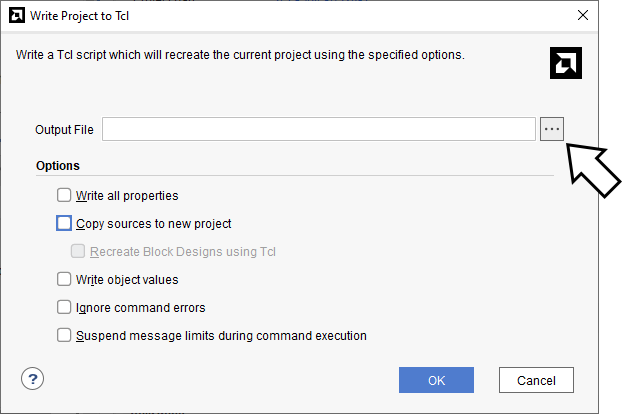
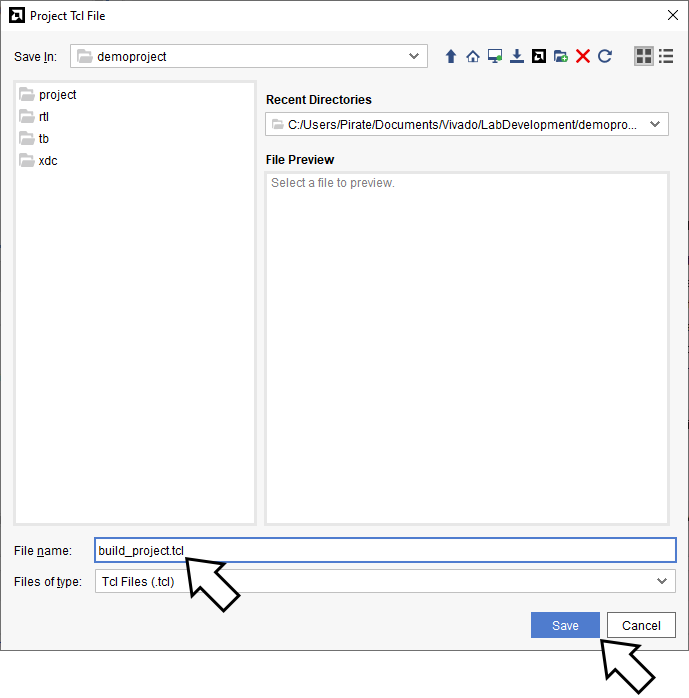
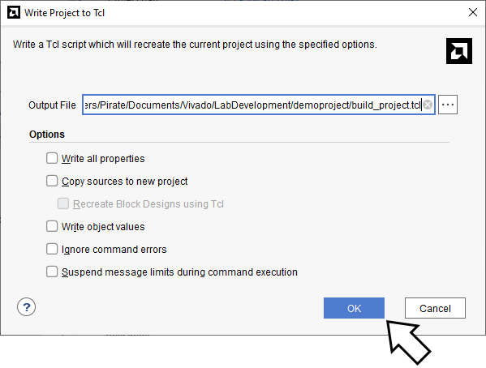

# Лабораторная работа 1. Язык Tcl.

## Что такое Tcl


 * Tcl (от англ. Tool Command Language — «командный язык инструментов») — скриптовый язык высокого уровня

 * Tcl де-факто является языком автоматизации и интеграции во всех ведущих программных пакетах разработки микросхем (ПЛИС и ASIC)

## Зачем нужен tcl нам?

 * Tcl полезен для автоматизированного создания проекта из исходных кодов
 * Tcl может использоваться для создания сценариев синтеза и моделирования в САПР
 * Tcl позволяет работать с САПР в командной строке, без графического интерфейса пользователя
 * В частности, поддержка языка Tcl встроена в Vivado

## Подготовка к выполнению лабораторной работы
* Создайте в Vivado проект "demoproject" (для вашего удобства создавайте его в отдельной папке, отметив галочку "Create project subdirectory")
* Добавьте в этот проект RTL файлы [demo.v](./demoproject/rtl/demo.sv) и [demo_wrapper_nexys_a7.v](./demoproject/rtl/demo_wrapper_nexys_a7.sv)
* Добавьте в проект файл тестбенча [tb_demo.v](./demoproject/tb/tb_demo.sv)
* Добавьте в проект xdc-файл [Nexys-A7-100T-Master.xdc](./demoproject/xdc/Nexys-A7-100T-Master.xdc)

Если вы не помните как создавать проекты, то обратитесь к
[материалам АПС с прошлого семестра](https://github.com/MPSU/APS/tree/master/Vivado%20Basics).

## Экспорт скрипта для автоматизированного создания проекта в Vivado

Давайте теперь мы создадим свой первый Tcl скрипт. Этот скрипт будет сгенерирован Vivado и будет предназначаться для восстановления проекта. Затем мы будем менять и дополнять этот скрипт.

Используйте пункт меню «File > Project > Write Tcl»


В появившемся окне нужно указать путь до tcl скрипта, который будет сгенерирован Vivado. 

> Убедитесь, что в этом окне все галочки не отмечены.




Пусть это будет файл «build_project.tcl» в директории «demoproject»



После нажатия на «OK» будет создан tcl скрипт



Давайте теперь проверим созданный скрипт. Смело удаляем созданный вами проект (но файлы исходников не трогаем!).

Теперь запустим Tcl скрипт.
Для этого нужно выполнить в терминале вашей ОС следующие команды:

Для windows:
```
call C:\Xilinx\Vivado\2019.2\settings64.bat
vivado -mode=batch -nojournal -nolog -source build_project.tcl
```

Для Unix-подобного:
```
/tools/Xilinx/Vivado/2019.2/settings64.sh
vivado -mode batch -nojournal -nolog -source build_project.tcl
```

Соответственно, путь до `settings64` вам необходимо указать с учетом того, где установлена Vivado.

Если вы в процессе нигде не допустили ошибку, то проект восстановится с использованием Tcl файла, можно открыть его и убедиться в том, что это тот же самый проект.

## Подсматриваем за Vivado с целью писать Tcl скрипты

> Хорошо, мы создали скрипт и он даже заработал. А что дальше? Как писать эти ваши Tcl? У меня есть книжка "Python для чайников", но для Tcl что-то такое не встречалось. Во всяком случае, на полке бестселлеров такое точно не найти.

Приведенная вымышленная цитата вымышленного студента на самом деле рано или поздно возникает у каждого человека, который хоть немного копнёт тему с Tcl. Давайте разбираться и запоминать полезные советы.

Прежде всего, необходимо понять, из чего состоит синтаксис языка Tcl в конкретной САПР, а состоит он из двух частей:
 * Базовый синтаксис языка
 * Дополнительные функции, добавленные разработчиком САПР для работы с ней

То есть важно понимать, что Tcl представляет из себя простой язык, он содержит базовый инструментарий для написания программ и не включает конструкции "добавь файл исходного кода в проект" или "запусти моделирование". Такие конструкции дополнительно добавляются разработчиком каждой конкретной САПР, и, как правило, эти конструкции не совместимы между САПР разных производителей. Все велосипедят своё, самое лучшее и не имеющее аналогов.

Хорошо, с этим разобрались, есть база и есть дополнения САПР. Где можно почитать про это всё?
* Трудно найти лучшее место с информацией про базовые конструкции Tcl, чем [oфициальный мануал с примерами](https://www.tcl.tk/man/tcl8.5/tutorial/tcltutorial.html).
* За информацией про функции САПР можно обратиться [непосредственно к документации на саму САПР](https://docs.xilinx.com/v/u/2019.2-English/ug835-vivado-tcl-commands).

Давайте не будем обманывать ни себя, ни преподавателя. В процессе выполнения лабораторной работы вряд-ли кто-то станет вдумчиво читать многотомную документацию на английском техническом языке. Запомните, что тут есть ссылки на документацию, которая вам может очень сильно помочь уже в инженерной практике, и будем идти дальше.

На практике достаточно удобно бывает "подсматривать" за САПР и таким образом находить Tcl команды для интересующих нас действий.

Рассмотрим этот процесс на примере Vivado:


 * В нижней части окна Vivado есть вкладка "Tcl Console"
 * Эта вкладка интересна нам по нескольким причинам:
   * Прежде всего, это консоль, куда мы можем вбивать свои команды
   * Также, в этой консоли появляются вызванные команды (синий шрифт) и логи (черный шрифт)
   * Любопытный читатель наверняка уже замечал, что в этом окне волшебным образом появляются команды, которые он сам не печатал. Разгадка проста: **"под капотом" Vivado работает так, что почти любое действие в графическом интерфейсе вызывает выполнение какой-то Tcl команды в консоли**.
   * Этим мы можем и непременно будем пользоваться сегодня.

Например, если нажать кнопку "Run Synthesis", в Tcl консоли появится следующий набор команд:

```tcl
update_compile_order -fileset sources_1
reset_run synth_1
launch_runs synth_1 -jobs 4
```

Ещё одной полезной командой (которая пригодится вам для выполнения задания лабораторной работы) является `start_gui`. Фактически, эта команда открывает окно графического интерфейса Vivado.

Попробуйте теперь дописать в конец скрипта создания проекта следующий фрагмент кода:

```tcl
start_gui
update_compile_order -fileset sources_1
reset_run synth_1
launch_runs synth_1 -jobs 4
```

Закройте Vivado, удалите проект и запустите скрипт заново. В случае успеха вы увидите, как у вас открылось окно Vivado и начался синтез проекта.

Для выполнения некоторых вариантов вам может понадобиться команда `wait_on_run`. В Vivado команда `launch_runs` не является блокирующей, то есть интерпретатор Tcl начинает выполнять команды далее, не дожидаясь окончания, например, синтеза. В общем случае, в этом нету ничего плохого, но бывают ситуации, когда нам необходимы результаты выполнения `launch_runs` – в таком случае скрипт завершится с ошибкой. Пример использования `wait_on_run` показан ниже:

```tcl
launch_runs synth_1 -jobs 4
wait_on_run synth_1
```

> В Vivado, начиная с версии 2021.2, команда `wait_on_run` была переименована в `wait_on_runs`. В то же время, `wait_on_run` на данный момент ещё работает в режиме обратной совместимости. Если вы работаете в свежей версии Vivado, то лучше используйте `wait_on_runs`.

Теперь вы знаете всё, что нужно для выполнения задания.

# Задание лабораторной работы
 * Откройте созданный скрипт в редакторе, прочитайте его, выделите основные секции и попробуйте объяснить для себя смысл максимально большого количества строк в нём
 * Найдите в скрипте места, где добавляются все файлы проекта (rtl, tb и xdc)
 * Найдите в скрипте место, где выбирается part number микросхемы FPGA

Индивидуальные задания:

 0. Модифицировать скрипт так, чтобы после создания проекта запускалось моделирование на 100 мкс (с графическим интерфейсом)
 1. Модифицировать скрипт так, чтобы после создания проекта открывалось окно RTL Analysis > Schematic со схемой проекта (с графическим интерфейсом, используйте команду `show_schematic`)
 2. Модифицировать скрипт так, чтобы после создания проекта запускался синтез, а затем открывалось окно Synthesis > Schematic со схемой проекта (с графическим интерфейсом, используйте команду `show_schematic`)
 3. Модифицировать скрипт так, чтобы после создания проекта запускался синтез, имплементация, а затем открывалось окно Implementation > Report Utilisation (с графическим интерфейсом)
 4. Модифицировать скрипт так, чтобы после создания проекта началась генерация bitstream, а затем автоматически прошилась заранее подключенная к компьютеру отладочная плата (не запуская графический интерфейс)


Номер индивидуального варианта вычисляется как остаток от деления вашего номера в группе на 5.
