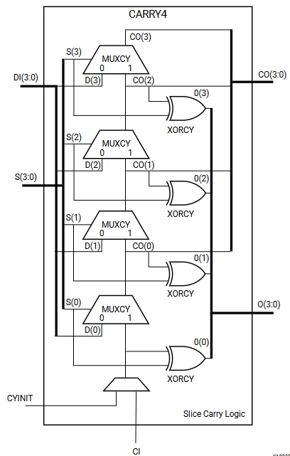

# Лабораторная работа 2. Таблицы истинности LUT и FF.

Данная лабораторная работа посвящена низкоуровневому проектированию логики для FPGA Xilinx 7. Не то, чтобы в этом было много практического смысла, но если мы можем, то почему бы и нет?

## Подготовка к лабораторной работе
 * Вам необходимо прослушать первую половину лекции о внутренней структуре FPGA ([Запись на YouTube](https://www.youtube.com/watch?v=fdJiGdp5eVc))

Xilinx Vivado предоставляет возможность описывать логику с использованием так называемых примитивов. Давайте мы условимся называть в этой лабораторной работе примитивом "вшитый в Vivado" модуль, который вы можете подключать в своём дизайне и использовать. Если использовать более корректную терминологию, то это библиотечные элементы, из которых в итоге САПР собирает ваш дизайн в процессе синтеза.

Xilinx прилагает [хорошую документацию к своим библиотечным элементам](https://docs.xilinx.com/v/u/2020.1-English/ug953-vivado-7series-libraries). Настоятельно рекомендую отвлечься от данного текста и потратить несколько минут на ознакомление с документом. В частности, стоит по диагонали просмотреть страницы 259-588, там на самом деле можно найти очень много интересного, особенно, если вы внимательно и целиком смотрели лекцию вживую или в записи.

### Примитивы LUT
Для нас сейчас наиболее интересны примитивы LUT1-LUT6. Они позволяют использовать соответствующие элементы логических ячеек FPGA. При этом важно понимать, что в семействе Xilinx 7 физически существуют либо LUT6, либо LUT5 с двумя выходными сигналами, соответственно, LUT с меньшим числом входов будут реализованы на существующих ресурсах, при этом некоторые входы LUT5/LUT6 окажутся незадействованными.

Давайте рассмотрим пример использования LUT6. Этот примитив имеет один параметр `INIT` шириной 64 бита. По сути это таблица истинности LUT'a. Нулевой бит соответствует значению выхода `O` при входном векторе `6'b000000`.
Бит 63 соответствует значению выхода `O` при входном векторе `6'b111111`.

```verilog
// LUT6: 6-input Look-Up Table with general output
// 7 Series
// Xilinx HDL Language Template, version 2020.1
LUT6 #(
  .INIT(64'h0000000000000000) // Specify LUT Contents
) LUT6_inst (
  .O(O), // LUT general output
  .I0(I0), // LUT input
  .I1(I1), // LUT input
  .I2(I2), // LUT input
  .I3(I3), // LUT input
  .I4(I4), // LUT input
  .I5(I5) // LUT input
);
// End of LUT6_inst instantiation
```

### Примитив CARRY4

Другим интересным примитивом является цепочка переноса CARRY4. По сути этот примитив предоставляет нам доступ к цепочки переноса в рамках одного Slice.



Cхема выглядит пугающе и непонятно, особенно странным выглядит нижний мультиплексор, которым мы с первого взгляда не можем управлять. Всё становится значительно проще, если взглянуть на [поведенческую модель этого примитива](https://github.com/Xilinx/XilinxUnisimLibrary/blob/master/verilog/src/unisims/CARRY4.v):

```verilog
module CARRY4
(
  output [3:0] CO,
  output [3:0] O,

  input CI,
  input CYINIT,
  input [3:0] DI,
  input [3:0] S
);

  wire CI_in;
  wire CYINIT_in;

  assign CI_in = (CI !== 1'bz) && CI; // rv 0
  assign CYINIT_in = (CYINIT !== 1'bz) && CYINIT; // rv 0

// begin behavioral model

  wire [3:0] CO_fb;
  assign CO_fb = {CO[2:0], CI_in || CYINIT_in};
  assign O = S ^ CO_fb;
  assign CO = (S & CO_fb) | (~S & DI);

endmodule
```
С помощью этого примитива можно реализовать быстрые цепочки переноса для арифметических операций.

 * Сигналы `CI_in` и `CYINIT_in` отвечают за входной перенос сумматора, причем входной перенос формируется как логическое "ИЛИ" между двумя сигналами, и можно использовать один из них. Предлагается использовать `CI_in`.
 * Сигнал `CO_fb` представляет из себя непосредственно биты переноса. 0 бит это входной перенос, а 3 бит будет являться выходным переносом для 4-бит сумматора.


Давайте рассмотрим работу цепочки переноса в сумматоре. Ниже представлена знакомая картинка из курса АПС c однобитным сумматором.


Мы сразу видим несколько аналогий:
 * Сигнал `s` в сумматоре эквивалентен сигналу `O` в примитиве CARRY4
 * Сигнал `cout` в сумматоре логически эквивалентен сигналу `CO` в примитиве CARRY4
 * Сигнал `cin` эквивалентен сигналу `CI_in` в CARRY4
 * Сигнал `g` эквивалентен `DI` в CARRY4
 * Сигнал `p` эквивалентен `S` в CARRY4

Таким образом, чтобы построить сумматор с использованием CARRY4, необходимо сформировать сигналы `CI_in`, `DI` и `S` по аналогии с сигналами `cin`, `g` и `p` в полном сумматоре.

### Примитивы D триггеров

Последним типом рассмотренных примитивов будут D-триггеры.
 * FDCE - D-триггер с сигналом Clock Enable и асинхронным сбросом
 * FDPE - D-триггер с сигналом Clock Enable и асинхронным возведением (как сброс, но в 1 вместо 0)
 * FDRE - D-триггер с сигналом Clock Enable и синхронным сбросом
 * FDSE - D-триггер с сигналом Clock Enable и синхронным возведением

При рассмотрении данных примитивов нужно помнить, что они на самом деле реализуют разные режимы функционирования одних и тех же D-триггеров, которые физически присутствуют в FPGA.

Использование данных примитивов не представляет существенной сложности, в случае необходимости обратитесь к документации за объяснением логики работы, примерами подключения и таблицами истинности.

Также вскользь стоит упомянуть наличие защелок, для которых присутствуют примитивы LDCE и LDPE.

> Обратите внимание на то, что такие примитивы D-триггеров при моделировании не запоминают данные в течение первых ~100 наносекунд, это нормально и должно быть так. Вы можете подавать данные на них не сразу, а к моменту, когда они "проснутся".

## Задания лабораторной работы

**Часть 1: Реализовать комбинаторную логику согласно варианту индивидуального задания. Написать простой testbench на "initial" блоках и проверить выполнение задания.**

0. Реализовать функцию y[3:0] = a[3:0] ^ (b[3:0] | c[3:0]) с помощью примитивов LUT
1. Реализовать функцию y[3:0] = a[3:0] & (~c[3:0]) с помощью примитивов LUT
2. Реализовать функцию y[3:0] = a[3:0] - b[3:0] с использованием примитива цепочки переноса CARRY4
3. Реализовать функцию y[3:0] = (~a[3:0]) | (~c[3:0]) с помощью примитивов LUT
4. Реализовать функцию y[3:0] = a[3:0] & b[3:0] & c[3:0] с помощью примитивов LUT
5. Реализовать функцию y[3:0] = a[3:0] | b[3:0] | c[3:0] с помощью примитивов LUT
6. Реализовать функцию y[3:0] = a[3:0] ^ b[3:0] ^ (~c[3:0]) с помощью примитивов LUT
7. Реализовать функцию y[3:0] = a[3:0] + b[3:0] с использованием примитива цепочки переноса CARRY4

Номер индивидуального варианта вычисляется как остаток от деления вашего номера в группе на 8.

**Часть 2: Реализуйте запоминание данных с помощью одного из примитивов D-триггера. Написать простой testbench на "initial" блоках и проверить выполнение задания.**

0. Реализуйте запоминание результата выполнения первой части задания с помощью примитива FDCE
1. Реализуйте запоминание результата выполнения первой части задания с помощью примитива FDPE
2. Реализуйте запоминание результата выполнения первой части задания с помощью примитива FDRE
3. Реализуйте запоминание результата выполнения первой части задания с помощью примитива FDSE

Номер индивидуального варианта вычисляется как остаток от деления вашего номера в группе на 4.
