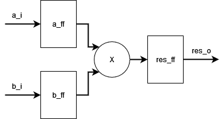
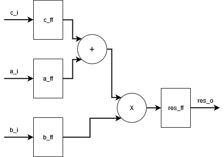
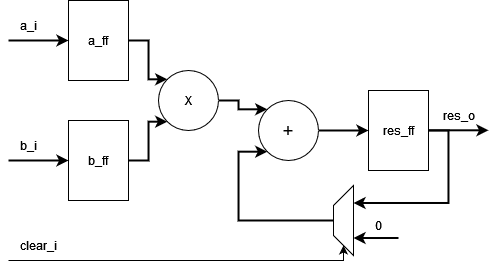
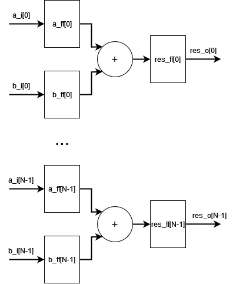
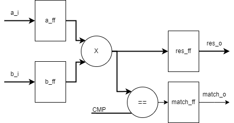

# Лабораторная работа 3. DSP-ячейки

В данной лабораторной работе мы изучим DSP-ячейки в FPGA Xilinx 7, их структуру и функциональность, а также научимся использовать эти ячейки в своей логике.

## DSP ячейки в FPGA Xilinx 7
Упрощённая структурная схема DSP ячейки представлена на рисунке:


DSP ячейка состоит из:
 * Умножителя разрядностью 25 x 18 бит (25x18 multiplier)
 * Предварительного сумматора (pre-adder)
 * Блока АЛУ, способного работать в режиме SIMD
 * Определителя паттернов (pattern detector)
 * Регистр-аккумулятор шириной 48 бит
 * Промежуточных регистров
 * Мультиплексоров данных

> На самом деле структура DSP ячейки несколько сложнее. В частности, DSP ячейка включает в себя дополнительную логику цепочек переноса, предназначенную для каскадирования нескольких ячеек и реализации более сложных вычислительных алгоритмов. Вы можете подробнее изучить структуру DSP ячейки, обратившись к [документации на неё](https://docs.xilinx.com/v/u/en-US/ug479_7Series_DSP48E1).

## Использование DSP

Существует два способа использовать DSP ячейки в своей логике:
 * Использовать примитив `DSP48E1`. Можно использовать библиотечные элементы по аналогии с тем, как мы использовали LUT/FF/CARRY4 в лабораторной работе 2. Использование DSP ячейки таким образом даёт полный контроль над всеми её функциями и возможностями, но ухудшает общую читаемость кода и усложняет любые правки и модификации. Прочитать про примитив `DSP48E1` можно в [документации](https://docs.xilinx.com/v/u/en-US/ug479_7Series_DSP48E1).
 * Альтернативным способом использовать DSP ячейки является написание логики на HDL так, чтобы эта логика естественным образом "ложилась" на существующие в DSP ячейках аппаратные структуры. В этом случае САПР автоматически будет использовать DSP ячейки при синтезе. Такой подход даёт понятный и читаемый код, который не зависит от специфичных для Xilinx библиотечных элементов, пусть и ценой потери полного контроля над происходящим внутри DSP ячейки.

В данной лабораторной работе мы будем придерживаться второго подхода. Любознательный читатель может самостоятельно изучить использование примитива `DSP48E1`, руководствуясь документацией.

Рассмотрим примеры использования DSP ячеек, предоставленные непосредственно Xilinx (взяты из Language Templates).

### Умножение без DSP
В общем случае, САПР Vivado пытается использовать аппаратный умножитель всегда, когда разработчик не запретил это делать.

Управлять использованием аппаратных умножителей можно с помощью директивы `(* use_dsp = "no" *)` в начале модуля:

```verilog
(* use_dsp = "no" *)
module mult_no_dsp(
  input  logic               clk_i,
  input  logic               rst_i,
  input  logic signed [24:0] a_i,
  input  logic signed [17:0] b_i,
  output logic signed [42:0] res_o

);

  logic signed [24:0] a_ff;
  logic signed [17:0] b_ff;
  logic signed [42:0] res_ff;
  logic signed [42:0] mult;

  always_ff @(posedge clk_i) begin
    if (rst_i) begin
      a_ff <= '0;
      b_ff <= '0;
    end
    else begin
      a_ff <= a_i;
      b_ff <= b_i;
    end
  end

  assign mult = a_ff * b_ff;

  always_ff @(posedge clk_i) begin
    if (rst_i)
      res_ff <= '0;
    else
      res_ff <= mult;
  end

  assign res_o = res_ff;

endmodule
```
Файл с данным примером можно найти [по ссылке](./examples/01_mult_no_dsp/mult_no_dsp.sv).

Данный пример описывает модуль, показанный на схеме ниже:




### Умножение с DSP

Для того, чтобы использовать аппаратный умножитель DSP ячейки, достаточно убрать из предыдущего примера запрещающую директиву.

Файл с данным примером можно найти [по ссылке](./examples/02_mult_dsp/mult_dsp.sv).


### Асинхронное умножение


Файл с данным примером можно найти [по ссылке](./examples/02_mult_dsp/mult_dsp_async.sv).

### Предварительное сложение




Файл с данным примером можно найти [по ссылке](./examples/03_pre_adder/pre_adder.sv).

### Умножение с накоплением



Файл с данным примером можно найти [по ссылке](./examples/04_mult_accumulate/mult_accumulate.sv).

### SIMD в АЛУ



Файл с данным примером можно найти [по ссылке](./examples/05_alu_simd/alu_simd.sv).

### Обнаружитель паттернов



Файл с данным примером можно найти [по ссылке](./examples/06_pattern_detect/mult_compare.sv).


## Задание лабораторной работы

Для успешной защиты лабораторной работы вам необходимо выполнить все пункты задания и внятно ответить на все вопросы.

1. Воспроизведите примеры "Умножение без DSP" и "Умножение с DSP".
   * Проведите синтез обоих примеров и сравните Utilization. Почему пример "без DSP" использует LUT, а пример "с DSP" не использует их?
   * Откройте Synthesis > Schematic для обоих примеров и объясните увиденное.
   * Почему в примере "Умножение с DSP" на схеме отсутствуют регистры? Куда они пропали и где находятся?
   * Подключите файл [clk.xdc](./examples/02_mult_dsp/clk.xdc) к проектам с примерами "Умножение без DSP" и "Умножение с DSP" и выполните сравнительный анализ тактовой частоты. **Внимание! Для примера "Умножение с DSP" используйте top-level модуль-обёртку [mult_dsp_wrapper.sv](./examples/02_mult_dsp/mult_dsp_wrapper.sv)**
   * Какие получились тактовые частоты у разных примеров? Почему они отличаются?
2. 
