# Лабораторная работа 5. Конвейеры и систолические массивы

Конвейеры в тех или иных видах применялись человечеством ещё с древних времён для транспортировки зерна и воды. Во время промышленной революции (вторая половина XIX века) конвейеры нашли широкое применение на заводах и позволили автоматизировать и оптимизировать технологические процессы.

В цифровой технике используются конвейеры -- концептуально схожий принцип постепенной и часто непрерывной транспортировки данных с последовательной их обработкой.

## Концепция конвейеризации в цифровых схемах

### Критический путь

Прежде чем перейти к конвейерам, необходимо понять, зачем они нужны и вообще могут быть полезны.

Вспомним несколько важных вещей:
* Любая логика имеет конечную скорость распространения электрического сигнала.
* Время распространения сигнала в логике называется propagation delay (`Tpd`).
* Любая комбинаторная логика имеет некоторый propagation delay.
* **Критический путь** – максимально длинная цепочка комбинаторной логики в цифровой схеме, ограничивающая её тактовую частоту.

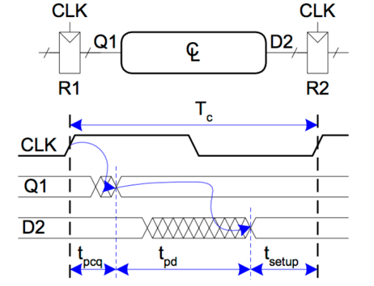

Итоговая максимальная тактовая частота дизайна определяется по формуле `𝐅_𝐦𝐚𝐱=𝟏/𝐓_𝐜`.

### Из комбинаторной логики в конвейер

Пусть существует некоторая цифровая схема из трёх одинаковых, соединенных последовательно блоков комбинаторной логики.
Задержка распространения одного блока логики равна `Tpd`.

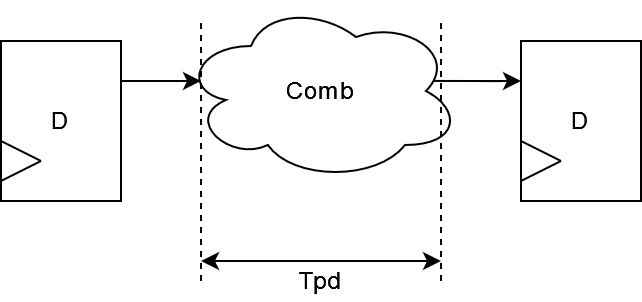

Суммарная задержка распространения такой схемы будет равна: `3 * Tpd`.

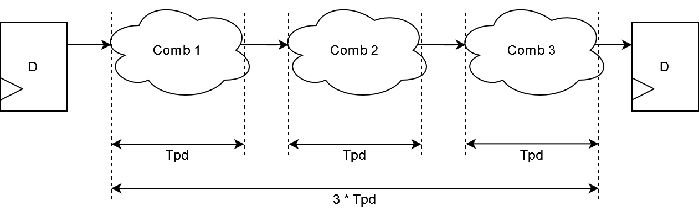

Можно ли уменьшить суммарную задержку представленной схемы, не нарушая её функциональность?
Да, можно. И решение – преобразовать её в **конвейер**, добавив регистры между блоками логики.

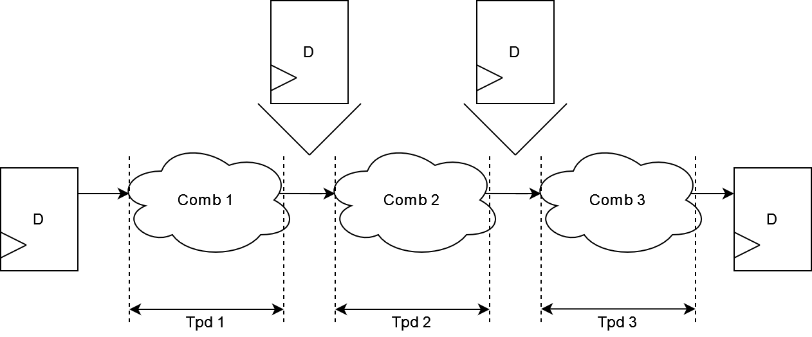

Задержка распространения одного блока логики равна `Tpd`.
Суммарная задержка распространения такой схемы будет также равна `Tpd`.
Задержка распространения стала меньше, следовательно увеличивается максимальная тактовая частота.

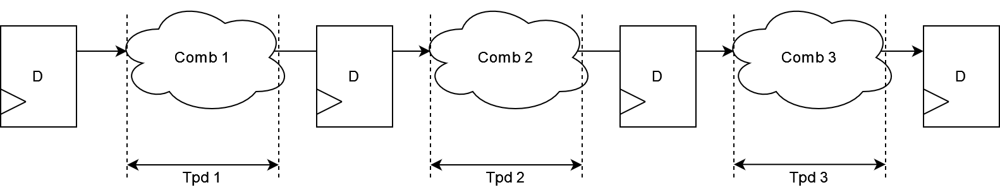

### Латентность конвейера

Давайте рассмотрим потактово работу комбинаторной схемы:

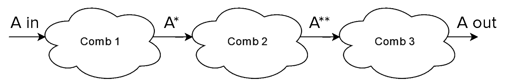

И её конвейеризованного аналога:

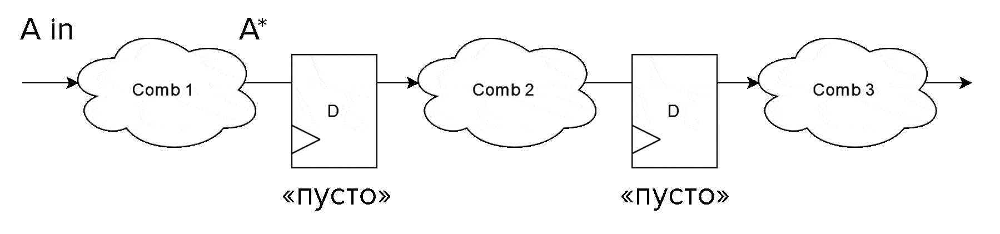

Мы видим, что комбинаторная схема выдаёт результат сразу же, на этом такте, а вот конвейер выдаёт результат не сразу, а по прошествии какого-то времени. Можно сделать следующие выводы:
* Конвейер как труба с водой -- чтобы получить воду на одном конце трубы, нужно заполнить трубу водой и дождаться момента, когда она протечёт до другого конца
* Конвейер начинает выдавать выходные данные с некоторой задержкой, связанной с заполнением его промежуточных регистров данными
* Как только конвейер заполнится, он может выдавать новые выходные данные каждый такт

**Латентностью** (latency) конвейера называют задержку в тактах между подачей входных данных и получением соответственных выходных результатов. Если проще -- это время на заполнение конвейера.

Латентность комбинаторной логики – 0.

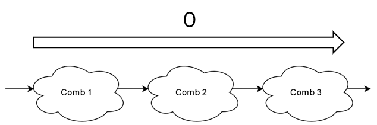

Латентность рассмотренного конвейера – 2.

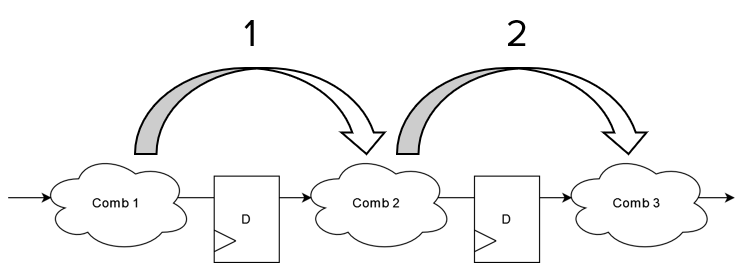

### Оценка эффективности конвейера

Давайте попробуем сделать очень грубую сравнительную оценку производительности (пропускной способности) комбинаторной схемы и построенного на её основе конвейера.

> Далее под словом "операция" мы понимаем вычисление, преобразующее входные данные `in` в выходные данные `out`.

Комбинаторная логика:
* Комбинаторная логика выполняет операции за время `N_оп * 3 * Tpd`.
* Например, для 4 операций это `4 * 3 * Tpd = 12 * Tpd`.

Конвейер:
* Конвейер выполняет операции за время `(L + N_op) * Tpd`, где `L` -- латентность конвейера.
* Для 4 операций и рассмотренного конвейера это `(2 + 4) * Tpd = 6 * Tpd`.

Получается, что **конвейер способен выполнить 4 операции в 2 раза быстрее, чем комбинаторная схема**, затрачивая на одну операцию в 2 раза меньше времени.

А теперь давайте рассчитаем, сколько времени понадобится для выполнения 1000 операций:

Комбинаторная логика: `1000 * 3 * Tpd = 3000 * Tpd`

Конвейер: `(2 + 1000) * Tpd = 1002 * Tpd`

Итого получается интересная закономерность: **при устремлении количества операций к достаточно большому числу, разница в производительности между комбинаторной схемой и простейшим конвейером устремляется к разнице их тактовых частот**.

> Конечно же, представленная оценка упрощена для наглядности и излишне оптимистична, в реальной жизни выигрыш от конвейеризации получается ниже. Но, тем не менее, использование конвейера остаётся оправданным в целом ряде случаев.

> Также важно понимать, что мы говорим о *простых* конвейерах, в которых нет никаких конфликтов (будь то структурных, либо по управлению, либо по данным). То есть указанные подсчёты принципиально не применимы, например, для конвейеров процессорных ядер.

## Операция возведения в степень как пример для конвейеризации

Рассмотрим операцию возведения числа в пятую степень.
Такая операция требует выполнения 4 умножений и является хорошим примером сценария, при котором необходима конвейеризация.

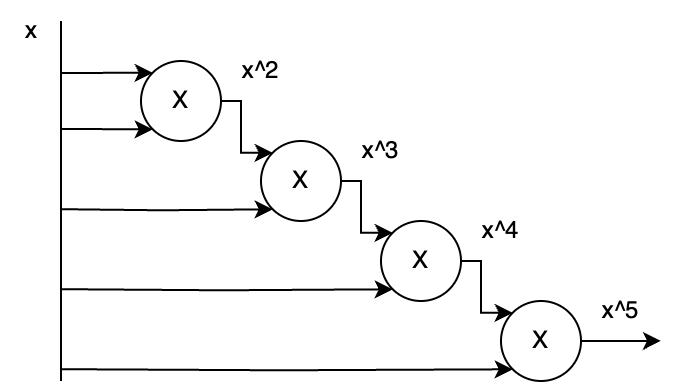

Умножение само по себе достаточно "долгая" и громоздкая операция и каскадирование сразу нескольких умножений подряд приводит к низкой тактовой частоте дизайна.

## Пример конвейера для возведения в степень

Добавив регистры между умножениями, мы разбили критический путь и увеличили тактовую частоту такого дизайна.

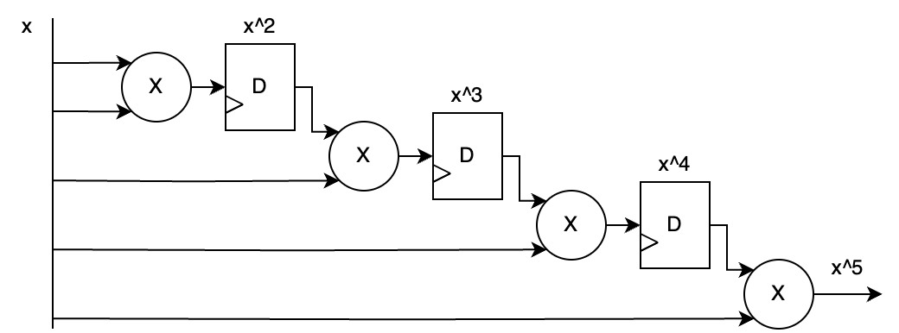

Но есть проблема: такая схема требует удержания значения входных данных `x` до конца вычисления степени, что нивелирует выигрыш от конвейеризации. То есть по сути такая логика не является конвейером в прямом смысле этого слова.

Давайте также конвейеризуем значение входных данных `x`.

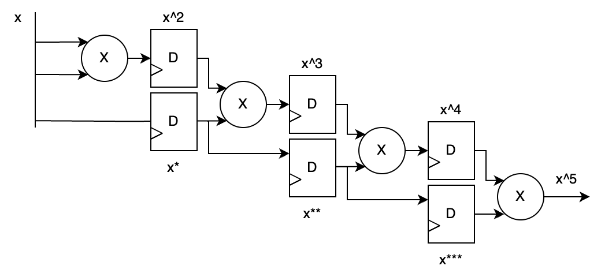

В такой схеме можно каждый такт подавать новое значение `x` и каждый такт получать на выходе возведенное в степень число. В процессе работы по конвейеру будет ехать как промежуточный результат вычислений, так и соответствующий ему `x`, который необходим для выполнения следующих операций.

Получилась полная аналогия конвейера из реальной жизни.

## Clock Gating, энергоэффективность конвейера и сигнал valid

### Энергопотребление в цифровых схемах
Важной задачей инженера является оптимизация цифровых дизайнов по энергопотреблению, то есть снижение энергопотребления.

А что такое энергопотребление цифровой микросхемы и из чего оно складывается?

Существуют два фактора, в сумме почти целиком формирующих энергопотребление цифрового дизайна:
* **Статическое энергопотребление** -- некоторый ненулевой **ток, всегда бежит через полевые транзисторы**, даже если эти транзисторы закрыты. Этот ток определяется параметрами технологического процесса и в том числе степенью удачности конкретного экземпляра микросхемы. Мы, как цифровые инженеры, можем повлиять на этот параметр только уменьшением дизайна, и, как следствие, сокращением количества транзисторов.
* **Динамическое энергопотребление** -- **расход энергии на зарядку и разрядку паразитных емкостей** (конденсаторов). Мы не можем избавиться от таких емкостей в микросхеме (разве что уменьшать дизайн), но мы можем эффективно ограничить переключения логики только в те моменты, когда это действительно нужно.

Конвейеры включают в себя достаточно большое количество регистров, при этом регистры разделяют стадии конвейера. Таким образом, если мы ограничим переключение регистров, то снизится динамическое энергопотребление.

### Clock gating

**Clock gating** – механизм отключения тактирования фрагментов логики, когда она не нужна.
Нет переключения тактовой частоты – нет динамического энергопотребления (но остаётся статическое).

Моделью Clock gating можно представить вентиль "ИЛИ" между сигналом `~en` и `clk`. Принцип работы показан на рисунке ниже.

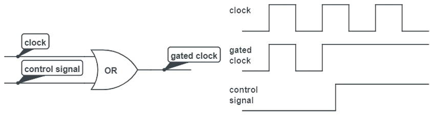

> Важно понимать, что пример с логическим «ИЛИ» приведен только для наглядности. В реальной логике используются специальные блоки и попытка использовать такую схему не приведёт к желаемому результату – используйте библиотечные элементы или примитивы «Clock gating».

Реализация Clock gating возможна на нескольких уровнях иерархии:
* «Fine grained» – автоматическое задействование Clock gating для отдельных регистров через «enable». Начиная с определенной ширины регистра (десятки бит для 130-180 нм и единицы бит для 7 нм и ниже) синтезатор автоматически конвертирует enable регистра в блок clock gating. Наиболее часто применяющийся на практике, его мы и будем использовать в этой лабораторной работе. Принцип работы показан на рисунке.

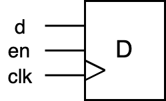.

* Использование вручную примитива (черного ящика) «Clock gating» для отключения тактирования средних фрагментов логики. Например, в GPU можно использовать незадействованные в данный момент шейдерные ядра.
* Отключение тактирования крупных блоков на уровне СнК. Аналогично предыдущему, но распространяется на более крупные узлы: отключение процессорных ядер или кластеров из ядер и так далее. Оба варианта проиллюстрированы на рисунке ниже.

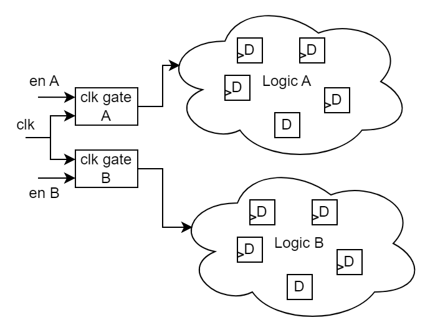

### Флаг валидности данных в конвейере

Давайте добавим в конвейер флаг валидности данных `valid`, перемещающийся вместе с данными.
Если валидных данных на входе регистра нет, то и защелкивать ничего не нужно – в такой момент можно убрать `enable` на соответствующей стадии конвейера.

Получается следующая схема:

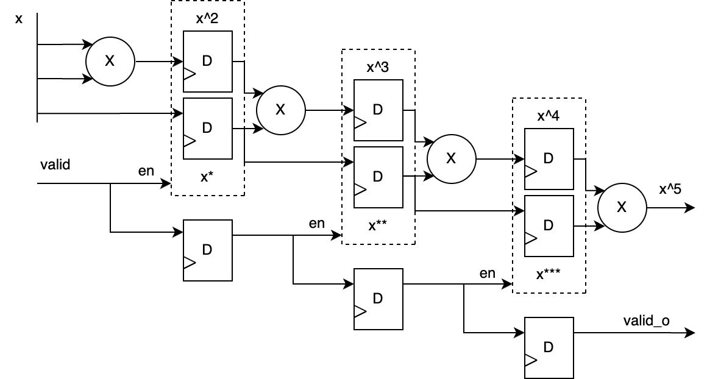

Давайте проанализируем её:
* Мы видим, что регистры, хранящие флаг valid, переключаются каждый такт. В то же время, разрядность этих регистров 1 бит на стадию, и существенного влияния на энергопотребление они не оказывают.
* Регистры, хранящие промежуточные результаты вычислений и `x` теперь стали переключаться только тогда, когда необходимо. При этом разрядность таких регистров может достигать десятков бит.
* Таким образом, добавив в конвейер небольшое (единицы) количество неограниченно переключающихся регистров с `valid`, мы смогли ограничивать переключение десятков и сотен других регистров в моменты, когда в этом нет необходимости.

Для инженера важно знать и помнить:

* Регистры, которые всегда переключаются (их сигнал `enable` в явном или неявном виде выставлен всегда в "1") называются **free running**.
* В противовес им, регистры, переключение которых выполняется только в требуемые моменты времени, называются **clock gated**.

На тематических ресурсах часто рекомендуют по возможности стараться описывать регистры так, чтобы они не переключались "в холостую", и теперь вы знаете почему это действительно стоит делать.

## Сбросы в конвейерах

> Вся указанная далее информация применима только к ASIC и не имеет прямого отношения к FPGA. В FPGA регистры в Slice физически всегда умеют асинхронно сбрасываться, они такие уже есть на кристалле и мы не можем их упростить. Тем не менее, полезно писать RTL, который оптимален как для FPGA, так и для ASIC. А если однажды вы будете писать RTL для ASIC, то приведенные далее знания будут вам просто критически необходимы.

Мы не будем подробно касаться типов сбросов в материале этой лабораторной работы. Давайте вспомним:
* **Синхронный сброс** -- мультиплексор перед входом данных регистра, увеличивает собой комбинаторную логику перед входом регистра, часто ухудшает критический путь. Собственно, такой тип сброса называется синхронным, поскольку данные сброса на вход регистра поступают по цепочке входных данных по фронту сигнала синхронизации.
* **Асинхронный сброс** -- вход `reset`/`clear`/`set` регистра, моментальный асинхронный сброс регистра, использующий дополнительную логику в регистре. Такой сброс не увеличивает комбинаторную цепочку перед входом данных регистра.

Размер регистров на кристалле ASIC может отличаться не только в зависимости от их ширины.
В частности, на размер регистра влияет наличие или отсутствие у него асинхронного сброса.
Наличие сброса увеличивает площадь одного регистра приблизительно на 25-35%.

На картинке ниже приведены реальные размеры регистров со сбросом и без, в библиотеке элементов TSMC 180 нм.

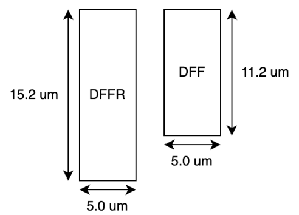

Вернёмся к конвейеру.

Так как ранее был добавлен флаг валидности данных, теперь можно избавиться от сброса в регистрах конвейера.
При этом для флага валидности сброс всё ещё нужен.

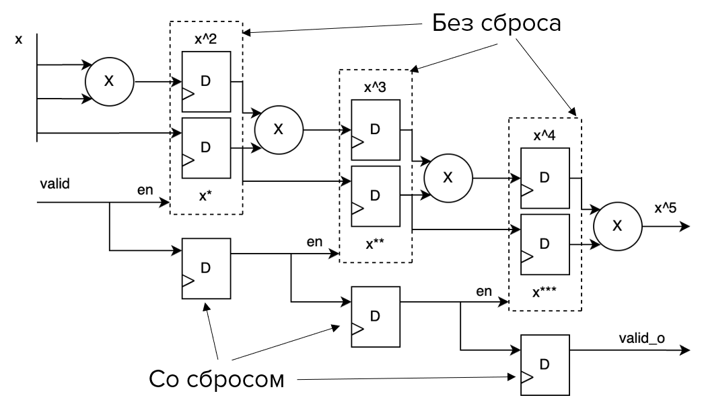

В регистрах без сброса после подачи питания на микросхему будет "мусор", но нас это не смущает -- флаги `valid` в "0" сигнализируют логике о том, что с этим мусором ничего делать не надо: ни выполнять вычисления, ни выдавать как результат вычислений конвейера.

## Систолические массивы

**Систолический массив** – однородная сеть тесно связанных блоков обработки данных, узлов.
Каждый узел результат как функцию данных, полученных от его соседей, сохраняет результат и передает его другим узлам. Таким образом получается избежать многочисленных пересылок промежуточных данных в память и из неё при вычислении целого ряда математических алгоритмов, в частности, при перемножении матриц и вычислении сверток в нейронных сетях.

Систолические массивы являются основой современных ускорителей нейронных сетей, например, Google TPU.

Рассмотрим пример систолического массива, реализующего вычисления со статичными весами "weight stationary".

Систолические массивы состоят из однотипных элементов, называемых "узлами". Пример внутренней структуры такого узла представлен на рисунке.

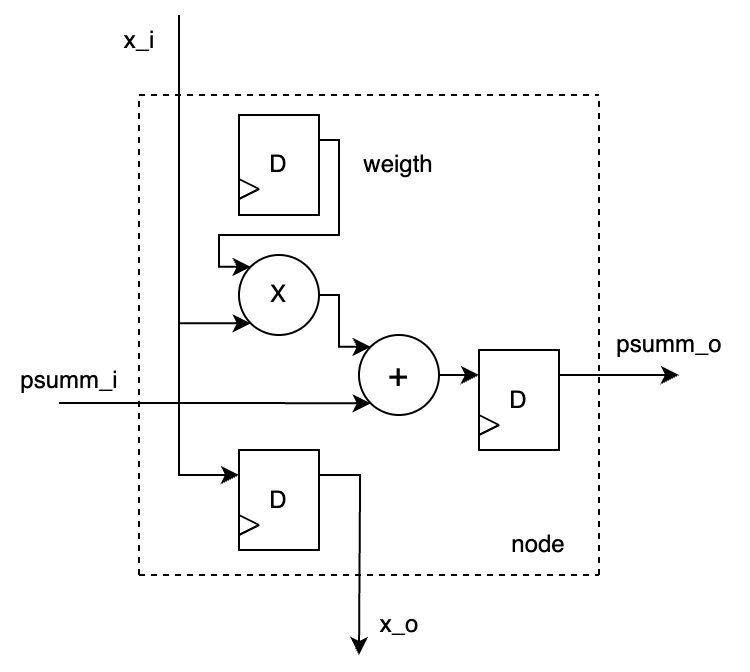

Представленный узел выполняет следующие операции:
* Хранит значение коэффициента-множителя `weight`.
* Принимает на вход значение `x_i` от ячейки выше, сохраняет его в регистр, значение регистра выводит на выход `x_o` к ячейке ниже (вертикальное распространение данных).
* Принимает частичную сумму от соседней слева ячейки, прибавляет к ней произведение `x_i * weight`, результат сохраняет в регистр, выводит содержимое регистра на выход `summ_o` к ячейке справа.

Давайте рассмотрим пример простого систолического массива. Он представляет объединенные в прямоугольную сетку узлы.

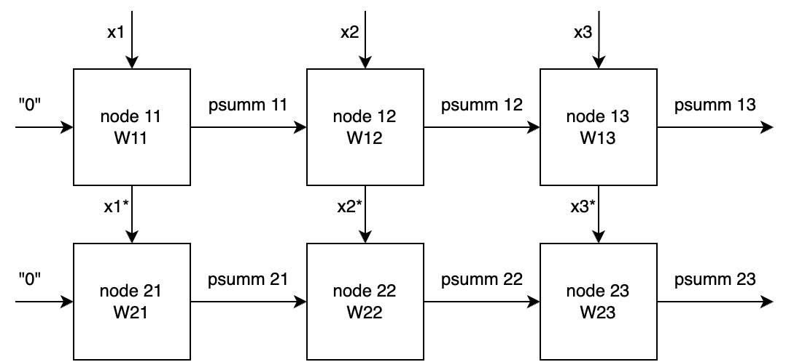

Входные данные распространяются сверху-вниз через линии `x1`, `x2`, `x3`.
Частичные суммы (промежуточные результаты вычислений) распространяются слева-направо.
В левом столбце на входы частичных сумм подаются нулевые значения.
Результаты вычисления появляются на выходах `psumm13` и `psumm23` по мере продвижения данных по систолическому массиву.

Анимация ниже иллюстрирует работу систолического массива. Обратите внимание на то, что вычисления в массиве выполняются как-бы диагональными волнами, которые распространяются направо-вниз. Это характерная особенность работы систолических массивов со статичными весами.

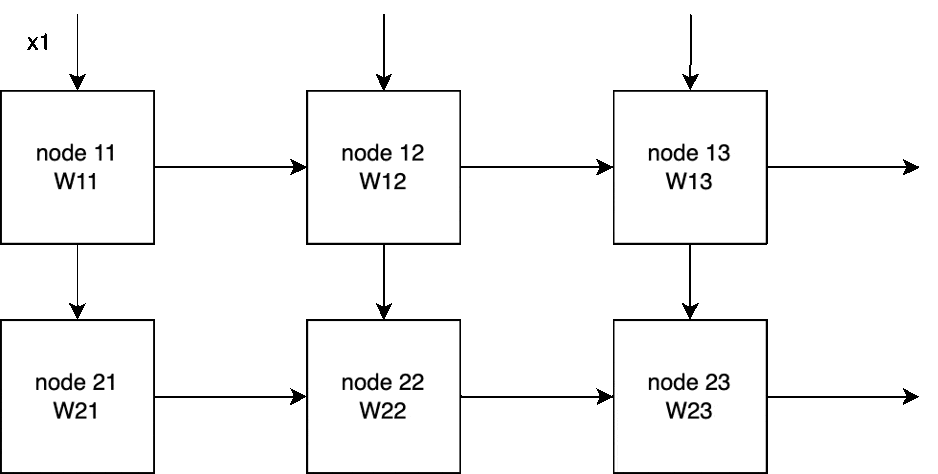

## Задание лабораторной работы

## Контрольные вопросы
