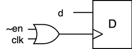

# Лабораторная работа 5. Конвейеры и систолические массивы

## Концепция конвейеризации

## Операция возведения в степень как пример для конвейеризации

## Пример конвейера для возведения в степень

## Clock Gating, энергоэффективность конвейера и сигнал valid

## Сбросы в конвейерах

## Систолические массивы

