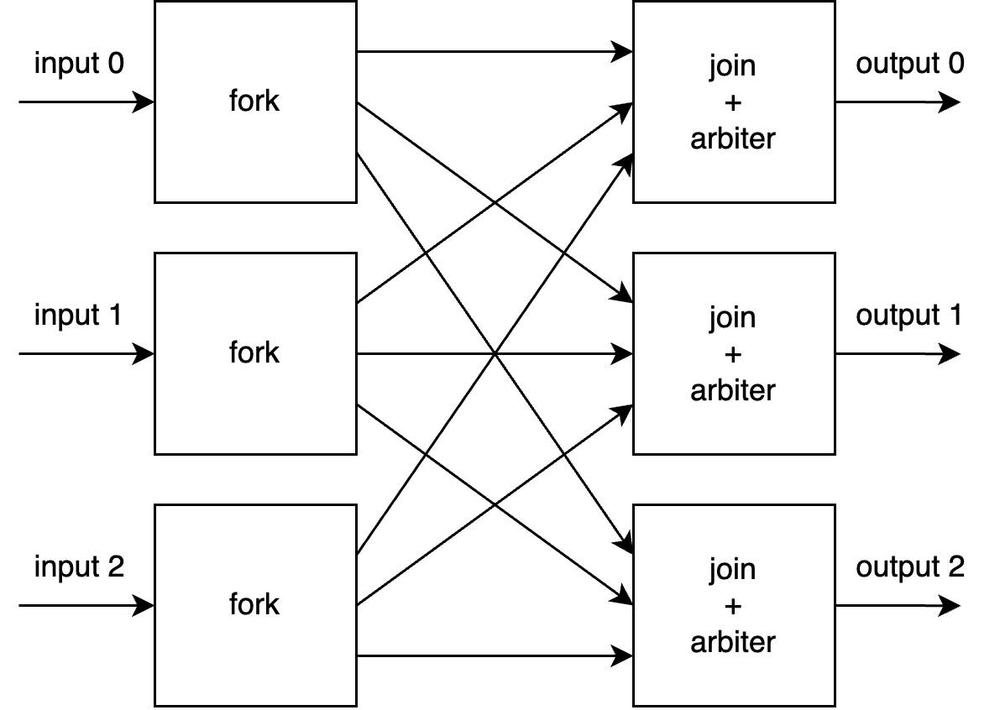

# Лабораторная работа 6. Шина AXI-Stream, Valid-Ready, Credit Flow control.

## Интерфейс "valid-ready"

[В предыдущей лабораторной работе](../05.%20Pipelines%20and%20Systolic%20arrays/README.md) мы рассмотрели использование сигнала валидности данных `valid` в конвейерах. Такой сигнал позволяет сообщать принимающему устройству (например, стадии конвейера) о том, что в данный такт передаются корректные данные, требующие обработки. Но в реальной жизни часто бывает так, что принимающее устройство не в состоянии обеспечить приём данных, например, потому, что занято обработкой принятого ранее пакета с данными. Данная лабораторная работа посвящена изучению способа решения такой проблемы.

Прежде, чем перейти к изучению материала, необходимо ввести несколько терминов.

**Потоковой передачей данных** называется однонаправленный процесс передачи данных от одного узла схемы к другому узлу.
При этом одно устройство в процессе передачи отправляет данные и называется **ведущим (master)**, а устройство, принимающее данные, называется **ведомым (slave)**.

Давайте рассмотрим пример такой передачи, в котором данные передаются от ведущего устройства к ведомому.

Ранее мы уже видели такую схему, где вместе с данными передавался флаг `valid`. Теперь же в интерфейсе между двумя блоками появился новый сигнал: `ready`. `ready` представляет из себя сигнал "ведомый блок готов принимать информацию".

Если данные и `valid` передаются от master к slave, то `ready` передаётся в обратном направлении, от slave к master.

Теперь непосредственно передача данных между устройствами будет выполняться **только при условии, если `valid == 1` и `ready == 1`**.
При этом:
 - master отслеживает сигнал `ready` от slave и не выставляет новые данные до момента, пока не случится условие `valid == 1` и `ready == 1`
 - slave не обязан принимать данные от master, пока он выставляет сигнал `ready == 0`

Ситуация, когда одновременно `valid == 1` и `ready == 1` называется **рукопожатием (handshake)**. Ведущий и ведомый блок взаимно сообщают друг другу о готовности совершить обмен данными.

Наличие сигнала `ready` привносит в схему такое понятие как **backpressure (обратное давление)**. Backpressure возникает тогда, когда slave опускает сигнал `ready` в `0`, при этом приостанавливая продвижение данных между устройствами. Хорошей аналогией тут может выступить водопроводная труба: если на одном её конце есть давление, а на другом нет, то вода свободно течёт. Если же на втором конце создать давление (например, перекрыв кран), то вода течь перестанет.

В англоязычной литературе управление логикой с помощью сигналов `valid` и `ready` часто называется **Flow Control**.

Временная диаграмма работы такой связки модулей представлена ниже:
<!---
{signal: [
  {name: 'clk', wave: 'p........'},
  {name: 'valid', wave: '0101..010'},
  {name: 'ready', wave: '1..0.1...'},
  {name: 'data', wave: 'x3x4..x5x', data: ['d1', 'd2', 'd3']},
  {},
  {name: 'handshake', wave: '010..1010'}
]}
-->

На диаграмме можно увидеть 3 момента, когда активный сигнал `valid` пересекается с активным сигналом `ready`. В этот момент происходит рукопожатие, которое на диаграмме отмечено сигналом `handshake`, а вместе с ним передаются данные.


Давайте рассмотрим примитивное устройство, которое является slave.

```verilog
module simple_valid_ready_slave
(
  input  logic       clk_i,
  input  logic       rstn_i,

  input  logic       valid_i,
  input  logic [7:0] data_i,
  output logic       ready_o,

  output logic [7:0] saved_data_o
);

  logic       handshake;
  logic       ready_ff;
  logic [7:0] data_ff;

  assign handshake = valid_i && ready_o;

  always_ff @(posedge clk_i or negedge rstn_i) begin
    if (~rstn_i)
      ready_ff <= '1;
    else if (handshake)
      ready_ff <= '0;
  end

  always_ff @(posedge clk_i or negedge rstn_i) begin
    if (~rstn_i)
      data_ff <= '0;
    else if (handshake) begin
      data_ff <= data_i;
    end
  end

endmodule

```

<!---
{signal: [
  {name: 'clk_i', wave: 'p........'},
  {name: 'rstn_i', wave: '101......'},
  {name: 'valid_i', wave: '0..101...'},
  {name: 'ready_o', wave: 'x1..0....'},
  {name: 'data_i', wave: 'x..3x....', data: ['d1', 'd2', 'd3']},
  {name: 'saved_data_o', wave: 'x2..3....', data: ['0', 'd1', 'd3']},
  {},
  {name: 'handshake', wave: 'x0.10....'}
]}
-->

На приведённой выше временной диаграмме показана работа такого модуля. Модуль принимает один пакет данных, сохраняет его в регистре `data_ff` и переходит в состояние, в котором он более не способен принимать данные (`ready_o` опускается в 0 до следующего сброса).

Давайте теперь рассмотрим ещё один пример блока. Данный блок уже не только принимает, но и возвращает данные (то есть является и slave и master одновременно). Выполняемая операция: `y = 2*x + 15`.

```verilog
module valid_ready_pipe_1
(
  input  logic       clk_i,
  input  logic       rstn_i,

  // Slave port
  input  logic       s_valid_i,
  input  logic [7:0] s_data_i,
  output logic       s_ready_o,

  // Master port
  output logic       m_valid_o,
  output logic [7:0] m_data_o,
  input  logic       m_ready_i
);

  logic [7:0] m_data_ff;
  logic       m_valid_ff;

  always_ff @(posedge clk_i or negedge rstn_i) begin
    if (~rstn_i)
      m_valid_ff <= '0;
    else if (s_ready_o)
      m_valid_ff <= s_valid_i;
  end

  always_ff @(posedge clk_i) begin
    if (s_ready_o)
      m_data_ff <= (s_data_i << 1) + 15;
  end

  assign m_valid_o = m_valid_ff;
  assign m_data_o  = m_data_ff;
  assign s_ready_o = ~m_valid_ff | m_ready_i;

endmodule
```

Стоит обратить внимание на то, как работает логика. Сам модуль конвейеризован, данные и признак валидности сохраняются в пару регистров `m_data_ff` и `m_valid_ff`. При этом: конвейер готов принимать данные (поднимает `s_ready_o`) тогда, когда он пуст (`m_valid_ff` равен 0) или же когда следующее далее по поточному интерфейсу устройство готово принимать данные (`m_ready_i` равен 1). То есть, пустой конвейер всегда готов принять один пакет данных, вне зависимости от `m_ready_i`.

Обратите внимание на логику формирования `s_ready_o`. Он комбинаторно зависит от `m_ready_i`. То есть, если соединить последовательно длинную цепочку из аналогичных модулей, то на пути сигнала `ready` может возникнуть критический путь.

<!---
ИЛЛЮСТРАЦИЮ критпути ТУТ
-->

У вас может возникнуть логичный вопрос: а почему бы просто не поставить регистры на сигнал `ready`, ничего не меняя? Вы можете построить временную диаграмму работы такого решения и убедиться, что оно, к сожалению, окажется неработоспособно.

Тем не менее, существует несколько вариантов решения проблемы с критическим пути по линии `ready`. Самый простой вариант представлен ниже:

```verilog
module valid_ready_pipe_2
(
  input  logic       clk_i,
  input  logic       rstn_i,

  // Slave port
  input  logic       s_valid_i,
  input  logic [7:0] s_data_i,
  output logic       s_ready_o,

  // Master port
  output logic       m_valid_o,
  output logic [7:0] m_data_o,
  input  logic       m_ready_i
);

  logic [7:0] m_data_ff;
  logic       m_valid_ff;

  always_ff @(posedge clk_i or negedge rstn_i) begin
    if (~rstn_i)
      m_valid_ff <= '0;
    else if (s_ready_o)
      m_valid_ff <= s_valid_i;
  end

  always_ff @(posedge clk_i) begin
    if (s_ready_o & s_valid_i)
      m_data_ff <= (s_data_i << 1) + 15;
  end

  assign m_valid_o = m_valid_ff;
  assign m_data_o  = m_data_ff;
  assign s_ready_o = m_ready_i;

endmodule
```

Что изменилось? `s_ready_o` теперь будет без изменений передаваться через всю цепочку модулей, тем самым не формируя потенциального критпути. Но есть один недостаток: теперь весь конвейер будет останавливаться при каждом опускании `ready` на его конце, хотя ранее он мог продолжать работу, заполняя валидными данными пустые стадии. По итогу это негативным образом сказывается на общей пропускной способности конвейера.

Часто в образовательных материалах рассматривается ещё один вариант разбиения критпути по `ready`, применение которого на практике зачастую лишено смысла.

```verilog
module valid_ready_pipe_3
(
  input  logic       clk_i,
  input  logic       rstn_i,

  // Slave port
  input  logic       s_valid_i,
  input  logic [7:0] s_data_i,
  output logic       s_ready_o,

  // Master port
  output logic       m_valid_o,
  output logic [7:0] m_data_o,
  input  logic       m_ready_i
);

  logic [7:0] m_data_ff;
  logic       m_valid_ff;

  always_ff @(posedge clk_i or negedge rstn_i) begin
    if (~rstn_i)
      m_valid_ff <= '0;
    else if (m_ready_i)
      m_valid_ff <= s_valid_i;
    else if (s_ready_o)
      m_valid_ff <= '0;
  end

  always_ff @(posedge clk_i) begin
    if (s_ready_o)
      m_data_ff <= (s_data_i << 1) + 15;
  end

  assign m_valid_o = m_valid_ff;
  assign m_data_o  = m_data_ff;
  assign s_ready_o = ~m_valid_ff;

endmodule
```

Особенность такой реализации заключается в том, что она способна пропускать один пакет данных раз в 2 такта, при этом не способна работать в режиме последовательной передачи данных раз в такт. Это уменьшение пропускной способности в 2 раза является причиной того, что подобная схема редко встречается в реальной жизни.

### FIFO

Перед тем, как двигаться дальше, нам необходимо вспомнить (или узнать) о том, что такое буфер FIFO.

В цифровой схемотехнике часто возникает необходимость буферизации данных: временного хранения. Буфер представляет из себя память, организованную следующим образом: новые данные всегда записываются в конец памяти, а считываются всегда из её начала.

В англоязычной литературе такой блок памяти носит название **FIFO** от словосочетания **First In First Out** – Первый Пришел Первый Ушел. Название FIFO настолько широко распространено, что оно практически вытеснило русское название "очередь".

Так как данные всегда записываются в конец очереди, а читаются всегда из её начала, то интерфейс FIFO не содержит адресной шины.

Давайте рассмотрим примитивный пример fifo

```verilog
module simple_fifo
#(
  parameter D_WIDTH = 8,
  parameter PTR_WIDTH = 4
)
(
  input  logic               clk_i,
  input  logic               rstn_i,

  input  logic               push_i,
  input  logic [D_WIDTH-1:0] wdata_i,

  input  logic               pop_i,
  output logic [D_WIDTH-1:0] rdata_o,

  output logic               full_o,
  output logic               empty_o

);

  logic [D_WIDTH-1:0] fifo_mem [(2**PTR_WIDTH)-1:0];
  logic [PTR_WIDTH:0] rptr_ff;
  logic [PTR_WIDTH:0] wptr_ff;

  logic [PTR_WIDTH-1:0] mem_rptr;
  logic [PTR_WIDTH-1:0] mem_wptr;

  always_ff (posedge clk_i or negedge rstn_i) begin
    if (~rstn_i)
      wptr_ff <= '0;
    else if (push_i)
      wptr_ff <= wptr_ff + 1;
  end

  assign mem_wptr = wptr_ff[PTR_WIDTH-1:0];

  always_ff (posedge clk_i) begin
    if (push_i)
      fifo_mem[wptr_ff] <= wdata_i;
  end

  always_ff (posedge clk_i or negedge rstn_i) begin
    if (~rstn_i)
      rptr_ff <= '0;
    else if (pop_i)
      rptr_ff <= rptr_ff + 1;
  end

  assign mem_rptr = rptr_ff[PTR_WIDTH-1:0];
  assign rdata_o = fifo_mem[mem_rptr];

  assign full_o = (rptr_ff[PTR_WIDTH]     != wptr_ff[PTR_WIDTH])
                & (rptr_ff[PTR_WIDTH-1:0] == wptr_ff[PTR_WIDTH-1:0]);

  assign empty_o = (rptr_ff == wptr_ff);

endmodule
```

Данный блок FIFO реализует асинхронное чтение (то есть, может быть реализовано только на FF или LUTRAM). Стоит обратить внимание на то, что данный модуль не содержит "защиты от дурака", то есть, можно провести запись в FIFO, когда оно заполнено (`full_o` в 1) или провести чтение, когда оно пустое (`empty_o` в 1). Такую защиту мы реализуем в другом модуле, находящимся выше по уровню иерархии.

> Изучите самостоятельно принцип формирования сигналов full и empty в данном примере.

Теперь, имея на руках FIFO, можно вернуться к интерфейсу valid-ready. Напишем простую обёртку-переходник для того, чтобы подключать это FIFO в цепочку модулей:

```verilog
module fifo_wrapper
(
  input  logic       clk_i,
  input  logic       rstn_i,

  // Slave port
  input  logic       s_valid_i,
  input  logic [7:0] s_data_i,
  output logic       s_ready_o,

  // Master port
  output logic       m_valid_o,
  output logic [7:0] m_data_o,
  input  logic       m_ready_i
);

  logic full;
  logic empty;
  logic push;
  logic pop;

  assign push = s_valid_i & ~full;
  assign pop  = m_ready_i & ~empty;

  simple_fifo
  #(
    .D_WIDTH (8),
    .PTR_WIDTH (4)
  )
  (
    .clk_i   (clk_i),
    .rstn_i  (rstn_i),

    .push_i  (push),
    .wdata_i (s_data_i),

    .pop_i   (pop),
    .rdata_o (m_data_o),

    .full_o  (full),
    .empty_o (empty)
  );

  assign s_ready_o = ~full;
  assign m_valid_o = ~empty;

endmodule
```

Добавление такого модуля в цепочку является ещё одним способом избавиться от критического пути по линии ready.
При этом возможен вариант, когда размер буфера FIFO уменьшается до минимально возможных двух элементов:
```verilog
    .PTR_WIDTH (1)
```


### Кредитный механизм
Ещё одним способом реализации backpressure является **кредитный механизм**. По сути дела, кредитный механизм предлагает весьма радикальный способ избавления от критпути по ready - путём избавления от этого сигнала.

Давайте рассмотрим схему на рисунке ниже.


Мы видим три логически разделимые части схемы:
- Отправитель данных (Sender)
- Вычислительный конвейер
- Получатель данных

Отправитель данных и получатель данных представляют из себя своеобразную "обёртку" над конвейером, лишенным обратного давления. Такой конвейер очень напоминает вариант, который мы рассматривали [в лабораторной работе 5](../05.%20Pipelines%20and%20Systolic%20arrays/README.md).

Давайте рассмотрим подробнее каждый элемент схем кредитного механизма.

#### Отправитель данных (Sender)
Основной частью отправителя данных является **кредитный счётчик (credit counter)** и назван он так неспроста. Счётчик по сути дела является аналогом банка. В начальный момент времени он содержит некоторое число элементов N, которые могут находиться в кредитном механизме в один момент времени. Часто это число является глубиной конвейера, это число может быть и больше с целью увеличения производительности.

При поступлении пакета данных происходит декремент кредитного счётчика, то есть, счётчик уменьшается на 1. Таким образом, выпустив в конвейер N пакетов, кредитный счётчик достигает значения "0". Если значение кредитного счётчика нулевое, то сигнал `ready_o` опускается и отправитель более не готов принимать данные до момента, когда ему "вернут кредит".

#### Получатель данных
Основным элементом получателя данных является FIFO. Очень важно то, чтобы FIFO имело глубину, равную максимальному значению кредитного счетчика (N). Идея заключается в том, что FIFO должен иметь возможность "подхватить" все пакеты с данными, попавшие в конвейер, и, в определённый момент покинувшие его. Таким образом, при гипотетической ситуации, при которой `ready_i` никогда не поднимается в "1", кредитный механизм не потеряет ни одного пакета данных -- все пакеты, выпущенные отправителем, после обработки, окажутся в FIFO приёмника данных.

Когда происходит handshake и данные из FIFO отправляются наружу, покидая кредитный механизм, происходит инкремент (увеличение на 1) кредитного счётчика, то есть, возврат кредита. По сути, возврат кредита является сообщением для отправителя данных "в FIFO освободилось место для одного пакета данных, поэтому можно безопасно начать обработку ещё одного пакета".

Интересной особенностью пути возврата кредита является то, что его при необходимости можно регистровать. Это может быть полезно, если путь дорожки металлизации возврата кредита по результатам синтеза топологии микросхемы оказывается излишне длинным. На изображении показано добавление двух регистров. Регистрование этого пути в определенной степени снижает производительность и пропускную способность кредитного механизма, так как возврат кредита теперь происходит с задержкой.


## Интерфейс AXI-Stream
AXI Stream (Advanced eXtensible Interface Stream) — это протокол для высокоскоростной однонаправленной потоковой передачи данных. В отличие от других интерфейсов семейства AXI (например, AXI4 или AXI-Lite), он не использует адресацию и ориентирован на непрерывную передачу данных с минимальными задержками. Интерфейс идеально подходит для задач, требующих обработки потоков данных в реальном времени: цифровая обработка сигналов (DSP), видео, аудио или сетевая коммуникация.

Ключевые особенности интерфейса:
 - Однонаправленность: Данные передаются только в одном направлении (от источника (master) к приёмнику(slave)).
 - Отсутствие адресации: Передача организована в виде непрерывного потока или пакетов.
 - Гибкость: Поддержка переменной длины пакетов, метаданных и управления потоком.

Немного терминологии:

**Транзакцией** мы будем называть одну передачу данных с рукопожатием.

**Пакетом** мы будем называть набор из как минимум одной транзакции (можно больше одной), при этом один пакет отделяется от другого с помощью сигнала `TLAST`, о котором будет рассказано далее.

Интерфейс AXI Stream содержит следующие основные и обязательные сигналы:
1. `ACLK` (Сигнал тактовой частоты)

2. `ARESETn` (Сигнал сброса) -- Асинхронный сброс интерфейса (активный уровень — низкий)

3. `TVALID` (Valid — Валидность данных) Указывает, что master готов передать данные. Этот сигнал генерирует Master. Данные на шине считаются действительными только при `TVALID` = 1.

4. `TREADY` (Ready — Готовность приёмника). Указывает, что приёмник готов принять данные. Этот сигнал генерируется Slave. Передача данных происходит только при одновременной активности `TVALID` и `TREADY` (handshake).

При этом в спецификации интерфейса AXI Stream существует важные правила, определяющие работу сигналов `TVALID` и `TREADY`
* Slave может удерживать `TREADY` = 1 во то время, когда `TREADY` = 0.
* Slave может опускать `TREADY` в 0 в любой момент времени и "слушающий этот сигнал" Master должен это учитывать.
* Однажды выставив `TVALID` в 1 Master более **не имеет права** выставлять `TVALID` в 0 до момента, пока не произойдёт рукопожатие и транзакция. То есть, Master не имеет права "передумать", выставляя флаг валидности.

5. `TDATA` -- Основная шина для передачи данных.
Разрядность: Может быть 8, 16, 32, 64, 128 бит и т.д. (зависит от реализации).

Если вернуться к началу данной лабораторной работы, то можно убедиться в том, что обязательный набор сигналов AXI Stream представляет из себя просто интерфейс valid-ready.

Рассмотрим пример транзакции по минимальному интерфейсу AXI Stream -- мы не увидим никаких значимых отличий от valid-ready. На временной диаграмме показана передача трёх транзакций.

<!---
{signal: [
  {name: 'ACLK', wave: 'p.........'},
  {name: 'ARESETn', wave: '0.1.......'},
  {name: 'TVALID', wave: '0.1.0.1010'},
  {name: 'TREADY', wave: '0..101....'},
  {name: 'TDATA', wave: 'x.3.x.3x3x', data: ['D0', 'D1', 'D2']},
  ]
}
-->

Теперь давайте рассмотрим набор дополнительных сигналов шины AXI Stream.


1. `TSTRB` -- Определяет, какие байты в `TDATA` являются валидными. Разрядность данного сигнала -- по 1 биту на каждый байт в `TDATA` (например, для 32-битной `TDATA` — 4 бита `TSTRB`).
Например: Если `TSTRB` = 4'b1100, то активны только третий и четвертый байты `TDATA`. Если же `TSTRB` = 0 для байта, то этот байт не содержит полезной информации и называется *position byte*. При передаче данных нет необходимости поддерживать корректное значение `TDATA` в байтах, для которых `TSTRB` = 0, но позиция байтов относительно *position byte* должна быть неизменна.

2. `TKEEP` — Указывает, какие байты `TDATA` должны быть переданы от источника к приёмнику.
Разрядность сигнала налогична `TSTRB`, по одному биту на байт `TDATA`.
Если `TKEEP` = 1 для байта, то соответствующий байт должен дойти до приёмника. Если же `TKEEP` = 0, то байт может быть удалён из потока. В этом кроется принципиальное отличие `TKEEP` от `TSTRB` -- в случае с `TSTRB` важно сохранять "пропуски данных", в то время как с `TKEEP` можно эти пропуски удалить, смещая и как-бы "уплотняя" байты.

> Часто `TSTRB` используется для формирования пропусков данных "внутри" пакета, а `TKEEP` для непосредственно границ пакета, если они не выровнены по ширине шины `TDATA`.

Возможные состояния `TKEEP` и `TSTRB` для одного байта показаны в таблице ниже.

| `TKEEP` | `TSTRB` | Ситуация |
|-|-|-|
| 1 | 1 | Байт содержит полезные данные и должен быть передан от источника к приёмнику (**data byte**) |
| 1 | 0 | Байт не содержит полезных данных, но, так как активен `TKEEP`, байт должен быть передан как **position byte** |
| 0 | 0 | Байт не содержит полезных данных и может не быть передан (**null byte**) |
| 0 | 1 | Запрещённое сочетание, не имеющее смысла |

3. `TLAST` Сигнализирует конец передачи пакета. Например, в обработке видео `TLAST` может обозначать конец кадра или строки.

4. `TID` Идентифицирует номер потока данных (полезно при мультиплексировании нескольких потоков).
Разрядность зависит от требуемого количества потоков (например, 4 бита для 16 потоков).

5. `TDEST` Определяет пункт назначения данных (например, маршрутизация между несколькими получателями). Разрядность зависит от количества возможных получателей.

6. `TUSER` User-defined, передача произвольных метаданных (например, контрольная сумма, флаги ошибок, параметры данных). Разрядность определяется разработчиком.


## Потоки данных

Приведённое в главе выше описание сигналов `TID` и `TDEST` могло натолкнуть читателя на то, что протокол AXI-Stream может использоваться не только для простого соединения блоков с топологией точка-точка.

Например, возможны следующие варианты:
- Более одного источника данных
- Более одного приёмника данных
- Разветвление данных (**fork**)
- Соединение данных в один поток (**join**)

Для реализации такой функциональности необходима реализация мультиплексоров и демультиплексоров данных.

### Разветвление потоков данных (fork)

Давайте представим блок, имеющий один вход и несколько выходов шины AXI Stream.


На единственный вход подаётся транзакция, содержащая некоторый идентификатор, указывающий, на какой из выходных портов эта транзакция будет направлена. Такой идентификатор может содержаться в поле `TDEST`. Например, при `TDEST` == 1 данные со входа будут направлены на выход 1.

Рассмотрим пример кода, реализующего такой разветвитель:

```verilog
module axis_fork
#(parameter TDATA_WIDTH = 32)
(
  input  logic                   s_tvalid,
  output logic                   s_tready,
  input  logic [TDATA_WIDTH-1:0] s_tdata,
  input  logic [1:0]             s_tdest,

  output logic                   m0_tvalid,
  input  logic                   m0_tready,
  output logic [TDATA_WIDTH-1:0] m0_tdata,

  output logic                   m1_tvalid,
  input  logic                   m1_tready,
  output logic [TDATA_WIDTH-1:0] m1_tdata,

  output logic                   m2_tvalid,
  input  logic                   m2_tready,
  output logic [TDATA_WIDTH-1:0] m2_tdata,

  output logic                   m3_tvalid,
  input  logic                   m3_tready,
  output logic [TDATA_WIDTH-1:0] m3_tdata
);

  assign m0_tdata = s_tdata;
  assign m1_tdata = s_tdata;
  assign m2_tdata = s_tdata;
  assign m3_tdata = s_tdata;

  assign m0_tvalid = s_tvalid & (s_tdest == 0);
  assign m1_tvalid = s_tvalid & (s_tdest == 1);
  assign m2_tvalid = s_tvalid & (s_tdest == 2);
  assign m3_tvalid = s_tvalid & (s_tdest == 3);

  always_comb begin
    case (s_tdest)
      0: s_tready = m0_tready;
      1: s_tready = m1_tready;
      2: s_tready = m2_tready;
      3: s_tready = m3_tready;
      default: s_tready = '0;
    endcase
  end

endmodule
```

- Сам блок асинхронный, поэтому, для простоты, сигналы `ACLK` и `ARESETn` в нём отсутствуют.
- Сигнал `s_tdata` направляется сразу во все `mX_tdata`, так как содержимое шины `tdata` может быть произвольным, пока не активен `tvalid`, а `tvalid` для рассмотренного примера может быть активен только для одного выходного порта.
- Сигналы `mX_tvalid` формируются как `s_tvalid`, маскированный проверкой значения `s_tdest`.
- `s_tready` формируется через мультиплексор из набора `mX_tready`, управляется мультиплексор значением `s_tdest`


### Соединение потоков данных (join)

Давайте рассмотрим обратный процесс, когда в блоке есть несколько входов и один выход AXI Stream.

Соединение потоков является более сложным процессом, так как, входов, на которых могут быть выставлены валидные данные, может быть много, а вот выход один. Возникает конфликт по аппаратным ресурсам, который необходимо решать с помощью логики **арбитража**.

Давайте рассмотрим более подробно возникающий конфликт:

- В случае, когда на только одном из входящих портов есть валидные данные, мы можем непосредственно скоммутировать, как показано на изображении ниже input 0 c output.


- Конфликт возникает тогда, когда сразу на двух и более входящих портов возникают валидные данные. Мы помним, что AXI Stream может передавать только одну транзакцию за такт, поэтому возникает как поступать в сложившейся ситуации: транзакцию с какого порта принять, в какой последовательности и с каким приоритетом принимать транзакции в будущем?


- Давайте рассмотрим пример разрешения конфликта, при котором мы сначала передаём данные от порта input 0 (при этом input 2 находится в состоянии ожидания, то есть, `ready` для этого порта равен 0).


- Когда транзакция от input 0 была успешно передана, следующей будет передана транзакция от input 2.


Алгоритм, по которому мы определяем приоритет входных портов, называется **алгоритмом арбитража**.

Существует достаточно много различных алгоритмов арбитража, но мы в рамках данной лабораторной работы рассмотрим самые простые.


#### Статический приоритет

Идея арбитража со статическим приоритетом заключается в том, что при возникновении конкурирующих запросов приоритет всегда отдаётся одному входному порту, и только затем другому, в порядке убывания приоритета.

Рассмотрим фрагмент кода, с помощью которого можно реализовать такой статический арбитраж.

```verilog
module axis_join_static
#(parameter TDATA_WIDTH = 32)
(
  input  logic                   s0_tvalid,
  output logic                   s0_tready,
  input  logic [TDATA_WIDTH-1:0] s0_tdata,

  input  logic                   s1_tvalid,
  output logic                   s1_tready,
  input  logic [TDATA_WIDTH-1:0] s1_tdata,

  input  logic                   s2_tvalid,
  output logic                   s2_tready,
  input  logic [TDATA_WIDTH-1:0] s2_tdata,

  input  logic                   s3_tvalid,
  output logic                   s3_tready,
  input  logic [TDATA_WIDTH-1:0] s3_tdata,

  output logic                   m_tvalid,
  input  logic                   m_tready,
  output logic [TDATA_WIDTH-1:0] m_tdata,
  output logic [1:0]             m_tuser
);

  logic [3:0] req;
  logic [3:0] grant;

  assign req = {s3_tvalid,
                s2_tvalid,
                s1_tvalid,
                s0_tvalid};

  always_comb begin
    casez (req[3:0])
      4'b???1 : grant = 4'b0001;
      4'b??10 : grant = 4'b0010;
      4'b?100 : grant = 4'b0100;
      4'b1000 : grant = 4'b1000;
      4'b0000 : grant = 4'b0000;
    endcase
  end

  assign m_tvalid = |grant;

  always_comb begin
    case (grant)
    4'b0001: m_tdata = s0_tdata;
    4'b0010: m_tdata = s1_tdata;
    4'b0100: m_tdata = s2_tdata;
    4'b1000: m_tdata = s3_tdata;
    default: m_tdata = s0_tdata;
  end

  always_comb begin
    case (grant)
    4'b0001: m_tuser = 2'd0;
    4'b0010: m_tuser = 2'd1;
    4'b0100: m_tuser = 2'd2;
    4'b1000: m_tuser = 2'd3;
    default: m_tuser = 2'd0;
  end

  assign s0_tready = m_tready & grant[0];
  assign s1_tready = m_tready & grant[1];
  assign s2_tready = m_tready & grant[2];
  assign s3_tready = m_tready & grant[3];

endmodule
```

- Непосредственно арбитраж реализован с помощью конструкции языка SystemVerilog `casez`, в которой знаком `?` обозначена позиция в векторе `req`, значение которой игнорируется при выборе.
- Сигналы `req` и `grant` используют позиционное кодирование (one-hot), то есть, номер бита указывает на номер входного порта AXI-Stream, соответствующего ему.
- При формировании сигнала `m_tvalid` мы используем упрощённое условие, так как знаем, что сигнал валидности будет в высоком уровне тогда, когда было выдано разрешение доступа `grant`.
- `m_tdata` формируется исходя из решения арбитража
- Для наглядности и удобства добавлено поле `m_tuser`, в котором мы передаём индекс входного порта, из которого поступила данная транзакция с данными.

Существуют альтернативные способы описать логику статического арбитража, которые применимы в зависимости от требуемого code-style.

```verilog
assign grant[0] = req[0];
assign grant[1] = ~req[0] & req[1];
assign grant[2] = ~req[0] & ~req[1] & req[2];
assign grant[3] = ~req[0] & ~req[1] & req[2] & ~req[3];
```

Второй способ полезен при описании конфигурируемых дизайнов, где количество портов (а значит и элементов, требующих арбитража) может параметризоваться. Данный пример не является законченным и синтезируемым, но он отлично поясняет идею, которую можно развить с помощью конструкции `for`.

```verilog
parameter N = 16; // Number of requesters

// For example, higher_pri_reqs[3] = higher_pri_reqs[2] | req[2];
assign higher_pri_reqs[0] = 1'b0;
assign higher_pri_reqs[N-1:1] = higher_pri_reqs[N-2:0] | req[N-2:0];
assign grant[N-1:0] = req[N-1:0] & ~higher_pri_reqs[N-1:0];

```


#### Динамический равноправный приоритет
Логичный минус арбитража со статическим приоритетом заключается в том, что он исключает возможность равномерного распределения пропускной способности по разным портам, которая необходима в ряде случаев.

В таком случае приходит на помощь арбитр с равномерным приоритетом (**round robin** в англоязычной терминологии).

Как ни странно, такой арбитр строится на основе статического арбитража с фиксированным приоритетом, который мы рассмотрели ранее.

Ниже приведён код блока join для AXI-Stream, работающий по принципу round-robin.

```verilog
module axis_join_rr
#(parameter TDATA_WIDTH = 32)
(
  input  logic                   clk_i,
  input  logic                   rstn_i,

  input  logic                   s0_tvalid,
  output logic                   s0_tready,
  input  logic [TDATA_WIDTH-1:0] s0_tdata,

  input  logic                   s1_tvalid,
  output logic                   s1_tready,
  input  logic [TDATA_WIDTH-1:0] s1_tdata,

  input  logic                   s2_tvalid,
  output logic                   s2_tready,
  input  logic [TDATA_WIDTH-1:0] s2_tdata,

  input  logic                   s3_tvalid,
  output logic                   s3_tready,
  input  logic [TDATA_WIDTH-1:0] s3_tdata,

  output logic                   m_tvalid,
  input  logic                   m_tready,
  output logic [TDATA_WIDTH-1:0] m_tdata,
  output logic [1:0]             m_tuser
);

  logic [3:0] req;
  logic [3:0] grant;
  logic [3:0] req_rotated;
  logic [3:0] grant_rotated;

  logic [1:0] ptr_ff;
  logic [1:0] ptr_next;

  assign req = {s3_tvalid,
                s2_tvalid,
                s1_tvalid,
                s0_tvalid};

  always_comb begin
    case (ptr_ff)
      2'd0: req_rotated = req;
      2'd1: req_rotated = {req[0],   req[3:1]};
      2'd2: req_rotated = {req[1:0], req[3:2]};
      2'd3: req_rotated = {req[2:0], req[3]  };
    endcase
  end

  always_comb begin
    casez (req_rotated[3:0])
      4'b???1 : grant_rotated = 4'b0001;
      4'b??10 : grant_rotated = 4'b0010;
      4'b?100 : grant_rotated = 4'b0100;
      4'b1000 : grant_rotated = 4'b1000;
      4'b0000 : grant_rotated = 4'b0000;
    endcase
  end

  always_comb begin
    case (ptr_ff)
      2'd0: grant = grant_rotated;
      2'd1: grant = {grant_rotated[2:0], grant_rotated[3]};
      2'd2: grant = {grant_rotated[1:0], grant_rotated[3:2]};
      2'd3: grant = {grant_rotated[0],   grant_rotated[3:1]};
    endcase
  end

  assign m_tvalid = |grant;

  always_comb begin
    case (grant)
    4'b0001: m_tdata = s0_tdata;
    4'b0010: m_tdata = s1_tdata;
    4'b0100: m_tdata = s2_tdata;
    4'b1000: m_tdata = s3_tdata;
    default: m_tdata = s0_tdata;
  end

  always_comb begin
    case (grant)
    4'b0001: m_tuser = 2'd0;
    4'b0010: m_tuser = 2'd1;
    4'b0100: m_tuser = 2'd2;
    4'b1000: m_tuser = 2'd3;
    default: m_tuser = 2'd0;
  end

  assign s0_tready = m_tready & grant[0];
  assign s1_tready = m_tready & grant[1];
  assign s2_tready = m_tready & grant[2];
  assign s3_tready = m_tready & grant[3];

  always_comb begin
    case(grant)
      4'b0001: ptr_next = 2'd1
      4'b0010: ptr_next = 2'd2;
      4'b0100: ptr_next = 2'd3:
      4'b1000: ptr_next = 2'd0;
      default: ptr_next = 2'd0;
    endcase
  end

  always_ff @(posedge clk_i or negedge rstn_i) begin
    if (~rstn_i)
      ptr_ff <= '0;
    else if (m_tvalid & m_tready)
      ptr_ff <= ptr_next;
  end

endmodule

```

- Представленный выше код блока в достаточно большой степени заимствует логику блока со статическим приоритетом, за исключением одной особенности, которую проще всего представить в виде схемы:


- Мы добавили указатель `ptr_ff`, который указывает текущий приоритет. При этом, следующее значение указателя всегда выбирается таким, чтобы он указывал на следующий порт относительно того, на котором в данный момент происходит транзакция. Таким образом, приоритет порта с транзакцией на следующий такт понизится до наименьшего.
- В сердце показанного примера до сих пор находится статический арбитр, но мы делаем интересный трюк: сначала мы циклический сдвигаем вектор `req` вправо на количество бит из текущего значения `ptr_ff`, то есть, мы поворачиваем входной вектор `req` так, чтобы `ptr_ff`-й элемент имел максимальный статичный приоритет, в результате получая вектор `req_rotated`. Результат вычисления приоритета `grant_rotated` нельзя просто так использовать для управления портами, его нужно "повернуть обратно", выполнив циклический сдвиг влево на те же `ptr_ff` бит. Таким образом, мы хитрым образом вращаем биты вокруг статического приоритета, чтобы получить динамический арбитраж. Всё гениальное -- просто!

Стоит обратить внимание на то, что формирование сигналов `req_rotated` и `grant` можно описать более красивым и изящным способом, который, помимо всего прочего, легко ложится на параметризуемый дизайн с переменным числом портов.

```verilog
assign req_rotated_double[7:0] = {req, req} >> ptr_ff;
assign req_rotated[3:0] = req_shifted_double[3:0];

// ...

assign grant_double[7:0] = {grant_rotated, grant_rotated} << ptr_ff;
assign grant[3:0] = grant_double[7:4];
```

Идея заключается в том, что циклические сдвиги можно делать, просто дублируя вектор, сдвигая его не нужное число бит, и выбирая из результата младшую или старшую половину.

> Для дальнейшего изучения стоит порекомендовать самостоятельно изучить статью [Arbiters: Design Ideas and Coding Styles](https://abdullahyildiz.github.io/files/Arbiters-Design_Ideas_and_Coding_Styles.pdf), из которой взяты фрагменты примеров, показанных выше.

### Коммутация потоков данных

Теперь, когда мы знакомы с концепциями fork и join, знаем про арбитраж, мы можем приступить к разработке блока коммутатора, имеющего N входов и M выходов и способного обеспечить связность любого входа с любым выходом. Такую схему, с начиная с зари развития телефонии, принято называть **crossbar switch**.

Суть простейшего коммутатора заключается в наборе блоков fork и join, подключенных с топологией соединений "каждый с каждым". Пример такого коммутатора на 3 входных и 3 выходных показан на рисунке ниже.



- Каждому входу и выходу соответствует свой блок fork и join соответственно
- Каждый блок fork соединён одной шиной с каждым блоком join
- Поле `TDEST` определяет целевой порт, в который будут переданы данные

<!---
Часто, с ростом количества портов, существенно возрастает количество комбинаторной логики в блоках fork-join, и, как следствие, увеличивается критический путь. Решением такой проблемы может быть конвейеризация коммутатора.

https://ebrary.net/206290/computer_science/crossbar_networks

TODO: добавить раздел про кроссбары и примеры

-->

## Задание лабораторной работы

#### Задание 1

Реализуйте блок (два-три входа, один выход) с интерфейсом valid-ready, выполняющий операцию согласно варианту:

0. $y = a^2 + (c * b)$
1. $y = a^2 + b^2+ c^2$
2. $y = (a + b)^2-c$
3. $y = (a - b + c)^2$
4. $y = a + (b + c)^3$

> Вариант вычисляется как остаток от деления вашего номера в списке группы на 5.

Ширина входных данных равна 16 битам, данные знаковые. Не допускайте обрезания разрядности данных при вычислениях, то есть, `y` должен содержать все биты, которые образуются при вычислениях. Умножение увеличивает разрядность результата в 2 раза, сложение или вычитание увеличивает разрядность на 1 бит.

Пример шапки модуля:
```verilog
module task1
(
  input  logic        clk_i,
  input  logic        rstn_i,

  input  logic [15:0] data_a_i,
  input  logic [15:0] valid_a_i,
  output logic        ready_a_o,

  input  logic [15:0] data_b_i,
  input  logic [15:0] valid_b_i,
  output logic        ready_b_o,

  input  logic [15:0] data_c_i,
  input  logic [15:0] valid_c_i,
  output logic        ready_c_o,

  output logic [31:0] data_y_o,
  output logic [31:0] valid_y_o,
  input  logic        ready_y_i
);
...
endmodule
```

При реализации важно учесть следующий нюанс:
- Модуль должен дождаться валидных данных сразу на всех входных портах, чтобы выполнить вычисление, соответственно, тогда же будет происходить рукопожатие по всем входным портам.
- Предполагается (и в тестбенче это должно быть учтено), что выставленные на входной порт данные с valid не могут меняться до рукопожатия. Кроме того, не допускается снятие сигнала valid до рукопожатия.

Проанализируйте тайминги вашего модуля и вычислите его максимальную тактовую частоту.

Вам необходимо повысить тактовую частоту, конвейеризовав модуль известными вам способами (то есть способами, которые приведены в описании этой лабораторной работы). Объясните преподавателю при защите, какой способ конвейеризации вы выбрали и почему. Напишите тестбенч, демонстрирующий работоспособность модуля.

#### Задание 2
Реализуйте конвейер c интерфейсом AXI Stream (используйте интерфейс в том числе для связи между стадиями конвейера), реализующий цепочку вычислений над входным значением согласно вашему варианту в таблице. Охватите конвейер кредитным механизмом от начала и до конца. Используйте глубину FIFO, равную 8. Используйте ширину входных данных, равную 16 битам. Не допускайте обрезания разрядности данных при вычислениях.

> Вариант вычисляется как остаток от деления вашего номера в списке группы на 7.

| Вариант | стадия 1 | стадия 2 | стадия 3 | стадия 4 | стадия 5 |
|-|-|-|-|-|-|
| 0 | -1 | *3 | +предыдущее значение | %128 | +10 |
| 1 | *2 | +5 | - значение 2 транзакции назад | %8 | +768 |
| 2 | -предыдущее значение | %16 | *5 | -16 | +652 |
| 3 | -652 | +9 | %32 | +предыдущее значение | *11 |
| 4 | -200 | +1023 | %64 | *15 | -предыдущее значение |
| 5 | %256 | *6 | +50 | + значение 2 транзакции назад | -53 |
| 6 | -2 | + значение 3 транзакции назад | * 9 | +76 | %1024 |

Если "предыдущих транзакций" после сброса ещё не было, принимайте их значение как нулевое.

Напишите тестбенч, демонстрирующий работоспособность модуля.

#### Задание 3

Реализуйте коммутатор AXI Stream согласно вашему варианту:

0. 5 входных портов и 5 выходных портов. Статический арбитраж, при этом порт 0 имеет наивысший приоритет.
1. 4 входных порта и 6 выходных портов. Статический арбитраж, при этом порт 4 имеет наивысший приоритет.
2. 8 входных портов и 2 выходных порта. Динамический арбитраж round robin.
3. 7 входных портов и 3 выходных порта. Статический арбитраж, при этом порт 0 имеет наивысший приоритет.
4. 6 входных портов и 4 выходных порта. Статический арбитраж, при этом порт 6 имеет наивысший приоритет.
5. 4 входных порта и 6 выходных портов. Динамический арбитраж round robin.
6. 4 входных порта и 6 выходных портов Статический арбитраж, при этом порт 0 имеет наивысший приоритет.
7. 8 входных портов и 2 выходных порта. Статический арбитраж, при этом порт 6 имеет наивысший приоритет.
8. 2 входных порта и 8 выходных портов. Динамический арбитраж round robin.

> Вариант вычисляется как остаток от деления вашего номера в списке группы на 9.

Используйте сигнал `TDEST` для указания назначения транзакции.

Напишите тестбенч, демонстрирующий работоспособность модуля.

#### Дополнительное задание повышенной сложности

- Реализуйте параметризуемые модули fork-join, используя конструкцию языка SystemVerilog `for` и примеры конструкций, указанные в материалах лабораторной работы.
- В этих модулях число входных портов для join и число выходных портов для fork должно задаваться параметрами, а сами порты должны быть многомерными векторами (MDA, multi-dimensional array).

Пример шапки такого модуля:
```verilog
module axis_join_param
#(
  parameter TDATA_WIDTH = 32,
  parameter SLAVE_NUM   = 8)
(
  input  logic                   clk_i,
  input  logic                   rstn_i,

  input  logic                   s_tvalid [S_NUM-1:0],
  output logic                   s_tready [S_NUM-1:0],
  input  logic [TDATA_WIDTH-1:0] s_tdata  [S_NUM-1:0],

  output logic                   m_tvalid,
  input  logic                   m_tready,
  output logic [TDATA_WIDTH-1:0] m_tdata,
  output logic [1:0]             m_tuser
);
```

## Контрольные вопросы
1. Зачем нужен сигнал `ready` в интерфейсе valid-ready?
2. Что такое рукопожатие (handshake)?
3. Что такой обратное давление (backpressure)?
4. Какая проблема возникает с сигналом `ready` при соединении большого количества модулей в конвейер?
5. Какие способы развязки критического пути по backpressure вы знаете? Опишите их.
6. Что такое кредитный механизм? Для чего он нужен? Как он работает?
7. Что такое интерфейс AXI Stream? Чем он отличается от интерфейса valid-ready?
8. Какие сигналы есть в интерфейсе AXI Stream?
9. Объясните принцип разветвления потоков данных (fork)
10. Объясните принцип слияния потоков данных (join). Какие сложности возникают при слиянии потоков данных?
11. Что такое алгоритм арбитража? Какие алгоритмы арбитража вы знаете? Опишите их.
12. Что такое коммутатор? Из каких частей состоит коммутатор и как он построен?
