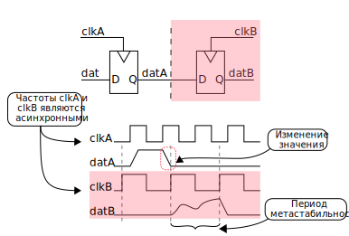
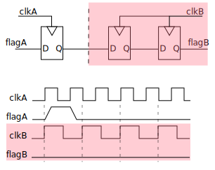
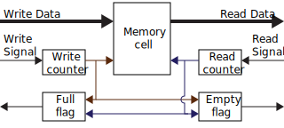
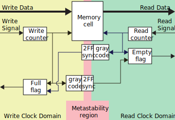

# WIP - TODO

- Работа с PLL Vivado
- Индивидуальные задания
- Вопросы

# Лабораторная работа 7. PLL, пересечение доменов тактовых частот

## PLL

PLL (Phase Locked Loop) или ФАПЧ (фазовая автоподстройка частоты) - это блок для генерации произвольной частоты на основе заданного опорного сигнала.
Блоки PLL применяются повсеместно как в цифровой технике, так и в радиотехнике. 

В цифрой схемотехнике, PLL чаще всего применяют для того, что бы из низкой опорной частоты, получить высокую промежуточную частоту, из которой можно вывести необходимые в схеме частоты.

PLL состоит из следующих основных элементов:

- Входной делитель Q
- Фазовый детектор
- Фильтр (интегратор)
- ГУН – генератор управляемый напряжением (англ. VCO – Voltage Controlled Oscillator)
- Делитель обратной связи P
- Выходной делитель N


Разберем выше перечисленные компоненты.

ГУН – является ключевым элементом в ФАПЧ, но в своей сути, является достаточно простым элементом.
Данный элемент, при подаче на него напряжения, выдает некоторую частоту.
Как правило, чем выше управляющее напряжение, тем выше выходная частота.


Фазовый детектор – компонент, который сравнивает сигнал с петли обратной связи с опорной частотой. 
На выходе детектора имеем два сигнала: положительного напряжения “lag” и отрицательного “lead”.
В период, когда ГУН отстает от опорной частоты, возводится сигнал “lag”
В момент, когда ГУН опережает фазу опорной частоты, возводится сигнал “lead”


Фильтр-интегратор – блок, формирующий управляющее напряжение для ГУН. 
В момент, когда появляется сигнал “lag”, управляющее напряжение увеличивается. 
В момент, когда приходит сигнал “lead”, управляющее напряжение уменьшается.


Делители выполняют следующие функции:
- Входной делитель Q, необходим для приведения входной частоты в рабочий диапазон фазового детектора. Чем выше частота, поступающая на фазовый детектор, тем меньше время включения и джиттер, но тем выше энергопотребление.
- Делитель обратной связи P, контролирует коэффициент, на который увеличивается выходная частота из ГУН относительно опорной. Увеличение данного делителя, уменьшает фазовый шум, но увеличивает джиттери энергопотребление.
- Выходной делитель N, позволяет уменьшить выходную частоту ГУН до необходимой рабочей частоты. Так же увеличение коэффициента деления N позволяет уменьшить выходной фазовый шум.


### Работа с PLL в Vivado

<details>

<summary>Work in progress</summary>

```verilog
PLLE2_BASE #(
    .BANDWIDTH("OPTIMIZED"),  // OPTIMIZED, HIGH, LOW
    .CLKFBOUT_MULT(5),        // Multiply value for all CLKOUT, (2-64)
    .CLKFBOUT_PHASE(0.0),     // Phase offset in degrees of CLKFB, (-360.000-360.000).
    .CLKIN1_PERIOD(33.333),   // Input clock period in ns to ps resolution (i.e. 33.333 is 30 MHz).
    // CLKOUT0_DIVIDE - CLKOUT5_DIVIDE: Divide amount for each CLKOUT (1-128)
    .CLKOUT0_DIVIDE(1),
    .CLKOUT1_DIVIDE(1),
    .CLKOUT2_DIVIDE(1),
    .CLKOUT3_DIVIDE(1),
    .CLKOUT4_DIVIDE(1),
    .CLKOUT5_DIVIDE(1),
    // CLKOUT0_DUTY_CYCLE - CLKOUT5_DUTY_CYCLE: Duty cycle for each CLKOUT (0.001-0.999).
    .CLKOUT0_DUTY_CYCLE(0.5),
    .CLKOUT1_DUTY_CYCLE(0.5),
    .CLKOUT2_DUTY_CYCLE(0.5),
    .CLKOUT3_DUTY_CYCLE(0.5),
    .CLKOUT4_DUTY_CYCLE(0.5),
    .CLKOUT5_DUTY_CYCLE(0.5),
    // CLKOUT0_PHASE - CLKOUT5_PHASE: Phase offset for each CLKOUT (-360.000-360.000).
    .CLKOUT0_PHASE(0.0),
    .CLKOUT1_PHASE(0.0),
    .CLKOUT2_PHASE(0.0),
    .CLKOUT3_PHASE(0.0),
    .CLKOUT4_PHASE(0.0),
    .CLKOUT5_PHASE(0.0),
    .DIVCLK_DIVIDE(1),        // Master division value, (1-56)
    .REF_JITTER1(0.0),        // Reference input jitter in UI, (0.000-0.999).
    .STARTUP_WAIT("FALSE")    // Delay DONE until PLL Locks, ("TRUE"/"FALSE")
) PLLE2_BASE_inst (
    // Clock Outputs: 1-bit (each) output: User configurable clock outputs
    .CLKOUT0(),   // 1-bit output: CLKOUT0
    .CLKOUT1(),   // 1-bit output: CLKOUT1
    .CLKOUT2(),   // 1-bit output: CLKOUT2
    .CLKOUT3(),   // 1-bit output: CLKOUT3
    .CLKOUT4(),   // 1-bit output: CLKOUT4
    .CLKOUT5(),   // 1-bit output: CLKOUT5
    // Feedback Clocks: 1-bit (each) output: Clock feedback ports
    .CLKFBOUT(),  // 1-bit output: Feedback clock
    .LOCKED(),    // 1-bit output: LOCK
    .CLKIN1(),    // 1-bit input: Input clock
    // Control Ports: 1-bit (each) input: PLL control ports
    .PWRDWN(),    // 1-bit input: Power-down
    .RST(),       // 1-bit input: Reset
    // Feedback Clocks: 1-bit (each) input: Clock feedback ports
    .CLKFBIN()    // 1-bit input: Feedback clock
);
```


>> Вызов из TCL

</details>

## CDC - Clock Domain Crossing | Пересечение частотных доменов

### Метастабильность

Метастабильность – это явления, при котором сигнал, в определенный момент времени не принимает стабильного состояния 0 или 1 в течение какого-то периода.
В проектах, которые имеют несколько частотных доменов, невозможно избежать метастабильности, но можно значительно уменьшить вероятность пагубного влияния данного явления.

На рисунке ниже показан пример метастабильности.
В этом примере можно увидеть, что триггер по частоте clkB захватывает значение, которое еще не успело установиться, в результате его выход становится метастабильным.



Основная проблема заключается не в том, что выход триггера стал метастабильным.
Как уже было сказано выше, этого невозможно избежать.
Проблема находится дальше, выход триггера может идти на комбинационные элементы и дальше распространятся по устройству, в результате чего логика устройства может повести не корректно.  

### CDC - передача сигнала

В ситуации, когда надо перенести сигнал из одного частотного домена в другой, и при этом сигнал не изменяется часто или допускается “пропустить” его изменения, то можно воспользоваться простейшим пересинхронизатором из двух триггеров.

На рисунке ниже изображен 2-ух стадийный пересинхронизатор.
На первой стадии, триггер захватывает значение, а затем ожидаем один такт, что бы установившееся передать на вторую стадию.
Сигнал на выходе второй стадии уже будет устоявшимся.


<details>
<summary>Реализация на SystemVerilog</summary>

```verilog
module ff2_synchroniser (
    input  logic clkB_i,
    input  logic datA_i,
    output logic datB_o
);

    //Clock domain B

    logic [1:0] syncB;

    always_ff @(posedge clkB_i) begin
        syncB <= {syncB[0], datA_i};
    end

    assign datB_o = syncB[1];

endmodule
```
</details>

Но теоретически все еще остается вероятность, что сигнал на выходе первого триггера все еще будет не установившимся, в этом случае выход второго триггера так же будет метастабильным.
На эту вероятность влияет множество факторов такие как: скорость работы схемы, частота изменения данных и технология, которая применяется в устройстве.
Если же в результате расчётов, эта вероятность остается слишком высокой, можно увеличить количество стадий в пересинхронизаторе.

### CDC - передача флага

Рассмотренный в предыдущем пункте пересинхронизатор не подходит для задач пересинхронизации флагов (сигналов длительностью один такт) с быстрой частоты на более медленную.
На рисунке ниже как изображен пример такой ситуации, пересинхронизатор работающий на частоте clkB, пропустил изменения сигнала flagA.



В этом случае, необходимо задачу передачи флага, преобразовать в задачу изменения уровня сигнала, которую мы уже знаем, как решать.
На рисунке ниже изображен как раз таки такой пересинхронизатор. Флаг flagA он преобразовывает в изменение уровня сигнала datA, а уже на принимающей стороне это изменения уровня снова преобразовывается в сигнал, длинной один такт.


<details>
<summary>Реализация на SystemVerilog</summary>

```verilog
module ff2_synchroniser_flag (
    input  logic clkA_i,
    input  logic clkB_i,
    input  logic datA_i,
    output logic datB_o
);

    //Clock domain A

    logic toggleA;

    always_ff @(posedge clkA_i) toggleA <= toggleA ^ datA_i;

    //Clock domain B

    logic [2:0] syncB;

    always_ff @(posedge clkB_i) syncB <= {syncB[1:0], toggleA};

    assign datB_o = ^syncB[2:1];

endmodule
```
</details>

Но как можно заметить из временной диаграммы, мы не можем каждый такт clkA передавать флаг, так как иначе схема будет работать не правильно.
Для этого, можно внедрить сигнал занятости (busy), который будет показывать, что передача флага все еще в процессе.
Это поможет логике в частотном домене A правильно передавать флаг, чтобы не нарушить работу устройства.
На рисунке ниже изображен пример реализации такого пересинхронизатора, в нем мы берем значение из последней стадии пересинхронизации в частотном домене B и возвращаем обратно в домен A.


<details>
<summary>Реализация на SystemVerilog</summary>

```verilog
module ff2_synchroniser_flag_busy (
    input  logic clkA_i,
    output logic busyA_o,
    input  logic clkB_i,
    input  logic datA_i,
    output logic datB_o
);

    //Clock domain A

    logic       toggleA;
    logic [1:0] syncBusyA;

    always_ff @(posedge clkA_i) toggleA <= toggleA ^ datA_i;
    always_ff @(posedge clkA_i) syncBusyA <= {syncBusyA[0], syncB[2]};

    assign busyA_o = syncBusyA[1] ^ toggleA;

    //Clock domain B

    logic [2:0] syncB;

    always_ff @(posedge clkB_i) syncB <= {syncB[1:0], toggleA};

    assign datB_o = ^syncB[2:1];

endmodule
```
</details>

### CDC - шины данных

Во время пересечения частотных доменов группой сигналов, очень часто можно забыть, что сигналы должны быть не только доставлены в другой частотный домен, но и считаны одновременно.
Проблема заключается в том, что сигналы в группе могут иметь небольшие различия в задержке между ними.
Это различие в задержке может повлиять на значение, которое будет захвачено в другом частотном домене.
В результате чего, в другом домене, будет считано не верное значение.

Для того, что бы успешно пересечь частотные домены группой сигналов, мы можем применить один из следующих приемов:
- Код Грея
- Заморозка данных на шине
- Асинхронное FIFO

### CDC - код Грея

В случае, если данные, которые необходимо передать, изменяются монотонно (увеличиваются или уменьшаются на одно и то же значние), то можно применить код Грея.

Главной особенностью кода Грея является то, что соседние коды отличаются только в одном разряде.
Эта особенность позволяет использовать простейшие пересинхронизаторы для пересечения частотных доменов.


Так же код Грея очень просто преобразуются в бинарное значения и обратно.

```verilog
module bin2grey (
    input  logic [3:0] bin_i,
    output logic [3:0] grey_o,
);

    assign grey_o = (bin_i >> 1) ^ bin_i;

endmodule

module grey2bin (
    input  logic [3:0] grey_i,
    output logic [3:0] bin_o,
);

    assign bin_o[3] =  grey_i[3];
    assign bin_o[2] = ^grey_i[3:2];
    assign bin_o[1] = ^grey_i[3:1];
    assign bin_o[0] = ^grey_i[3:0];

endmodule
```

### CDC - заморозка данных на шине

В случае же, если данные не монотонные, и нет необходимости в передаче большого потока информации, данные можно "заморозить" и предать в другой частотный домен флаг об их готовности.


Данный способ не требует установки дополнительных регистров для пересинхронизации данных, так как к моменту, когда появится разрешающий сигнал, значения на шине данных уже стабилизируются.
Но при описании CDC файла, необходимо указать, что данные на шине передаются несколько тактов (Multicycle Path, MCP), что бы корректно проходил STA.

### CDC - асинхронное FIFO

В ситуациях, когда есть поток данных, который должен пересечь частотный домен, можно применить асинхронное FIFO.

Если вспомнить структуру синхронного FIFO. То можно выделить следующие основные компоненты:
- Двухпортовая память
- Счетчики позиций записи и чтения
- Логика для сигналов “Full” и “Empty”



Основная проблема в этой схеме, что сигналы “Full” и “Empty” используют оба счетчика.
В асинхронном FIFO порт записи и порт чтения используют разные частотные домены.
Следовательно, проблема заключается в синхронизации значений счетчиков.



Для решения этой проблемы, мы можем применить выше описанные методы.
Для этого значения счетчиков будет закодировано кодом Грея, так как значения монотонно изменяются. 
А затем при помощи простейшего пересинхронизатора мы можем пересечь частотный домен и декодировать значение обратно.
Пересекать частоты, придется два раза, для значения указателя записи и для указателя чтения.


## Индивидуальные задания

## Вопросы

