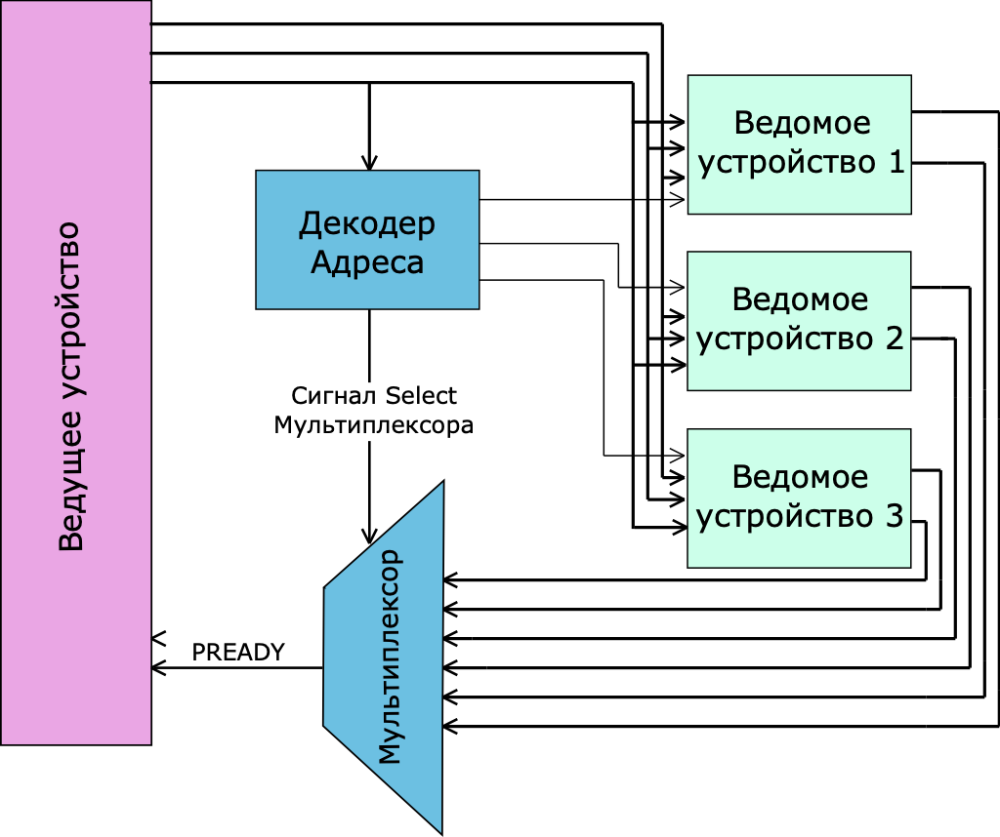
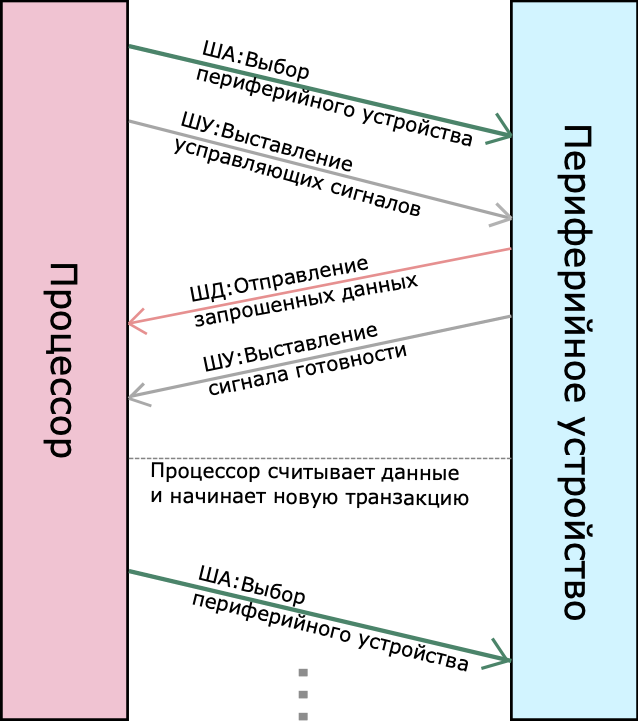
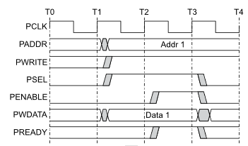

# Лабораторная работа 8. Системные шины.

## Системная шина

**Системная шина (system bus)** -- совокупность сигнальных линий, служащих для обмена информацией между элементами системы на кристалле или на печатной плате.  Сигналы системной шины в зависимости от назначения можно разделить на три группы. Линии системной шины, отвечающие за передачу данных, называется шиной данных. Линии, передающие адрес, называются шиной адреса, а прочие управляющие сигналы -- шиной управления.
Как было замечено ранее, основной функцией системной шины является обмен информацией. В простейшем случае происходит обмен информацией между одним процессорным ядром и множеством контроллеров. Обобщённая структурная схема подключения процессора и контроллеров к системной шине показана на рисунке.


На рисунке ниже приведена диаграмма обобщенной конструкции системной шины.





Существует ряд терминов, которые обычно используются в спецификациях шин для систем на кристалле.

 - **Ведущее устройство (Master)** -- устройство, которое инициирует передачу данных для чтения или записи по системной шине (например, процессор или ЦОС-процессор).
 - **Ведомое устройство (Slave)** -- устройство, которое не инициирует обмен данными и отвечает только на входящие запросы на передачу.
 - **Декодер** относится к логическому блоку, который дешифрует адрес назначения передачи данных, инициированной ведущим устройством, и выбирает соответствующее ведомое устройство для приема данных.
 - **Мультиплексор** используется для мультиплексирования шины считанных данных и ответных сигналов от подчиненных устройств к ведущему. Декодер обеспечивает управление мультиплексором.


Теперь вы знаете, что такое системная шина, ее обобщенную организацию и основные термины, относящееся к понятию системная шина. Реализация СнК невозможна без системной шины. Однако действительно ли использование стандартизированных системной шины оправдано? Да, использование стандартизированных системных шин имеет ряд преимуществ, среди которых:

- Существует огромное количество IP-блоков, которые мы можем подключить в проект, который использует стандартизированную системную шину, без изменения исходных файлов IP-блока;
- Масштабируемость проекта -- возможность с легкостью подключать новые IP-блоки или даже несколько одинаковых;
- Простота ПО для систем со стандартизированными системными шинами, так как организация адресного пространства таких шин достаточно прямолинейна.


Операции чтения и записи на системной шине называются транзакциями.  Существует три вида транзакций, каждая из которых используется в определенных стандартах системных шин, в зависимости от назначения:


- Single


- Pipeline


- Burst


Транзакции отличаются скоростью передачи данных, сложностью арбитража и реализацией. Pipeline является промежуточным вариантом между двумя другим и используется для повышения производительности. Burst транзакция используется для обмена большим количеством данных, например для передачи данных во внешнюю память.


Рассмотрим пример транзакции по системной шине:

1. Ведущее устройство выбирает одно периферийное устройство и назначает адрес системной шине. В то же время он устанавливает на шину управляющие сигналы (например, сигнал чтения);
2. Ведущее устройство ожидает ответа ведомого устройства (например, периферийного устройства).
3. Как только ведомое устройство готово, оно отправляет запрошенные данные ведущему устройству. Одновременно ведомое устройство устанавливает сигнал готовности на шине управления.
4. Наконец, мастер считывает переданные данные и может инициировать следующую транзакцию.





## Классификация системных шин и существующие стандарты


Используемые в настоящее время шины отличаются по:
- **Разрядности** (8, 16, 32, 64 бит). Чем больше разрядность шины, тем больше информации может быть передано за один цикл чтения или записи по каналу. Разрядность шины адреса можно определять независимо от разрядности шины данных. Разрядность шины адреса показывает, сколько ячеек памяти можно адресовать при передаче данных.
- **Способу передачи сигнала** (последовательные или параллельные)
- **Пропускной способности**. Ширина полосы пропускания называется также пропускной способностью и показывает общий объем данных, который можно передать по шине за данную единицу времени.
- Шины могут быть **синхронными** (осуществляющими передачу данных только по тактовым импульсам) и **асинхронными** (осуществляющими передачу данных в произвольные моменты времени).

Далее рассмотрим существующие стандарты системных шин.

**Advanced Microcontroller Bus Architecture (AMBA)** -- это открытый стандарт требований к внутрикристальным межсоединениям для соединения и управления функциональными блоками в системах на кристалле. Она облегчает развитие многопроцессорных разработок с большим числом контроллеров и периферии. Несмотря на название, с самого своего начала, AMBA имела виды, уходящие далеко за границы микроконтроллерных устройств. Сегодня AMBA широко применяется в ряде частей ASIC и SoC, включая прикладные процессоры, применяемые в современных небольших переносных устройствах вроде смартфонов.

Существует несколько разновидностей стандарта AMBA. На рисунке ниже представлены первые 4 стандарта AMBA.


В таблице представлены наиболее популярные шины стандартов AMBA.

| Стандарт | Шина | Описание |
| --- | --- | --- |
| **AMBA1** | Advanced System Bus (ASB) | ASB -- это первое поколение системной шины AMBA. ASB реализует функции, необходимые для высокопроизводительных систем, включая: пакетные передачи, конвейерные передачи, режим мульти-мастера (Возможность более 1 ведущего устройства). В качестве ведущих устройств могут быть, например, процессорное ядро, ЦОС-процессор. В качестве ведомых устройств мост APB, устройства памяти, а также любые другие. Однако периферийные устройства с низкой пропускной способностью обычно находятся на шине APB |
| **AMBA1, AMBA2, AMBA3, AMBA4** | Advanced Peripheral Bus (APB, APB2, APB3, APB4) | APB является частью иерархии шин AMBA и оптимизирована для минимального энергопотребления и снижения сложности интерфейса. APB выглядит как локальная вторичная шина, которая инкапсулирована как одно ведомое устройство AHB или ASB. Мост APB выглядит как подчиненный модуль, который обрабатывает передачу управляющих сигналов от имени локальной периферийной шины. APB следует использовать для взаимодействия с любыми периферийными устройствами, которые имеют низкую пропускную способность и не требуют высокой производительности интерфейса конвейерной шины. |
| **AMBA2, AMBA5** | Advanced High-performance Bus (AHB, AHB5) | AHB -- это шина второго поколения шин AMBA, предназначенная для удовлетворения требований высокопроизводительных синтезируемых конструкций. Это высокопроизводительная системная шина, которая поддерживает несколько ведущих устройств шины и обеспечивает работу с высокой пропускной способностью. AHB реализует функции, необходимые для высокопроизводительных систем с высокой тактовой частотой, включая: пакетные передачи, разделенные транзакции, однотактная процедура арбитража мастеров, реализация передачи без третьего состояния и более широкие конфигурации шины данных (64/128 бит). Мостовое соединение между этим более высоким уровнем шины и текущим ASB / APB может быть эффективно выполнено, чтобы обеспечить простую интеграцию любых существующих конструкций.  Широко применяется в разработках, основанных на ARM7, ARM9 и ARM Cortex-M.  |
| **AMBA3, AMBA5** | Advanced High-performance Bus Lite (AHB-Lite) | AHB-Lite отвечает требованиям высокопроизводительных синтезируемых конструкций. Это интерфейс шины, который поддерживает одного мастера шины и обеспечивает работу в широкой полосе пропускания, отсутствует арбитраж. AHB-Lite реализует функции, необходимые для высокопроизводительных систем с высокой тактовой частотой, в том числе: пакетные передачи, реализация без синхронизации, широкие конфигурации шины данных, 64, 128, 256, 512 и 1024 бит. Наиболее распространенными ведомыми устройствами AHB-Lite являются устройства внутренней памяти, интерфейсы внешней памяти и периферийные устройства с высокой пропускной способностью. Хотя периферийные устройства с низкой пропускной способностью могут быть включены в качестве ведомых устройств AHB-Lite, по соображениям производительности системы они обычно находятся на APB. Мостовое соединение между этим более высоким уровнем шины и APB выполняется с использованием ведомого устройства AHB-Lite, известного как мост APB. |
| **AMBA3, AMBA4** | Advanced Extensible Interface (AXI3, AXI4) | Протокол AXI поддерживает высокопроизводительные высокочастотные системы. Протокол AXI подходит для широкополосных сетей и систем с низкой задержкой, обеспечивает высокочастотную работу без использования сложных мостов, отвечает требованиям интерфейса широкого диапазона компонентов, подходит для контроллеров памяти с высокой начальной задержкой доступа, обеспечивает гибкость в реализации архитектур межсоединений, имеет обратную совместимость с существующими интерфейсами AHB и APB. Основные характеристики протокола AXI: отдельный адрес / управление и данные фазы, поддержка передачи данных без выравнивания с использованием байтовых стробов, использует пакетные транзакции только с выданным начальным адресом, отдельные каналы чтения и записи данных, которые могут обеспечить недорогой прямой доступ к памяти (DMA), поддержка выдачи нескольких ожидающих адресов, поддержка завершения транзакции вне порядка. Широко применяется в процессорах ARM Cortex-A, включая Cortex-A9. |
| **AMBA4** | Advanced Extensible Interface 4 Lite (AXI4-Lite) | Протокол AXI включает в себя спецификацию AXI4-Lite, подмножество AXI4 для связи с более простыми интерфейсами управления внутри компонентов, которые не требуют полной функциональности AXI4. Основные функциональные возможности AXI4-Lite: все транзакции имеют длину пакета 1, все обращения к данным используют полную ширину шины данных -- AXI4-Lite поддерживает ширина шины данных 32-битная или 64-битная, все обращения не изменяются, не буферизируются, исключительные обращения не поддерживаются. |
| **AMBA4** | AXI Coherency Extensions (ACE) | Протокол ACE расширяет протокол AXI4 дополнительным средством оповещения передач широкой когерентности и обеспечивает поддержку аппаратно-согласованных кэшей. Это средство когерентности позволяет множеству процессоров разделять память. Протокол ACE обеспечивает: Барьерные транзакции, которые гарантируют упорядочение транзакций в системе, функциональность распределенной виртуальной памяти для управления виртуальной памятью. |
| **AMBA4** | AXI Coherency Extensions Lite (ACE-Lite) | Интерфейс ACE-Lite является подмножеством полного интерфейса ACE. ACE-Lite используется ведущими компонентами, которые не имеют аппаратных когерентных кэшей. Lite состоит из интерфейса AXI4 с дополнительными сигналами на канале чтения адреса и канале записи адреса. ACE-Lite не включает в себя: адресный канал snoop, канал ответа snoop , сигнал подтверждения чтения, сигнал подтверждения записи, любые дополнительные биты ответа чтения. |
| **AMBA4** | Advanced Extensible Interface 4 Stream (AXI4-Stream v1.0) | Протокол AXI4-Stream используется в качестве стандартного интерфейса для подключения компонентов, которые хотят обмениваться данными. Интерфейс может использоваться для подключения одного ведущего устройства, которое генерирует данные, к одному подчиненному устройству, которое получает данные. Протокол также можно использовать при подключении большего количества основных и подчиненных компонентов. Протокол поддерживает несколько потоков данных, используя один и тот же набор общих проводов, что позволяет создать общее межсоединение, которое может выполнять операции увеличения, уменьшения размера и маршрутизации. Интерфейс AXI4-Stream также поддерживает широкий спектр различных типов потоков. Потоковый протокол определяет связь между передачами и пакетами. |

Сегодня эти протоколы являются де-факто стандартными для встраиваемых процессоров, поскольку они хорошо описаны и могут применяться без лицензионных отчислений.


Еще одним из популярных на текущий день стандартов является **Wishbone**. Шина Wishbone -- параллельная  шина для объединения модулей в системе на кристалле. Шина описана в открытой спецификации, и широко используется в проектах цифровых систем с открытым исходным кодом на сайте OpenCores.org. Стандарт допускает присутствие нескольких ведущих устройств в системе, а также различные топологии соединения модулей.

Общие характеристики:
- ширина шин адреса и данных: 8, 16, 32, 64 бит;
- тип шины: параллельная;
- внутренняя шина, используется только для соединения модулей на кристалле.


## Адресное пространство системы на кристалле


При подключении различных периферийных устройств к системной шине возникает вопрос, каким образом различать эти контроллеры между собой? Решением данной проблемы является присвоение индивидуального диапазона адресов каждому из контроллеров. Таким образом, взаимодействие процессора с конкретным контроллером происходит посредством обращения по адресам заданного диапазона.


Весь доступный диапазон адресов называется **адресным пространством** (Memory Map) системы на кристалле, а диапазон адресов, выделенный для отдельно взятого контроллера, -- адресным пространством контроллера. **Базовым адресом контроллера** называется адрес начала выделенного диапазона. Структурная схема адресного пространства системы на кристалле приведена на рисунке.


Адресное пространство, выделенное под каждое периферийное устройство, определяется его стартовым (базовым) адресом и размером адресного пространства.  Для обмена данными в периферийном устройстве (контроллере или вычислительном блоке) существует набор регистров, каждый из которых имеет уникальный адрес. Регистры адресуются относительно стартового адреса. Абсолютный адрес регистра в адресном пространстве системы на кристалле определяется как сумма базового адреса периферийного устройства и смещения (относительного адреса).


Так как архитектура RISC-V является load-store архитектурой, то для обращения к ячейке адресного пространства используются инструкции load и store для загрузки данных в регистры процессора и записи данных из регистра в ячейку памяти соответственно.


Следует отметить, что в RISC-V используется побайтовая адресация. Так как шина данных является 32-разрядной, то при обращении по адресу ноль происходит считывание или запись первых четырех байт (0,1,2,3). Этот факт необходимо учитывать при проектировании вычислительных блоков и при назначении регистрам адресов.

## Системная шина APB


В нашей системе на кристалле мы используем системную шину **APB (Advanced Peripheral Bus)**.


> Ознакомиться со спецификацией системной шины APB можно по ссылке: https://web.eecs.umich.edu/~prabal/teaching/eecs373-f12/readings/ARM_AMBA3_APB.pdf

Шина APB -- это часть семейства шин AMBA 3 фирмы ARM. Она представляет собой универсальный интерфейс для подключения периферийных устройств.


На рисунке ниже представлена диаграмма системной шины APB. Декодер управляется ведущим устройством, которое выставляет на системную шину адрес одного из ведомых устройств. По адресу декодер определяет, какое из устройств выбрано для обмена данными и формирует сигнал *PSEL*. Декодер формирует сигнал *Select* для мультиплексора, который указывает, данные какого из ведомых устройств должны быть выставлены на системную шину.


Передача данных по шине APB состоит из двух фаз: фазы адреса и фазы данных. Фаза адреса всегда занимает один такт шины, а фаза данных может содержать состояния ожидания и длиться несколько тактов. Простейший цикл записи без состояний ожидания происходит следующим образом. В фазе адреса по нарастающему фронту тактового сигнала *PCLK* ведущее устройство устанавливает следующие сигналы:

- адрес ведомого устройства *PADDR*;
- сигнал записи *PWRITE* (активный уровень -- высокий);
- сигнал выбора устройства *PSEL* (активный уровень -- высокий);
- данные для записи *PWDATA*.



Состояния этих сигналов сохраняются и в фазе данных. По второму фронту тактового сигнала устанавливается сигнал *PENABLE* (активный уровень -- высокий). Это означает начало фазы записи данных. До следующего такта ведомое устройство должно установить сигнал *PREADY* (активный уровень -- высокий) и принять передаваемые данные. Получив сигнал *PREADY*, ведущее устройство по третьему такту снимает сигнал *PENABLE*. Сигнал выбора *PSEL* при этом также снимается, даже если следующее обращение будет происходить к тому же самому устройству. На этом цикл записи заканчивается.

Периферийное устройство может задержать окончание цикла записи. Для этого оно должно при активном сигнале *PENABLE* не устанавливать сигнал *PREADY* до тех пор, пока не закончит прием данных. В таком случае цикл записи закончится по первому фронту тактового сигнала, на котором будет обнаружен активный уровень *PREADY*.


Временные диаграммы циклов чтения без состояний ожидания и с ними выглядят похоже. Первое отличие состоит в том, что в фазе адреса сигнал *PWRITE* имеет низкий уровень. В этом случае при активном уровне сигнала *PENABLE* ведомое устройство должно выставить данные на линиях чтения *PRDATA*, сопровождая их активным уровнем сигнала *PREADY*. Если периферийное устройство хочет задержать цикл чтения, оно должно снять сигнал *PREADY* при высоком уровне сигнала *PENABLE*. Тогда ведущее устройство перейдет в состояние ожидания до тех пор, пока не получит активного уровня сигнала *PREADY*.

На рисунке ниже показана временная диаграмма чтения без состояния ожидания.


На рисунке ниже показана временная диаграмма чтения с ожиданием.


В таблице представлены сигналы системной шины APB:


| **Имя сигнала** | **Описание** |
| --- | --- |
| **PCLK** | Тактовая частота. Все действия по шине APB происходят по переднему фронту сигнала PCLK. |
| **PRESETn** | Сброс. Активный уровень сигнала -- низкий. |
| **PADDR** | Шина адреса. Может иметь разрядность до 32 бит. Поступает от ведущего устройства. |
| **PSEL** | Выбор. Ведущее устройство вырабатывает этот сигнал отдельно для каждого периферийного устройства. Этот сигнал показывает, что ведомое устройство выбрано для обмена данными. |
| **PENABLE** | Разрешение работы. Этот сигнал указывает второй и следующие такты передачи по APB(фаза данных). |
| **PWRITE** | Направление. Высокий уровень сигнала указывает на цикл записи данных в периферийное устройство, а низкий -- цикл чтения из периферийного устройства. |
| **PWDATA** | Шина данных для записи. Может иметь разрядность до 32 бит. |
| **PREADY** | Сигнал готовности периферийного устройства. |
| **PRDATA** | Шина данных для чтения. Может иметь разрядность до 32 бит. |
| **PSLVERR** | Ошибка передачи. Периферийные устройства не обязаны его поддерживать. Если сигнал не используется, то не соответствующий вход ведущего устройства подается низкий уровень. |


## Проектирование аппаратного вычислителя на шине APB

Постановка задачи: спроектировать аппаратный вычислитель с подключением по системной шине APB. Для примера рассмотрим проектирование вычислителя контрольной суммы CRC8. Для каких целей может потребоваться такой блок? Например, если устройство, в состав которого входит вычислитель, должно в режиме реального времени принимать массивы данных и проверять их целостность. Тогда полученный массив данных отправляется на блок CRC8, в котором происходит вычисление и далее через механизм прямого доступа к памяти записывается в память. Таким образом, можно проверять целостность данных, не затрачивая при этом процессорное время, как при использовании программных реализаций алгоритма.


Вычислитель должен принимать на вход данные по системной шине, от которых он вычисляет контрольную сумму и по сигналу чтения выдавать на выходную шину данных значение CRC8. Обобщенная структурная схема вычислителя CRC8, подключенного по шине APB приведена на рисунке ниже.


Вычислитель состоит из двух частей: модуля, реализующего непосредственно сам алгоритм CRC8 и модуля-оболочки, в который подключается модуль-вычислитель контрольной суммы. Также модуль-оболочка содержит в себе логику управления системной шиной.


Рассмотрим подробнее механизм управления обмена информацией по системной шине, который реализует модуль-оболочка. Как было сказано ранее, каждому из периферийных устройств выделено свое адресное пространство с базовым адресом. При подключении вычислителя в проект его будет нужно указать, а пока необходимо разобраться с адресацией внутри адресного пространства вычислителя. Ранее было рассказано про смещения, относительно базового адреса, которые определяют абсолютные адреса регистров.


$$ Addr_{reg}=Addr_{base}+O\!f\!f\!set_{reg}, $$

где $Addr_{base}$ -- базовый адрес контролера, а $O\!f\!f\!set_{reg}$ -- смещение относительно базового адреса.

Регистры вычислительного блока хранят в себе данные, которые потребуются для считывания или записанные данные. Какие регистры могут потребоваться для данного вычислителя? В самом базовом случае это будет регистр для записи данных для вычисления и регистр для считывания значения CRC. Таким образом получается два регистра, а значит два адреса, каждый из которых будет иметь свое уникальное смещение. В системе используется 32-разрядная системная шина и побайтовая адресация, поэтому необходимо использовать адреса кратные 4, чтобы покрывать пословно адресное пространство.


## Реализация вычислителя CRC8


Для примера рассмотрим проектирование вычислителя контрольной суммы CRC8. В данном вычислительном блоке будет модуль, реализующий алгоритм CRC8, а также модуль-оболочка.

Начнем с проектирования модуля, реализующего алгоритм CRC8 (Заданный порождающий полином: $g(x) = x^8 + x^5 + x^4 + 1$).

На вход модуля поступают:
- сигнал тактирования *clk_i*;
- сигнал сброса *rst_i*;
- сигнал валидности данных *data_valid_i*;
- входная шина данных *din_i*;
- сигнал запроса на чтение *crc_rd* вычисленного значения CRC8 по шине *crc_o*. Разрядность данных была выбрана равной 8 бит.

Работа модуля построена по принципу работы конечного автомата с 3 состояниями:

| **Состояние** | **Описание** |
| --- | --- |
| **IDLE** | Состояние бездействия. Ожидание сигнала валидности данных или запроса на считывание CRC8. |
| **BUSY** | Состояние вычисления CRC8. |
| **READ** | Состояние считывания значения CRC8. |


*сrc_counter* - счетчик для расчёта количества бит входного байта данных, обработанных алгоритмом вычисления контрольной суммы CRC8.

Код модуля-вычислителя с комментариями приведен в листинге кода ниже.


```verilog
module crc8
(
  input  logic       clk_i,
  input  logic       rst_i,
  input  logic [7:0] din_i,
  input  logic       data_valid_i,
  input  logic       crc_rd,
  output logic [7:0] crc_o
);

  // Параметры для состояний автомата
  localparam IDLE = 2'b00;
  localparam BUSY = 2'b01;
  localparam READ = 2'b10;

  logic [1:0] state_ff;         // Регистр состояний
  logic [7:0] data_current_ff;  // Текущие данные (сдвиговый регистр)
  logic [3:0] crc_counter_ff;   // Регистр счетчик обработанных бит входного байта данных для состояния вычисления
  logic [7:0] crc_ff;           // Выходные данные CRC

  always_ff @(posedge clk_i)
  begin
    if (rst_i) begin // Сигнал сброса - обнуляем все регистры
      state_ff         <= IDLE;
      data_current_ff  <= 8'b0;
      crc_ff           <= 8'b0;
      crc_counter_ff   <= 4'd0;
    end
    else begin
      case (state_ff)
        IDLE:
          begin
            crc_counter_ff <= 4'b0;
            if (data_valid_i) // Если пришли новые данные - переходим
                                    // в состояние вычисления
            begin
              state_ff        <= BUSY;
              data_current_ff <= din_i;
            end
            else if (crc_rd)
              state_ff <= READ; // Если пришел запрос на чтение - переходим в состояние чтения
          end
        BUSY:
          begin
            crc_ff[7] <=  crc_ff[0]^data_current_ff[0];
            crc_ff[6] <=  crc_ff[7];
            crc_ff[5] <=  crc_ff[6];
            crc_ff[4] <=  crc_ff[5];
            crc_ff[3] <= (crc_ff[0] ^ data_current_ff[0])^ crc_ff[4];
            crc_ff[2] <= (crc_ff[0] ^ data_current_ff[0])^ crc_ff[3];
            crc_ff[1] <=  crc_ff[2];
            crc_ff[0] <=  crc_ff[1];

            data_current_ff <= {1'b0,data_current_ff[7:1]};
            crc_counter_ff  <= crc_counter_ff+ 1'b1;

            if(crc_counter_ff == 4'b0111)
              state_ff <= IDLE;
          end
        READ:
          begin
            crc_ff   <= 8'b0;
            state_ff <= IDLE;
          end
      endcase
    end
  end

  assign crc_o = crc_ff;

endmodule

```


Следующим шагом является написания модуля-оболочки.
Так как реализуется контроллер, совершающий обмен данными по интерфейсу APB с 32-разрядной шиной в заголовке необходимо указать все сигналы интерфейса. Фрагмент кода, содержащий заголовок модуля оболочки приведен в листинге ниже.


```verilog
module wrapper_crc8
(
  input  logic        p_clk_i,
  input  logic        p_rstn_i,
  input  logic [31:0] p_dat_i,
  output logic [31:0] p_dat_o,
  input  logic        p_sel_i,
  input  logic        p_enable_i,
  input  logic        p_we_i,
  input  logic [31:0] p_adr_i,
  output logic        p_ready
);
```


Для подключения модуля-вычислителя CRC необходимо объявить logic, которые будут подключаться к выводам модуля. Фрагмент кода приведен в листинге ниже.

```verilog
logic [7:0] din_i; // Объявляем провода, которые будут подключаться к сигналам модуля
logic [7:0] crc_o;
logic       crc_rd;
logic       data_valid_i;

crc8
i_crc8
(
  .clk_i        (p_clk_i),  // При подключении модуля указываем имя и название модуля name module_name (...
  .rst_i        (!p_rstn_i), // Подключаем к каждому сигналу модуля провод .signal_name(wire_name), ...
  .din_i        (din_i),
  .data_valid_i (data_valid_i),
  .crc_rd       (crc_rd),
  .crc_o        (crc_o)
);
```

Ранее было определено, что в базовой реализации будут использоваться два адреса, для обмена данными по системной шине -- запись данных и чтение с адресами смещений 0 и 4 соответственно. Также необходимо генерировать строб *cs*, который будет определять фазу данных транзакции для того, чтобы считать данные с шины либо выставить данные на нее. Фрагмент кода приведен в листинге ниже.

```verilog
logic cs_1_ff;
logic cs_2_ff;

// Формирование строба cs цикла чтения или записи по системной шине
always_ff @ (posedge p_clk_i)
begin
  cs_1_ff <= p_enable_i & p_sel_i;
  cs_2_ff <= cs_1_ff;
end

logic cs;
assign cs = cs_1_ff & (~cs_2_ff);
```


Формирование выходных данных системной шины и данных на модуль-вычислитель показано на листинге ниже.


```verilog
// Формирование выходных данных системной шины
always_comb
begin //Для чтения crc используем адрес 1
  if (cs & (~p_we_i) & (p_adr_i[3:0] == 4'd4))
    p_dat_o <= {24'd0, crc_o};
end

// Формирование сигналов на модуль-вычислитель

//Для записи данных для расчета crc используем адрес 0
assign data_valid_i = (cs &  p_we_i & (p_adr_i[3:0] == 4'd0));

//Для записи данных для расчета crc используем адрес 0
assign din_i        = (cs & p_we_i & p_adr_i[3:0]  == 4'd0) ? p_dat_i[7:0]: 8'd0;

//Для чтения crc используем адрес 4
assign crc_rd = (cs & ~p_we_i & (p_adr_i[3:0] == 4'd4));
```


Формирование сигнала *p_ready* показано на листинге ниже.

```verilog
logic cs_ack1_ff;
logic cs_ack2_ff;

// Формирование сигнала готовности системной шины p_ready
always_ff @ (posedge p_clk_i)
begin
  cs_ack1_ff <= cs_2_ff;
  cs_ack2_ff <= cs_ack1_ff;
end

logic p_ready_ff;

always_ff @ (posedge p_clk_i)
begin
  p_ready_ff <= (cs_ack1_ff & (~cs_ack2_ff));
end
```


Как можно видеть в листингах выше, на выходную шину данных значение crc выставляется только тогда, когда пришел запрос на обмен данными (строб *cs*), сигнал операции чтения (*~p_we_i*) и совпадает адрес (*p_adr_i == 32'd4*).

Аналогично выполняется операция записи, с той лишь разницей, что сигнал *p_we_i* должен быть равен единице.

Запись по адресу 32'd0 показана на рисунке ниже.


Чтение по адресу 32’d4 показано на рисунке ниже.


Полный исходный код модуля wrapper_crc8 показан в листинге ниже.

```verilog
`timescale 1ns / 1ps

module wrapper_crc8
(
  input  logic        p_clk_i,
  input  logic        p_rstn_i,
  input  logic [31:0] p_dat_i,
  output logic [31:0] p_dat_o,
  input  logic        p_sel_i,
  input  logic        p_enable_i,
  input  logic        p_we_i,
  input  logic [31:0] p_adr_i,
  output logic        p_ready,
  output logic        p_slverr
);

  logic [7:0] din_i;
  logic [7:0] crc_o;
  logic [1:0] state;
  logic       crc_rd;
  logic       data_valid_i;

  assign p_slverr = 1'b0;

  crc8
  i_crc8
  (
    .clk_i        (p_clk_i),
    .rst_i        (!p_rstn_i),
    .din_i        (din_i),
    .data_valid_i (data_valid_i),
    .crc_rd       (crc_rd),
    .crc_o        (crc_o)
  );

  logic cs_1_ff;
  logic cs_2_ff;

  logic cs_ack1_ff;
  logic cs_ack2_ff;

  always_ff @ (posedge p_clk_i)
  begin
      cs_1_ff <= p_enable_i & p_sel_i;
      cs_2_ff <= cs_1_ff;
  end

  logic cs;
  assign cs = cs_1_ff & (~cs_2_ff);

  always_ff @ (posedge p_clk_i)
  begin
    cs_ack1_ff <= cs_2_ff;
    cs_ack2_ff <= cs_ack1_ff;
  end

  // Generating acknowledge signal
  logic p_ready_ff;

  always_ff @ (posedge p_clk_i)
  begin
    p_ready_ff <= (cs_ack1_ff & (~cs_ack2_ff));
  end

  assign p_ready = p_ready_ff;

  always_comb
  begin
    p_dat_o = '0;
    if (cs & (~p_we_i) & (p_adr_i[3:0] == 4'd4))
      p_dat_o = {24'd0, crc_o};
    else if (cs & (~p_we_i)& (p_adr_i[3:0] == 4'd8))
      p_dat_o = {24'd0, state};
  end

  assign data_valid_i = (cs & p_we_i & p_adr_i[3:0]  == 4'd0);
  assign din_i        = (cs & p_we_i & p_adr_i[3:0]  == 4'd0) ? p_dat_i[7:0]: 8'd0;
  assign crc_rd       = (cs & ~p_we_i & p_adr_i[3:0] == 4'd4);

endmodule
```

# Моделирование работы блока CRC8

Следующая задача состоит в том, чтобы проверить написанный нами вычислитель. Одним из инструментов верификации является моделирование. Для моделирования работы вычислителя или любого отдельного модуля и даже всей системы существуют специальные модули -- *testbench*. Testbench имитирует входные воздействия и подает их на проверяемый модуль.


Для проверки блока сымитируем две транзакции записи данных по системной шине и одну транзакцию чтения значения CRC8.


Для проверки блока необходимо подключить его в testbench (аналогичным образом, как и модуль-вычислитель в оболочку). Фрагмент кода приведен ниже.

```verilog
logic        p_clk_i;
logic        p_rstn_i;
logic [31:0] p_dat_i;
logic [31:0] p_dat_o;
logic        p_enable_i;
logic        p_sel_i;
logic        p_we_i;
logic [31:0] p_adr_i;
logic        p_ready;

wrapper_crc8
dut_wrapper_crc8
(
  .p_clk_i    (p_clk_i),
  .p_rstn_i    (),
  .p_dat_i    (p_dat_i),
  .p_dat_o    (p_dat_o),
  .p_enable_i (p_enable_i),
  .p_sel_i    (p_sel_i),
  .p_we_i     (p_we_i),
  .p_adr_i    (p_adr_i),
  .p_ready    (p_ready)
);
```


Следует обратить внимание, что в testbench при подключении проверяемого модуля используются регистры для входных сигналов и провода для выходных. Таким образом можно генерировать входные воздействия.


Одной из самых простых конструкций testbench является *initial*-блок, который определяет, какие действия должны быть сделаны при старте программы. Этот блок не является синтезируемым. С помощью такого блока зададим начальные значения сигналов. Фрагмент кода приведен в листинге ниже.


```verilog
initial
begin
  p_dat_i    = 'hz;
  p_enable_i = 0;
  p_sel_i    = 0;
  p_we_i     = 'hz;
  p_adr_i    = 'hz;
  p_rstn_i    = 0;
  #200
  p_rstn_i    = 1; // Запись #200 обозначает что смена значения сигнала сброса произойдет через 200нс.
end
```

Еще одна конструкция, которую часто используют при моделировании -- *forever*-блок, который обеспечивает циклическое исполнение куска кода. Такой блок очень полезен для генерации сигнала тактовой частоты. Фрагмент кода приведен в листинге ниже.

```verilog
initial
begin
  p_clk_i=0;
  forever #50 p_clk_i = ~p_clk_i; // Сигнал инвертируется каждые 50нс
end
```


Следующей задачей при написании testbench контроллера является имитация обмена данными по системной шине -- циклов чтения и записи. Такие конструкции могут быть использованы при тестировании очень много раз. Например, для нашего случая это может быть посылка 20 байт для вычисления контрольной суммы с последующим считыванием результата. Использовать *initial*-блок в таких случаях просто нерационально, так как он будет содержать в себе большое число однотипных действий. Удобно использовать *task*-блоки, которые содержат в себе эти последовательности действий, например последовательность действий при цикле записи по системной шине. А далее вызывать эти *task*-блоки в *initial*-блоке с необходимыми нам параметрами.
Также удобно использовать вывод информации на консоль при помощи *display*.
Пример *task*-блока для записи по APB приведен в листинге ниже.

```verilog
task write_register; // Название task
  input [31:0] reg_addr; // Параметры передаваемые в task, в нашем случае адрес и данные
  input [31:0] reg_data;

  begin
    @ (posedge p_clk_i); // Ожидаем один такт

    // Формируем посылку согласно документации на APB
    p_adr_i    = reg_addr; // Выставляем значения на шины адреса и данных
    p_dat_i    = reg_data;
    p_enable_i = 0;
    p_sel_i    = 1;
    p_we_i     = 1;

    @ (posedge p_clk_i); // Ожидаем один такт

    p_enable_i = 1;

    wait (p_ready); // Ожидаем появление сигнала p_ready

    // Вывод информации о совершенной операции
    $display("(%0t) Writing register [%0d] = 0x%0x", $time, p_adr_i, reg_data);
    @ (posedge p_clk_i);

    // Возвращаем сигналы в исходное состояние
    p_adr_i    = 'hz;
    p_dat_i    = 'hz;
    p_enable_i = 0;
    p_sel_i    = 0;
    p_we_i     = 'hz;
  end
endtask
```

Аналогичным образом написан *task* для чтения по APB. Фрагмент кода приведен в листинге ниже.

```verilog
task read_register;
  input [31:0] reg_addr;
  begin
    @ (posedge p_clk_i);

    p_adr_i    = reg_addr;
    p_enable_i = 0;
    p_sel_i    = 1;
    p_we_i     = 0;

    @ (posedge p_clk_i);

    p_enable_i = 1;

    wait (p_ready);

    $display("(%0t) Reading register [%0d] = 0x%0x", $time, p_adr_i, p_dat_o);

    @ (posedge p_clk_i);

    p_adr_i    = 'hz;
    p_enable_i = 0;
    p_sel_i    = 0;
    p_we_i     = 'hz;
  end
endtask
```


В блоке *initial* вызван два раза *task* для записи по системной шине и один раз для чтения. Фрагмент кода приведен в листинге ниже.

```verilog
initial
begin
  write_register(32'd0, 32'hAA);
  #1200 write_register(32'd0, 32'h33);
  #1200 read_register(32'd4);
end
```


На временной диаграмме, изображенной на рисунке ниже, видно 2 цикла записи (данные 32’hAA и 32’h33), и один цикл чтения результата вычисления CRC.


## Задание к лабораторной работе

В рамках данной лабораторной работы требуется:
- Ознакомиться с теоретическим материалом лабораторной работы;
- Изучить принцип работы системной шины APB;
- Ознакомиться с исходными кодами представленных модулей;
- Повторить моделирование в САПР Vivado;
- дополнить описанный в лабораторной работе контроллер вычислительным блоком по индивидуальному варианту: реализовать предложенный алгоритм CRC, изменить модуль-оболочку;
- дополнить функционал вычислителя: добавить регистр состояния конечного автомата (IDLE, READ, BUSY) и регистр управления, для выбора одного из двух вычислительных блоков;
- промоделировать работу контроллера;
- проверить результаты моделирования;
- ответить на контрольные вопросы.

## Варианты заданий
- CRC10 полином: $g(x)=x^{10}+x^9+x^5+x^4+x+1;$
- CRC11 полином: $g(x)=x^{11}+x^9+x^8+x^7+x^2+1;$
- CRC12 полином: $g(x)=x^{12}+x^{11}+x^3+x^2+x+1;$
- CRC15 полином: $g(x)=x^{15}+x^{14}+x^{10}+x^8+x^7+x^4+x^3+1;$
- CRC16 полином: $g(x)=x^{16}+x^{15}+x^2+1;$
- CRC16 полином: $g(x)=x^{16}+x^{12}+x^5+1;$
- CRC16 полином: $g(x)=x^{16}+x^{15}+x^{11}+x^9+x^8+x^7+x^5+x^4+x^2+x+1;$


## Контрольные вопросы
- Дайте определение системной шины. Назначение системной шины.
- Классификация системных шин.
- Каким образом различаются контроллеры в адресном пространстве? Что такое базовый адрес контроллера?
- Системная шина APB. Каково назначение каждого из сигналов системной шины?
- Системная шина APB. Изобразить цикл записи с задержкой.
- Системная шина APB. Изобразить цикл чтения без задержки.
