# Лабораторная работа 9. Шина AXI4-Lite. Memory-mapped интерфейс в стиле valid-ready

## Введение

В предыдущих лабораторных работах мы уже познакомились с несколькими важными идеями, которые часто встречаются при проектировании цифровых систем. В частности, мы уже столкнулись со стандартом системных шин AMBA.

<details>
<summary>Что такое стандарт AMBA и зачем его использовать</summary>
`Advanced Microcontroller Bus Architecture`(`AMBA`) — открытый стандарт требований внутрикристалльных межсоединений фирмы `ARM` для соединения и управления функциональными блоками в разработках систем на кристалле. По сути, **протоколы `AMBA` определяют, как функциональные блоки взаимодействуют друг с другом**.


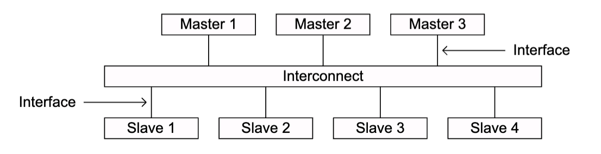

`AMBA` упрощает разработку систем с одним или несколькими процессорами и большим количеством контроллеров и/или периферийных устройств. Сегодня `AMBA` широко используется в различных компонентах систем на кристалле, включающих в себя процессорные ядра общего назначения и  использующихся в подсистемах Интернета вещей, смартфонах, либо же в высокопроизводительных серверных системах.

### Развитие AMBA

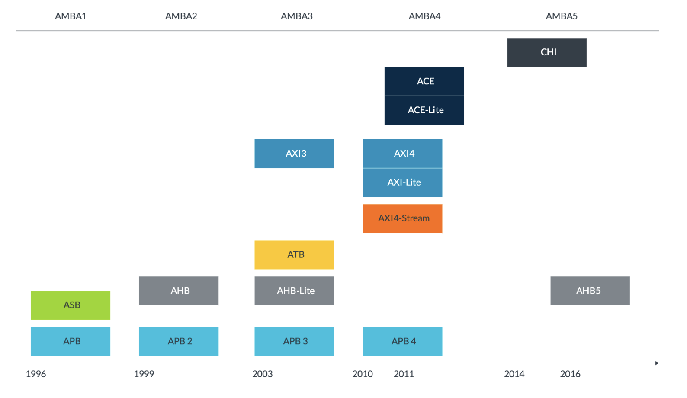

#### AMBA 1

`AMBA` была представлена `ARM` в 1996 году. Первыми шинами AMBA стали `Advanced System Bus (ASB)`, которая позднее была вытеснена более современными протоколами, и `Advanced Peripheral Bus (APB)`, широко использующаяся и сегодня. `APB` была разработана для передачи с низкой пропускной способностью, к примеру, для низкоскоростных периферийных интерфейсов. Шина содержит небольшой список сигналов с относительно простым способом их связи.

#### AMBA 2
В 1999 `AMBA 2` `ARM` добавила протокол `AMBA High-performance Bus (AHB)`. В данном протоколе для передачи информации от источника к приемнику используется **только** нарастающий фронт тактового сигнала, а не восходящий и нисходящий, как это было реализовано в `ASB`. Простая транзакция в протоколе происходит за две фазы: передачи адреса и следующей за этим передачи данных. Доступ к нужному устройству контролируется за счет мультиплексора, предоставляющего доступ только к одному ведущему устройству за раз. Для увеличения производительности `AHB`поддерживает конвейеризованные транзакции, в отличие от `APB`. В свою очередь, построение дизайна по протоколу `APB` проще.

#### AMBA 3
В 2003 году `ARM` представила третье поколение `AMBA 3`, включающее в себя `Advanced Trace Bus (ATB)`, `AHB-Lite`, `Advanced eXtensible Interface (AXI)`.

`ATB` является частью решения `CoreSight` для отладки и трассировки системы на кристалле.

Протокол `AHB-Lite` является подмножеством `AHB`, который упрощает конструкцию шины, но оставляет в ней только возможность работы с одним ведущим устройством.

Протокол `AXI` предназначен для систем с высокой производительностью и высокой тактовой частотой и включает возможности, которые делают его пригодным для реализации высокоскоростных шин в микросхемах, изготовленных с современными фотолитографическими нормами.

#### AMBA 4
В 2010-2011 году фирмой `ARM` были представлены спецификации `AMBA 4`, начиная с `AMBA 4 AXI4`, заканчивая `AMBA 4 AXI Coherency Extensions (ACE)`.

`ACE` расширяет каналы чтения и записи данных `AXI`,  вводя отдельные каналы отслеживания адреса, отслеживания данных и отслеживания ответа. Эти дополнительные каналы предоставляют механизмы для реализации протокола когерентности на основе отслеживания.

Протокол `ACE-Lite` обеспечивает однонаправленную когерентность, которая позволяет производить когерентное считывание данных из кэш-памяти процессора.

Протокол `AXI4-Stream` предназначен для однонаправленной передачи данных от ведущего устройства к ведомому с опциональной маршрутизацией. Например, на базе `AXI4-Stream` можно строить производительные конвейеры для цифровой обработки сигналов.

`AXI-Lite` — это упрощенная версия `AXI`, в нем отсутствует поддержка пакетной передачи данных.

#### AMBA 5
В 2014 году была представлена спецификация `AMBA 5` `Coherent Hub Interface (CHI)` с переработанным высокоскоростным транспортным уровнем и функциями, предназначенными для увеличения удельной пропускной способности. Протокол `CHI` использует многоуровневый пакетный протокол связи с реализацией протокольного, канального и физического уровней, а также поддерживает механизмы управления потоками данных и повторных отправок данных.

В 2016 году  протокол `AHB-Lite` был обновлен до версии `AHB5`, дополняющей архитектуру `Armv8-M` и расширяющей действие функции безопасности `TrustZone` от процессорного ядра до системы в целом.

В 2019 году был выпущен `Adaptive Traffic Profiles (ATP)`, дополняющий существующие протоколы `AMBA`. `ATP` используется для моделирования высокоуровневого доступа к памяти.
</details>


В [лабораторной работе про AXI-Stream](https://github.com/MPSU/FPGA_pract/blob/main/Labs/06.AXI-Stream/README.md) мы рассмотрели интерфейс `valid-ready`. Такой интерфейс позволяет передавать данные от одного блока к другому только тогда, когда передающая сторона действительно выставила корректные данные, а принимающая сторона действительно готова эти данные принять. Рукопожатие (handshake) и передача происходит в тот такт, когда одновременно выполняется условие:

```systemverilog
assign handshake = valid & ready;
```

Также мы увидели, что наличие сигнала `ready` позволяет принимающему устройству создавать backpressure — обратное давление. Если slave временно не может принимать данные, он опускает `ready` в `0`, тем самым останавливая продвижение данных по интерфейсу.

В [лабораторной работе про APB](https://github.com/MPSU/FPGA_pract/blob/main/Labs/08.%20APB%20and%20CRC/README.md) мы познакомились с другой важной концепцией: memory-mapped интерфейсом. В такой модели устройство занимает некоторую область адресного пространства, а его внутренние регистры доступны по адресам. Процессор или другой ведущий (master) блок может записывать значения в эти регистры и читать их обратно. Таким образом, обращение к устройству выглядит как обычная операция чтения или записи по адресу.

В данной лабораторной работе мы рассмотрим AXI4-Lite. AXI4-Lite тоже является memory-mapped интерфейсом, но устроен в формате AXI: операция чтения или записи разбивается на несколько независимых каналов, каждый из которых использует уже знакомый принцип `valid-ready`.

Таким образом, AXI4-Lite можно воспринимать как соединение двух уже знакомых идей: memory-mapped доступа к регистрам и valid-ready handshake.

С одной стороны, AXI4-Lite похож на APB тем, что позволяет обращаться к регистрам устройства по адресам. С другой стороны, он похож на AXI-Stream тем, что все его каналы работают по правилу `valid-ready`.

## AXI4 и AXI4-Lite

AXI4-Lite является упрощённым вариантом полноразмерной шины AXI4. Обе шины являются memory-mapped интерфейсами, то есть позволяют выполнять чтение и запись по адресу. Обе используют несколько независимых каналов с handshake по правилу `valid-ready`. Но AXI4 рассчитан на более производительные системы и поэтому содержит больше возможностей.

Полноразмерный AXI4 поддерживает burst-транзакции. Это значит, что master может передать один адрес, а затем выполнить несколько последовательных передач данных с автоматическим инкрементом адреса. Такой режим удобен, например, при работе с памятью, DMA-контроллерами, кэшами и другими блоками, которым нужно эффективно передавать большие массивы данных.

Кроме того, в AXI4 есть дополнительные сигналы для описания длины burst-транзакции, размера передачи, типа burst, идентификаторов транзакций и других параметров. Эти механизмы важны в высокопроизводительных системах, но они сильно усложняют первое знакомство с AXI-подобными memory-mapped интерфейсами, возможно отвлекая от сути.

AXI4-Lite убирает большую часть этой сложности. В AXI4-Lite нет burst-транзакций: каждая операция чтения или записи передаёт только одно слово данных. Также в AXI4-Lite не используются ID транзакций. Поэтому AXI4-Lite удобно использовать там, где необходимо читать и записывать регистры управления и состояния, а не передавать длинные блоки данных. Можно сказать, что в определённой степени AXI-Lite представляет из себя современную замену APB.


С точки зрения этой лабораторной работы AXI4-Lite является удачным образовательным примером. Он сохраняет главную идею AXI-подхода — разбиение обмена на независимые `valid-ready` каналы, — но не заставляет сразу разбираться с burst, ID и множеством дополнительных управляющих сигналов. Поэтому, разобравшись с AXI4-Lite, гораздо проще переходить к полноразмерному AXI4. Этим мы и займёмся в рамках данной лабораторной работы.


## memory-mapped интерфейсы

Прежде чем переходить к сигналам AXI4-Lite, вспомним саму идею memory-mapped интерфейса.

Пусть в системе есть некоторое периферийное устройство. Например, это может быть таймер, UART, GPIO, контроллер CRC, DMA или вычислительный блок. Такое устройство можно представить как набор регистров:

| Адрес  | Регистр    | Назначение         |
| ------ | ---------- | ------------------ |
| `0x00` | `CTRL`     | регистр управления |
| `0x04` | `STATUS`   | регистр состояния  |
| `0x08` | `DATA_IN`  | входные данные     |
| `0x0C` | `DATA_OUT` | результат          |

Если процессорное ядро хочет включить устройство, оно записывает некоторое значение в `CTRL`. Если хочет узнать состояние устройства, оно читает `STATUS`. Если хочет передать входные данные, оно записывает `DATA_IN`. Если хочет забрать результат, оно читает `DATA_OUT`.

Обратите внимание, что карта регистров не обязана зависеть от конкретной шины. Один и тот же вычислительный блок можно подключить к APB, AXI4-Lite или другому memory-mapped интерфейсу. При этом внутренняя логика вычислительного блока может остаться прежней. Изменится только wrapper — обвязка, которая преобразует транзакции конкретной шины в операции чтения и записи регистров.

## AXI4-Lite как набор valid-ready каналов

В AXI-Stream передача данных выполнялась по одному каналу. У этого канала были сигналы `TVALID`, `TREADY`, `TDATA` и дополнительные sideband-сигналы, такие как `TLAST`, `TKEEP`, `TDEST` и другие.

В AXI4-Lite ситуация устроена иначе. Операция чтения или записи по адресу разбита на несколько каналов. Каждый канал при этом работает по тому же правилу `valid-ready`:


Спецификация `AXI` описывает протокол связи двух интерфейсов: ведущего устройства (Master) и ведомого (Slave), связь осуществляется в рамках пяти однонаправленных каналов:

  * Канал `Write Address (AW)` — используется для передачи адреса, по которому ведущее устройство хочет произвести запись.
  * Канал `Write Data (W)` — используется для передачи от ведущего устройства данных, которые должны быть записаны в ведомое устройство.
  * Канал `Write Response (B – buffered)` — используется для ответа ведомого устройства при транзакции записи.
  * Канал `Read Address (AR)` — используется для передачи адреса, по которому ведущее устройство хочет считать данные.
  * Канал `Read Data (R)` — используется для передачи ведущему устройству данных, считанных из ведомого устройства.

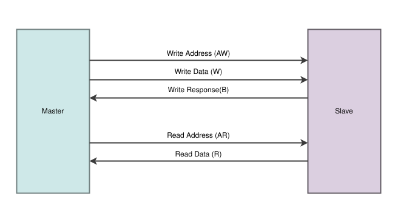


На первый взгляд AXI4-Lite может показаться более сложным, чем APB, потому что сигналов стало больше. Но на практике AXI-подобные интерфейсы часто оказываются удобными именно благодаря единообразной концепции `valid-ready`. Вместо того, чтобы запоминать отдельную временную диаграмму для каждой шины, мы используем одно и то же правило: данные или управляющая информация передаются только при одновременной активности `valid` и `ready`.

Важно понимать, что в AXI4-Lite нет одного общего сигнала готовности всей шины. Готовность локальна для каждого канала. Slave может быть готов принять адрес чтения, но ещё не быть готовым вернуть данные. Master может быть готов отправить адрес записи, но временно не готов принять ответ записи. Соответственно, рукопожатия (handshake) также независимы между всеми каналами. Именно такая декомпозиция на каналы позволяет строить более гибкие interconnect и crossbar-схемы.


Прежде чем рассматривать то, как взаимодействуют каналы между собой, необходимо рассмотреть такое понятие, как **Handshake** или **Рукопожатие**.

### Handshake модель

Предположим, есть **источник** (`Source`), которому необходимо передавать данные **приемнику** (`Destination`). Источник и приемник являются равноправными партнерами в обмене данными: источник не может заставить получателя принять данные, а получатель не может заставить источник отправить корректные данные. **Чтобы передача данных произошла, обеим сторонам необходимо "пожать друг другу руки"**. Для этого **рукопожатия** у источника должны быть достоверные данные, а приемник должен быть готов к их получению.

**Все каналы внутри `AXI` используют один механизм передачи, основанный на `Valid`, `Ready` сигналах. Для каждого канала эта пара сигналов своя.**

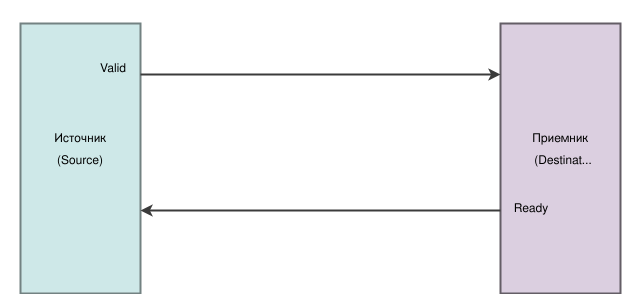

  - Сигнал `Valid` поднимает (выставляет в логическую единицу) **источник**, чтобы показать **приёмнику**, что данные сформированы для передачи, т.e. являются "**валидными**". В качестве источника может выступать как `Master` (на каналах `Write Address`, `Write Data`, `Read Address`), так и `Slave` (на каналах `Write Response`, `Read Data`).

  - Сигнал `Ready` поднимает **получатель** в момент, когда он **готов** принять данные **источника**.

`Handshake` считается случившимся, если `Valid` источника и `Ready` приемника выставлены одновременно во время возрастающего фронта тактового сигнала [`ACLK`](#aclk).

### Пример. Valid до Ready

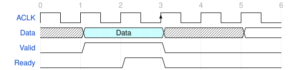

В данном примере на **первом такте** источник формирует данные и поднимает сигнал `Valid`. На **втором такте** получатель поднимает сигнал готовности `Ready`, и **на третьем такте** происходит `handshake`и осуществляется передача данных.

> Источник при выставлении `Valid` обязан держать данные и не изменять их до тех пор, пока не случится передача. **Изменения данных источника до их передачи недопустимо**.

> Источник **не может** опускать `Valid` до того, как произойдет `handshake`.

> Источник **НЕ может** ждать установки `Ready` для того, чтобы выставить `Valid`. Однако приёмник **может** ждать `Valid` источника для выставления сигнала `Ready`.

### Пример. Ready до Valid

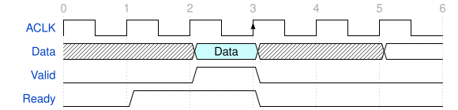

В данном примере приемник поднимает `Ready` на **первом такте**, однако источник ещё не выставил данные для передачи. На **втором такте** источник выставляет данные для передачи и сигнал `Valid`. На **третьем такте** происходит `handshake` и осуществляется передача данных.

> Допустимо, чтобы приемник ожидал установку сигнала `Valid` источника до установки сигнала `Ready`. Однако источник **не может** ожидать сигнала `Ready` для установки `Valid`.

> Приемник **может** опустить сигнал `Ready` до того, как произойдет `handshake`.

### Пример. Valid одновременно с Ready
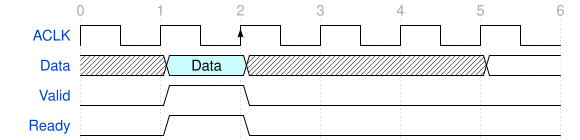

В данном примере на **первом такте** источник выставляет данные для передачи вместе с сигналом `Valid`, одновременно с этим получатель поднимает сигнал готовности к приёму данных `Ready`. На **втором такте** происходит `handshake` и осуществляется передача данных.

> Источник при выставлении `Valid` обязан держать данные и не изменять их до тех пор, пока не случится передача. **Изменения данных источника до их передачи недопустимо**.

> Источник **не может** опускать `Valid` до того, как произойдет `handshake`.

> Приемник **может** опустить сигнал `Ready` до того, как произойдет `handshake`.

## Описание сигналов AXI-Lite

### Глобальные сигналы
| Сигнал      | Источник         | Описание                                                                                                                     |
| ----------- | ---------------- | ---------------------------------------------------------------------------------------------------------------------------- |
| **ACLK**    | Источник частоты | Глобальный сигнал частоты. Применим для всех компонентов внутри AXI.                                                         |
| **ARESETn** | Источник сброса | Глобальный сигнал сброса, активный уровень "0". Может быть установлен асинхронно, но **снятие** **синхронно** с фронтом ACLK |

#### ACLK

Каждый компонент `AXI` использует один тактовый сигнал, `ACLK`. Все входные сигналы отбираются по положительному фронту `ACLK`. Все изменения выходного сигнала должны происходить после положительного фронта `ACLK`. 

#### ARESETn

Протокол `AXI` использует один активный сигнал сброса низкого уровня, `ARESETn`. Сигнал сброса может быть установлен асинхронно, но **снятие должно быть синхронным** с фронтом `ACLK`. Во время сброса применяются следующие требования к интерфейсу:
- `Master` должен установить `ARVALID`, `AWVALID`, `WVALID` в низкий уровень.
- `Slave` должен установить `RVALID`, `BVALID` в низкий уровень.
- Все остальные сигналы могут быть в любом значении.

### Сигналы каналов
В текущем разделе рассматриваются сигналы, свойственные стандарту передачи, использующемуся в контексте задачи хакатона. Он основан на протоколе AXI-Lite, но в отличие от него, использует меньше сигналов.

#### Каналы записи

Каналы записи используются для передачи данных, которые ведущее устройство хочет передать ведомому для их записи, а также для ответа ведомого устройства о статусе завершенной транзакции.

##### Write Address

| Сигнал       | Источник | Описание                                                                                                                                                       |
| ------------ | -------- | -------------------------------------------------------------------------------------------------------------------------------------------------------------- |
| **AWADDR**   | Master   | Адрес записи. Адрес, по которому должны записаться данные                                                                                                      |
| **AWVALID**  | Master   | Действительные данные. Этот сигнал указывает на то, что ведущее устройство передает действительный адрес записи                                                |
| **AWREADY**  | Slave    | Готовность передачи. Этот сигнал указывает на то, что ведомое устройство готово принять адрес                                                                  |

##### Write Data
| Сигнал     | Источник | Описание                                                                                                                             |
| ---------- | -------- | ------------------------------------------------------------------------------------------------------------------------------------ |
| **WDATA**  | Master   | Данные на запись                                                                                                                     |
| **WSTRB**  | Master   | Стробирование записи. Данный сигнал указывает, какие байты в слове содержат действительные данные                                    |
| **WVALID** | Master   | Действительные данные. Этот сигнал указывает на то, что ведущее устройство передает действительные данные на запись и стробирование  |
| **WREADY** | Slave    | Готовность передачи. Этот сигнал указывает на то, что ведомое устройство готово принять данные на запись                             |


Сигнал `WSTRB` указывает, какие байты в слове `WDATA` должны быть записаны в регистр.

Например, если ширина данных равна 32 битам, то `WSTRB` имеет ширину 4 бита:

```text
WSTRB[0] отвечает за WDATA[7:0]
WSTRB[1] отвечает за WDATA[15:8]
WSTRB[2] отвечает за WDATA[23:16]
WSTRB[3] отвечает за WDATA[31:24]
```

Если `WSTRB = 4'b1111`, то записывается всё 32-битное слово. Если `WSTRB = 4'b0001`, то обновляется только младший байт. Остальные байты регистра должны сохранить прежнее значение.

Такая частичная запись очень удобна, когда процессор записывает не всё слово целиком, а отдельный байт или половину слова.


##### Write Response
| Сигнал     | Источник | Описание                                                                                                       |
| ---------- | -------- | -------------------------------------------------------------------------------------------------------------- |
| **BRESP**  | Slave    | Ответ на запись. Этот сигнал передает статус транзакции записи                                                 |
| **BVALID** | Slave    | Действительные данные. Этот сигнал показывает, что ведомое устройство сигнализирует о действительном ответе    |
| **BREADY** | Master   | Готовность передачи. Этот сигнал указывает на то, что ведущее устройство может принять запись ответа           |

#### Каналы чтения
Каналы чтения используются для передачи данных, считанных с ведомого устройства, а также для передачи ответа о статусе завершенной транзакции.

##### Read Address

| Сигнал       | Источник | Описание                                                                                                                                                       |
| ------------ | -------- | -------------------------------------------------------------------------------------------------------------------------------------------------------------- |
| **ARADDR**   | Master   | Адрес чтения. Адрес, по которому происходит считывание данных                                                                                                  |
| **ARVALID**  | Master   | Действительные данные. Этот сигнал указывает на то, что ведущее устройство передает действительный адрес чтения                                                |
| **ARREADY**  | Slave    | Готовность передачи. Этот сигнал указывает на то, что ведомое устройство готово принять адрес чтения                                                           |

##### Read Data

| Сигнал     | Источник | Описание                                                                                                                       |
| ---------- | -------- | ------------------------------------------------------------------------------------------------------------------------------ |
| **RDATA**  | Slave    | Данные на чтение                                                                                                               |
| **RRESP**  | Slave    | Ответ на чтение. Этот сигнал передает статус транзакции чтения                                                                 |
| **RVALID** | Slave    | Действительные данные. Этот сигнал указывает на то, что ведомое устройство передает действительные считанные данные            |
| **RREADY** | Master   | Готовность передачи. Этот сигнал указывает на то, что ведущее устройство может принять считанные данные и информацию об ответе |


## Каналы для транзакции записи
`Master` отправляет в `Slave` адрес и данные для записи по каналам `Write Adress`(AW) и `Write Data`(W) соответсвенно.
`Slave` записывает полученные данные по указанному адресу. По завершении записи `Slave` передает ответ по `Write Respose`(B) каналу.

Таким образом, для записи данных по протоколу используются три канала:
  * `Write address` для передачи адреса записи данных от ведущего устройства к ведомому.
  * `Write Data` для передачи данных от ведущего устройства к ведомому.
  * `Write Response` для подтверждения того, что в ведущее устройство была произведена (или нет) запись.

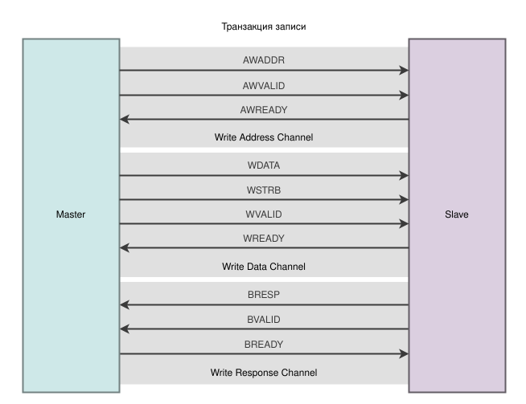

На рисунке Х на временной диграмме показан **пример** такой транзакции:
  * **Канал Write Address:**
     1. Ведущее устройство на **первом такте** выставляет на `AWADDR` адрес, по которому ведомое устройство должно записать данные, и сигнал `AWVALID`, свидетельствующий о том, что передается корректный адрес.
     2. Ведомое устройство готово для приёма данных, поэтому поднимает сигнал `AWREADY` на **втором такте**.
     3. На **третьем такте** происходит `handshake`, данные передаются.

  * **Канал Write Data:**
     1. Ведущее устройство на **пятом такте** выставляет на `WDATA` данные для записи, `WSTRB`, а также сигнал `WVALID`, свидетельствующий о том, что передаются корректные данные.
     2. Ведомое устройство готово для приёма данных, поэтому поднимает сигнал `WREADY` на **пятом такте**.
     3. На **шестом такте** такте происходит `handshake`, данные передаются.

  * **Канал Write Response:**
     1. Ведущее устройство готово для приёма данных, поэтому поднимает сигнал `BREADY` на **пятом такте**.
     2. Ведомое устройство после успешной записи данных на **шестом такте** на `BRESP` выставляет ответ для ведущего устройства и поднимает сигнал `BVALID`.
     3. На **седьмом такте** происходит `handshake`, данные передаются.

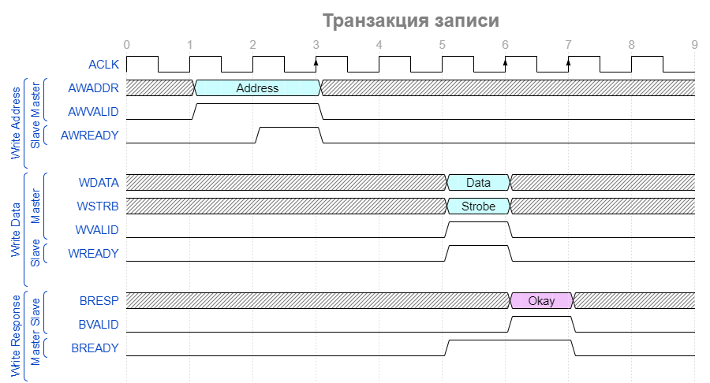

> Нужно отметить, что данные для записи (канал `Write Data`) могут передаваться до адреса записи (канал `Write Address`). Это возможно, когда канал адреса записи имеет бóльшую пропускную способность, чем канал записи данных. Аналогично, данные на запись могут передаваться и на том же такте, что и адрес.

Сигналы `handshake` пар для каналов записи используются следующие

| Канал транзакции | handshake пара сигналов |
| ---------------- | ------------------------ |
| Write address    | `AWVALID`,`AWREADY`      |
| Write data       | `WVALID`, `WREADY`       |
| Write response   | `BVALID`, `BREADY`       |

## Каналы для транзакции чтения
`Master` выставляет адрес, по которому он хочет прочитать данные, в канале `Read Adress`(AR). `Slave` выставляет считанные данные, а также статус (успех или неудачу) транзакции чтения, в канале `Read Data`(R).

> Все каналы однонаправленны. Так как ответ от ведомого устройства может быть возвращен вместе с данными внутри канала `Read Data`, то в отдельном канале передачи ответа, как это было в случае транзакции записи (в канале `Write Response`),нет необходимости.

Таким образом, для чтения данных по протоколу используются два канала:
  * `Read address` для передачи адреса считываемых данных от ведущего устройства к ведомому.
  * `Read Data` для передачи считанных данных и статуса транзакции от ведомого устройства к ведущему.

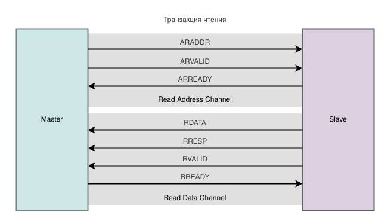

На рисунке Х на временной диграмме показан **пример** такой транзакции:
  * Канал Read Address:
     1. Ведущее устройство на **первом такте** выставляет на `ARADDR` адрес, по которому ведомое устройство должно считать данные, и сигнал `ARVALID`, свидетельствующий о том, что передается корректный адрес.
     2. Ведомое устройство готово для приёма данных, поэтому поднимает сигнал `ARREADY` на **втором такте**.
     3. На **третьем такте** происходит `handshake`, данные передаются.

  * Канал Read Data:
     1. Ведущее устройство поднимает сигнал готовности к передаче `RREADY` на **четвертом такте**.
     2. Ведомое устройство на **пятом такте** выставляет считанные данные на `RDATA`, статус транзакции чтения на `RRESP`, а также поднимает сигнал готовности данных `RVALID`.
     3. На **шестом такте** такте происходит `handshake`, данные передаются.

> В отличие от транзакции записи данных, в данном типе транзакции считанные данные (канал `Read Data`) не могут передаваться раньше адреса (канал `Read Address`). И действительно, невозможно корректно считать данные, не зная адрес для чтения.

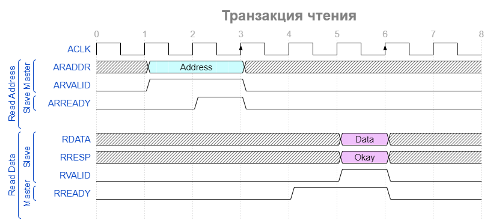

Сигналы `handshake` пар для каналов чтения используются следующие

| Канал транзакции | handshake пара сигналов |
| ---------------- | ------------------------ |
| Read address     | `ARVALID`, `ARREADY`     |
| Read data        | `RVALID`, `RREADY`       |

## Взаимодействие каналов

Необходимо соблюдать правила зависимости, существующие между сигналами `handshake`.

Как уже было сказано:
- Сигнал `Valid` интерфейса `AXI`, передающего информацию, не должен зависеть от сигнала `Ready` интерфейса `AXI`, получающего эту информацию.
- Интерфейс `AXI`, который принимает информацию, может ждать сигнал `Valid` перед установкой сигнала `Ready`.

Необходимо отметить существующие зависимости между `handshake` сигналами на разных каналах.

В диаграммах зависимости далее:
- Одинарные стрелки указывают на сигналы, которые **могут** зависеть от сигнала в начале стрелки.
- Двойные стрелки указывают на сигналы, которые **должны** зависеть от сигнала в начале стрелки.

### Зависимости транзакции чтения
Рисунок ниже показывает зависимости сигналов для `handshake`-а транзакции чтения.

Напомним, что для осуществления транзакции чтения необходимо взаимодействие двух каналов: `Read Address`(AR) и `Read Data`(R). Далее рассмотрим связи между сигналами `Valid` и `Ready` внутри этих каналов.

В общем случае зависимости выстраиваются следующие:

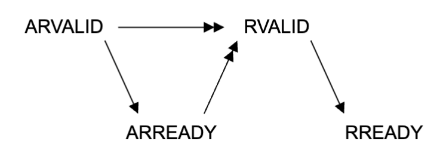

Разберем эти зависимости:
> - `Master` **должен** поднять сигнал `ARVALID` независимо от выставления `Slave`-ом сигнала `ARREADY`.
> - `Slave` **может** поднять `ARREADY` в любой момент. Он может как зависеть, так и не зависеть от `Master`-а.
> - `Slave` **должен** дождаться, когда сигналы `ARVALID` и `ARREADY` выставятся в единицу, прежде чем поднять сигнал `RVALID`, то есть строго после того, как произошел `handshake` по сигналам канала `Read Adress`.
> - `Slave` **не может** ожидать выставления в единицу `Master`-ом сигнала `RREADY`, чтобы поднять сигнал `RVALID`.
> - `Master` **может** поднять `RREADY` в любой момент, не ожидая сигнала `RVALID`.

### Зависимости транзакции записи
Рисунок ниже показывает зависимости сигналов для `handshake` транзакции записи.

При осуществлении транзакции записи необходимо взаимодействие трех каналов: `Write Adress`(AW), `Write Data`(W) и `Write Response`(B). Далее рассмотрим связи между сигналами `Valid` и `Ready` внутри этих каналов.

В общем случае зависимости выстраиваются следующие:

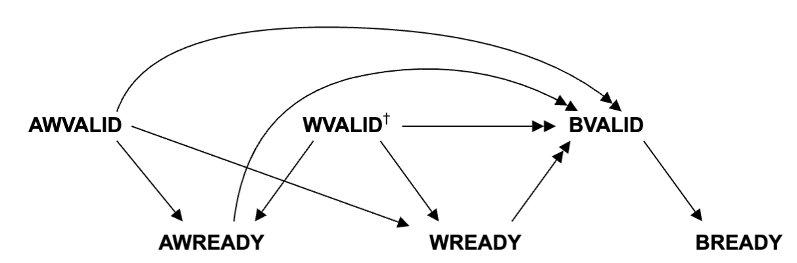

Разберем эти зависимости:

> - `Master` **не может** ожидать сигналы `AWREADY` или `WREADY` от `Slave-а` для выставления в единицу сигналов `AWVALID` или `WVALID`.
> - `Slave` может подождать выставления `AWVALID`, или `WVALID`, или оба сигнала, до выставления `AWREADY`
> - `Slave` **может** поднять `AWREADY` до того, как `Master` выставит в единицу сигналы `AWVALID` или `WVALID` (или оба).
> - `Slave` **может** подождать от `Master`-а сигналы `AWVALID` или `WVALID` (или оба) до выставления в единицу `WREADY`. Также `Slave` **может** поднять `WREADY`, не дожидаясь `AWVALID`, или `WVALID`, или обоих сигналов.
> - `Slave` **должен** дождаться, когда сигналы `AWVALID`, `AWREADY`, `WVALID`, `WREADY` выставятся в единицу, прежде чем поднять сигнал `BVALID`.
> - `Slave` **не может** ждать, пока `Master` установит в единицу `BREADY`, чтобы поднять `BVALID`.
> - `Master` **может** подождать `BVALID` до выставления в единицу `BREADY`. Также `Master` **может** поднять `BREADY`, не дожидаясь `BVALID`.


## Ответы AXI4-Lite

В AXI4-Lite операции чтения и записи возвращают response, индикатор успешности выполнения запроса. Для записи используется `BRESP`, для чтения — `RRESP`.

В данной лабораторной работе достаточно использовать следующие значения:

| Значение | Имя      | Смысл                       |
| -------- | -------- | --------------------------- |
| `2'b00`  | `OKAY`   | успешная транзакция         |
| `2'b10`  | `SLVERR` | ошибка slave                |
| `2'b11`  | `DECERR` | ошибка декодирования адреса |

Например, если master обращается к существующему регистру, slave может вернуть `OKAY`. Если адрес не соответствует ни одному регистру или ни одному slave в interconnect, можно вернуть `DECERR`.

На первых этапах реализации часто удобно всегда возвращать `OKAY`, а обработку ошибок добавить позже. Но в итоговой версии лабораторной работы потребуется реализовать ошибочный ответ для несуществующего адреса и проверить в тестах корректное поведение модулей при возникновении таких ситуаций.


## Рекомендации для дополнительного ознакомления:

- Подробнее про `AXI4-Lite` и в целом про `AMBA` можно узнать в официальной [спецификации](AXI4_specification.pdf).


## Задания лабораторной работы

### Задание 1. AXI4-Lite slave с регистровым файлом

Реализуйте модуль `axi_regs`, содержащий 8 32-битных регистров и AXI4-Lite slave интерфейс.

Параметры модуля:

```systemverilog
parameter ADDR_WIDTH = 8;
parameter DATA_WIDTH = 32;
```

Карта регистров:

| Адрес  | Регистр | Доступ | Значение после сброса |
| ------ | ------- | ------ | --------------------- |
| `0x00` | `REG0`  | RW     | `0`                   |
| `0x04` | `REG1`  | RW     | `0`                   |
| `0x08` | `REG2`  | RW     | `0`                   |
| `0x0C` | `REG3`  | RW     | `0`                   |
| `0x10` | `REG4`  | RW     | `0`                   |
| `0x14` | `REG5`  | RW     | `0`                   |
| `0x18` | `REG6`  | RW     | `0`                   |
| `0x1C` | `REG7`  | RW     | `0`                   |

Требования к реализации:

* запись должна учитывать `WSTRB`;
* `AW` и `W` должны корректно обрабатываться в любом порядке;
* `BVALID` должен удерживаться до `BREADY`;
* `RVALID`, `RDATA` и `RRESP` должны удерживаться до `RREADY`;
* чтение из несуществующего адреса должно возвращать `0` и ошибочный response;
* запись в несуществующий адрес не должна изменять регистры и должна возвращать ошибочный response.

В testbench необходимо проверить:

* обычную запись и чтение всех регистров;
* частичную запись через `WSTRB`;
* ситуацию, когда `AW` приходит раньше `W`;
* ситуацию, когда `W` приходит раньше `AW`;
* ситуацию, когда `AW` и `W` приходят одновременно;
* удержание `BVALID`, если `BREADY = 0`;
* удержание `RVALID` и `RDATA`, если `RREADY = 0`;
* обращение к несуществующему адресу.


### Задание 2. AXI4-Lite interconnect 1 master -> N slaves

Реализуйте AXI4-Lite interconnect, который подключает один master к нескольким slave-устройствам.

Slave выбирается по адресу:

| Вариант | Число slave | Адресные области                                              |
| ------- | ----------- | ------------------------------------------------------------- |
| 0       | 2           | `0x0000` — `0x00FF`, `0x0100` — `0x01FF`                      |
| 1       | 3           | `0x0000` — `0x00FF`, `0x0100` — `0x01FF`, `0x0200` — `0x02FF` |
| 2       | 4           | четыре области по `0x100` байт                                |
| 3       | 5           | пять областей по `0x100` байт                                 |
| 4       | 6           | шесть областей по `0x100` байт                                |

Вариант определяется как остаток от деления номера студента в списке группы на 5.

Требования:

* `AWADDR` должен выбирать slave для write-транзакции;
* `ARADDR` должен выбирать slave для read-транзакции;
* канал `W` должен быть направлен к slave, выбранному по `AWADDR`;
* канал `B` должен возвращаться от выбранного slave;
* канал `R` должен возвращаться от slave, выбранного по `ARADDR`;
* при обращении в пустую область interconnect должен возвращать ошибочный response;
* допускается ограничение: master не начинает новую write-транзакцию до завершения предыдущей;
* допускается ограничение: master не начинает новую read-транзакцию до завершения предыдущей.

В отчёте необходимо объяснить, чем выбор slave по адресу в AXI4-Lite похож на выбор выходного порта по `TDEST` в AXI-Stream crossbar.

### Задание 3. AXI4-Lite crossbar M masters -> N slaves

Реализуйте AXI4-Lite crossbar с несколькими master и несколькими slave.

| Вариант | Master | Slave | Арбитраж        |
| ------- | ------ | ----- | --------------- |
| 0       | 2      | 2     | static priority |
| 1       | 2      | 3     | round-robin     |
| 2       | 3      | 2     | static priority |
| 3       | 3      | 3     | round-robin     |
| 4       | 4      | 2     | static priority |
| 5       | 4      | 4     | round-robin     |

Вариант определяется как остаток от деления номера студента в списке группы на 6.

Ограничения:

* burst-транзакции не поддерживаются;
* ID не используются;
* каждый master имеет не более одной активной write-транзакции;
* каждый master имеет не более одной активной read-транзакции;
* если master-ы обращаются к разным slave, транзакции могут выполняться независимо;
* если несколько master-ов обращаются к одному slave, используется арбитраж.

На защите необходимо объяснить:

* как выбирается slave;
* как выбирается master при конфликте;
* какой арбитраж используется;
* почему нужно помнить маршрут для `B`;
* почему нужно помнить маршрут для `R`;
* чем AXI4-Lite crossbar похож на AXI-Stream crossbar;
* чем AXI4-Lite crossbar сложнее AXI-Stream crossbar.

### Дополнительное задание. AXI4-Lite -> APB bridge

Реализуйте мост из AXI4-Lite в APB.

Мост должен принимать AXI4-Lite read/write транзакции и генерировать соответствующие APB-транзакции.

Требования:

* корректно принимать `AW` и `W` в любом порядке;
* генерировать APB write-транзакцию после получения адреса и данных записи;
* генерировать APB read-транзакцию после получения `AR`;
* учитывать ожидание `PREADY = 0`;
* преобразовывать `PSLVERR` в `BRESP` или `RRESP`;
* удерживать `BVALID` до `BREADY`;
* удерживать `RVALID`, `RDATA` и `RRESP` до `RREADY`.

Это задание показывает, что разные memory-mapped интерфейсы могут сосуществовать в одной системе. AXI4-Lite может быть внешним интерфейсом со стороны AXI-системы, а APB может использоваться для подключения простой низкоскоростной периферии.

### Контрольные вопросы

1. Почему AXI4-Lite является memory-mapped интерфейсом?
2. Чем AXI4-Lite похож на APB?
3. Почему AXI4-Lite удобно использовать в AXI-системах?
4. Чем AXI4-Lite похож на AXI-Stream?
5. Что такое handshake?
6. Что такое backpressure?
7. Какие пять каналов есть в AXI4-Lite?
8. Какие каналы участвуют в операции записи?
9. Какие каналы участвуют в операции чтения?
10. Почему `AW` и `W` могут прийти в разные такты?
11. Может ли `W` прийти раньше `AW`?
12. Когда slave имеет право изменить регистр при записи?
13. Когда slave имеет право выставить `BVALID`?
14. Почему нельзя менять `RDATA`, пока `RVALID = 1`, но `RREADY = 0`?
15. Для чего нужен `WSTRB`?
16. Что означает response `OKAY`?
17. Что означает response `DECERR`?
18. Как адрес выбирает регистр внутри slave?
19. Как адрес выбирает slave внутри interconnect?
20. Чем адрес в AXI4-Lite похож на `TDEST` в AXI-Stream?
21. Почему interconnect должен маршрутизировать не только запросы, но и ответы?
22. Где в AXI4-Lite crossbar возникает арбитраж?
23. Чем static priority отличается от round-robin?
24. Почему AXI4-Lite и AXI-Stream часто используются вместе?
25. Зачем может понадобиться AXI4-Lite -> APB bridge?
