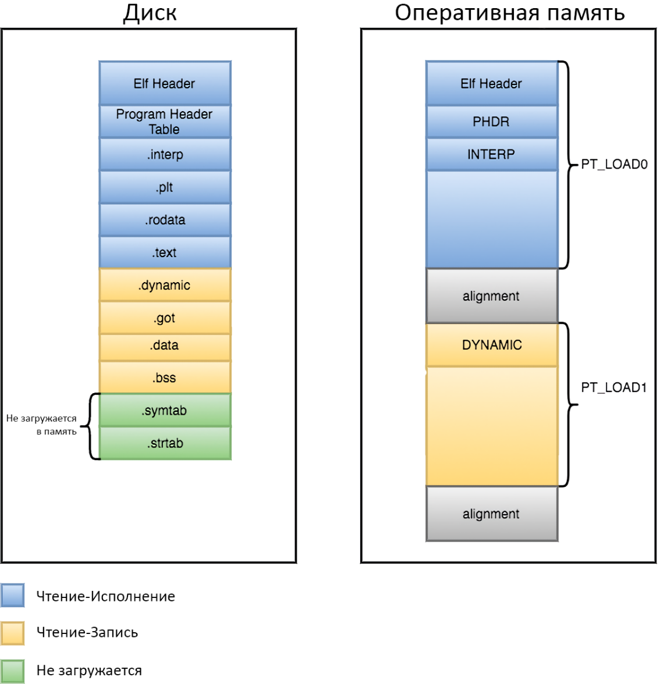

# Лабораторная работа 9. Набор инструментов разработчика GNU Toolchain, Makefile, ELF

## Введение

Часто, во время изучения языков программирования, студенту предлагается установить какую-либо программу: Code::Blocks или Microsoft Visual Studio для языков C/C++/C# или IntelliJ IDEA для java.

Данные программы называются IDE (*Integrated development environment* – интегрированная среда разработки) и являются инструментом, позволяющим разрабатывать огромные проекты наподобие многофункциональных графических редакторов или 3D-игр. Несмотря на то, что проекты, реализуемые при изучении языков программирования, весьма просты, и данные программы в общем-то не нужны, их предлагают установить, т.к. они позволяют с лёгкостью собирать и отлаживать проект, оставив на пользователя лишь заботу о написании кода. Это очень упрощает изучение языка на начальных этапах, однако оказывает медвежью услугу, поскольку будущий разработчик программ не понимает процессов, стоящих за нажатием кнопки `Run`.

Зачем вообще может понадобиться знание об этих процессах? Например, для кросс-компиляции. Разрабатывая программу для микроконтроллера или системы на кристалле, необходимо компилировать исходный код на рабочем компьютере, однако собранный код будет запускаться на устройстве с другой архитектурой. Код, скомпилированный под одну архитектуру не сможет работать на другой. Компиляция исходного кода на компьютере с одной архитектурой для запуска на компьютере с другой архитектурой и называется кросс-компиляцией. Распространённые IDE не используются в кросс-компиляции, необходимо использовать среды, написанные под какие-то конкретные семейства микроконтроллеров, в связи с чем, нет особого выбора. Для новичка, поиск материалов по настройке и реализации проекта не на микроконтроллерах Arduino и STM32 может вылиться в проблему, не говоря о том, что большинство материалов могут оказаться устаревшими или не совсем подходящими. В такие моменты можно прийти к выводу, что скомпилировать проект, используя один лишь кросс-компилятор будет проще. Кроме того, такой подход позволит работать на разных операционных системах и аппаратных платформах, используя инструменты сборки с открытыми исходными кодами (например, gcc).

Кроме того, в связи со своим мощным функционалом, популярные IDE, как правило, ресурсоёмки и не походят для запуска, компиляции и отладки на низкопроизводительных компьютерах или ноутбуках. Код можно редактировать и в легковесных редакторах, а сборку и отладку можно выполнять из терминала.

Таким образом, хорошему разработчику нужно уметь не только писать код, но и уметь его собирать.

## Hello World

Традиционно, любой курс начинается с примера `Hello World`. В листинге ниже приведена простейшая программа, которую можно написать в любом текстовом редакторе, и собрать её из терминала.

```c
#include <stdio.h>

int main() {
    printf("Hello, world!\n");
    return 0;
}
```

Для её сборки, необходимо открыть терминал, указав рабочей директорией папку с данным файлом, после чего выполнить следующую команду:

```shell
gcc hello.c
```

Результатом её выполнения в операционной системе Linux станет исполняемый файл `a.out`. При запуске файл выведет строку `Hello, world!` в окно текстового терминала. Процедура вышла весьма простой, однако лишь потому, что это упрощённый пример, и в реальных проектах процесс сборки сложнее.

Что же произошло во время выполнения этой команды?

В первую очередь, надо разобраться с тем, что такое gcc.

## Что такое GCC

Изначально, GNU C Compiler, был разработан Ричардом Столлманом, основателем GNU Project. С течением времени, GCC развивался и стал поддерживать множество языков: C (gcc), C++ (g++), Objective-C, Objective-C++, Java (gcj), Fortran (gfortran), Ada (gnat), Go (gccgo), OpenMP, Cilk Plus, и OpenAcc, поэтому теперь GCC расшифровывается как GNU Compiler Collection.

GCC – ключевой компонент так называемого GNU Toolchain, предназначенного для разработки приложений и операционных систем. Он включает:

  - GNU Compiler Collection (GCC) – набор компиляторов, поддерживающий множество языков, например: C/C++ and Objective-C/C++;
  - GNU Make – средство автоматизации для компиляции и сборки приложений;
  - GNU Binutils – набор утилит, включающий компоновщик и транслятор;
  - GNU Debugger (GDB) – средство отладки программ;
  - GNU Autotools – система сборки, включающая: Autoconf, Autoheader, Automake и Libtool;
  - GNU Bison: генератор синтаксических анализаторов (похож на lex и yacc).

Прямо сейчас интерес представляет сам GCC, а также Binutils, в дальнейшем, будут разобраны Make и GDB.

## Поэтапный разбор процесса компиляции

За употребляемым в среде программистов словом *компиляция* обычно стоят четыре последовательных этапа, показанные на рисунке:


### Предобработка

Предобработка исходного кода выполняется препроцессором. Его работа заключается во вставке содержимого файлов, подключённых с помощью директивы `#include`, а также подстановке значений в макросах, определённых директивой `#define`. Результатом его работы является изначальный исходный код, но включающий все вставки и замены.

### Компиляция

Компиляция переводит исходный код в набор машинных инструкций на языке ассемблера. Набор таких инструкций различается между архитектурами и именно это является причиной того, что код, скомпилированный под одну архитектуру, нельзя запустить на другой. Результатом работы компилятора является код на языке ассемблера.

### Трансляция

Ассемблер (транслятор) переводит код на языке ассемблера в машинный – набор нулей и единиц, который, однако, ещё не получится запустить – для этого необходимо разрешить связи между функциями и переменными (или символами) программы.

### Компоновка

Линковщик (компоновщик) устанавливает связи между вызовами функций в основном коде программы и реализацией этих функций в подключаемых библиотеках.
Далее будет подробно рассмотрен процесс сборки примера *Hello world*.
Сперва запускается препроцессор (исполняемый файл `cpp`), который подключает заголовочные файлы и раскрывает макросы. Результат сохраняется в промежуточный файл .i в виде раскрытого исходного кода:

```shell
cpp hello.c > hello.i
```

В данной команде, > означает перенаправление потока вывода в файл `hello.i`. Оно необходимо, поскольку по умолчанию, результат работы препроцессора будет направлен в стандартный поток вывода (в большинстве случаев, терминал, из которого запущена программа). Т.е. будет лишь выведен результат работы, но он не будет сохранен в файл. Того же самого можно добиться, заменив `>` на `-o` (подробнее опция `-o` будет рассмотрена далее).
Затем, происходит компиляция исходного кода в код на языке ассемблера, специфичный для конкретного процессора. За это отвечает программа `gcc`:

```shell
gcc -S hello.i
```

опция `-S` говорит остановиться после выполнения этапа компиляции, поскольку этой же программой можно выполнить все четыре этапа сразу, как было показано в первом примере.

Далее, происходит трансляция этого кода в машинный код, который помещается в объектный файл `hello.o`:

```shell
as -o hello.o hello.s
```

Опция `-o` указывает, какое имя файла должно получиться на выходе. Если она не указана, именем исполняемого/объектного файла будет `a.out`, а промежуточные файлы других этапов будут названы так же, как и поданный на вход файл, с изменённым суффиксом.
Наконец, компоновщик `ld` связывает объектный код с кодом библиотек, производя исполняемый файл `hello`.

```shell
ld -o hello hello.o ...libraries...
```

Полная версия команды не указана, т.к. вместо libraries необходимо указать весь список библиотек (как правило, весьма объёмный), который необходим для работы программы.

Чтобы все-таки собрать проект, проще воспользоваться самим `gcc`, который затем автоматически вызовет компоновщик со всеми необходимыми параметрами:

```shell
gcc -o hello hello.o
```

Если всё же возникла необходимость произвести компоновку самостоятельно, можно воспользоваться следующим способом для получения полного списка библиотек:
К команде вызова `gcc` необходимо добавить:

```shell
2> log.txt
```

Данная конструкция направит поток вывода в файл `log.txt`, внутри которого можно будет увидеть команды, которые выполнял компилятор. Надо найти строку:

```shell
COLLECT_GCC_OPTIONS
```

Под этой строкой необходимо найти место, где закончатся перечисления плагинов и пойдут перечисления объектных файлов и ключи `-L` – это и есть необходимые для компоновщика опции.

Если передать компилятору опцию `-save-temps`, тот сохранит промежуточные файлы каждого из выполненных этапов. Для интереса, можете посмотреть на результат работы препроцессора и компилятора (файлы `.i`/`.ii`, `.s` соответственно).

## Компиляция кода из нескольких файлов

В реальных проектах, код не пишется в одном единственном файле, классы и функции выносятся в отдельные файлы, которые потом могут собираться в библиотеки.

Ниже приведён пример проекта, использующего собственную функцию. Обычно, прототип функции описывается в файле `.h`, а её реализация – в файле с расширением `.c`. Файлы с расширением `.h` (заголовочные файлы) , как правило, поставляются с прекомпилированными библиотеками и как бы представляют её функционал и интерфейс, но не реализацию.

Часто заголовочные файлы и файлы исходного кода разделяются по папкам `inc` и `src` соответственно. Таким образом, создадим проект со следующей структурой:

```
Hello_project
  inc
    hello.h
  src
    hello.c
    main.c
```

В папке с проектом находятся папки `inc` и `src`, в которых находятся `hello.h` и `hello.c`, `main.c` соответственно. Содержимое этих файлов показано в листингах ниже.

Содержимое файла `hello.h`:

```c
#include <stdio.h>
void hello_world (void);
```

Содержимое файла `hello.c`:

```c
#include "hello.h"
void hello_world(void)
{
    printf("Hello World!");
}
```

Содержимое файла `main.c`:

```c
#include "hello.h"

int main() {
    hello_world();
    return 0;
}
```

Из этих трёх файлов скомпилировать надо два (заголовочный файл будет вставлен в остальные препроцессором). Сделать это можно из папки проекта командой:

```shell
gcc -c src/hello.c src/main.c -Iinc
```

Важно, что при вызове компилятора необходимо указывать полный путь до компилируемых файлов.

Ранее уже было сказано, что gcc последовательно вызывает препроцессор, компилятор, транслятор и компоновщик. Можно сообщить ему, на каком из этапов нужно остановиться с помощью специальных опций(ключей), переданных в команде:

  -	`-E` – остановиться после этапа предобработки;
  -	`-S` – остановиться после этапа компиляции;
  -	`-c` – остановиться после этапа трансляции.

Ключ `-I` (сокращение от Include) указывает компилятору, где искать подключаемые файлы. В переменных среды есть стандартные пути, поиска, поэтому нам не нужно искать, где находится заголовочный файл `stdio.h`. Кроме того, стоит заметить, что директории, указанные через данный ключ, обладают более высоким приоритетом, т.е. компилятор будет искать подключаемые файлы сначала в них, и если там будет заголовочный файл, одноименный с `stdio.h`, подключится именно он. Если необходимо указать несколько папок, каждую из них нужно передавать со своим ключом. Поиск не производится рекурсивно, если нужно добавить вложенные папки, каждую из них так же надо передать через ключ `-I`.

После получения объектных файлов, их необходимо скомпоновать в исполняемый файл. Для этого, опять же, необходимо воспользоваться `gcc` (который автоматически вызовет компоновщик):

```shell
gcc -o hello hello.o main.o
```

Может возникнуть вопрос: зачем два раза вызывать `gcc`, если можно было просто убрать ключ `-c` при первом вызове. Дело в том, что при изменении любого файла, необходимо пересобрать весь проект целиком. Пересборка больших проектов (скажем, ядра Linux) – это очень долгий процесс. Разделив сборку на две части, появляется возможность скомпилировать только изменённый файл, а затем, скомпоновать заново весь проект целиком.

В данный момент вручную указывается полный путь до компилируемых файлов и все папки с заголовочными файлами. Это делается для лучшего понимания процесса. Способы упрощения этой процедуры будут описаны позднее.

## Сборка библиотеки

Пусть существует код, который будет использоваться во многих проектах. Или объём кода довольно большой, дальнейшие изменения в нём не планируются, а компиляция уже занимает весьма много времени. Или необходимо получить из вашего кода бинарный файл, чтобы, передав его человеку, не раскрывать ему реализацию (сохранить свою интеллектуальную собственность). Для всего этого можно скомпилировать код в библиотеку.

Библиотеки делятся на два типа: статические и динамические.


### Статическая библиотека


Статическая библиотека (или `архив`) состоит из подпрограмм, которые непосредственно компилируются и линкуются с программой в исполняемый файл. При компиляции программы, которая использует статическую библиотеку, весь функционал статической библиотеки (тот, что использует программа) становится частью вашего исполняемого файла. В Windows статические библиотеки имеют расширение `.lib` (от `library`), тогда как в ОС семейства GNU\Linux статические библиотеки имеют расширение `.a` (от `archive`). Примечание автора: в дальнейшем, дабы уйти от громоздкой записи *ОС семейства GNU\Linux*, будет использоваться слово *Linux* в качестве её замены. В случаях, когда в тексте будет идти речь о ядре Linux, об этом будет сказано явно.

Одним из преимуществ статических библиотек является то, что нужно распространять всего лишь один файл (исполняемый файл), дабы пользователи могли запустить и использовать программу. Поскольку статические библиотеки становятся частью программы, то можно использовать их подобно функционалу этой же самой программы. С другой стороны, поскольку копия библиотеки становится частью каждого исполняемого файла, то это может привести к увеличению его размера. Также, для того чтобы обновить статическую библиотеку, необходимо перекомпилировать каждый исполняемый файл, который её использует.

### Динамическая библиотека

Динамическая библиотека (или *общая (разделяемая) библиотека*) состоит из подпрограмм, которые подгружаются в программу во время её выполнения. При компиляции программы, которая использует динамическую библиотеку, эта библиотека не становится частью исполняемого файла — она так и остаётся отдельным модулем. В Windows динамические библиотеки имеют расширение `.dll` (от *dynamic link library* = *библиотека динамической компоновки*), тогда как в Linux динамические библиотеки имеют расширение `.so` (от *shared object* = *общий объект*). Одним из преимуществ динамических библиотек является то, что разные программы могут совместно использовать одну копию динамической библиотеки, что значительно экономит используемое пространство. Ещё одним преимуществом динамической библиотеки является то, что её можно обновлять до более новой версии без перекомпиляции всех исполняемых файлов, которые её используют.

Поскольку динамические библиотеки не линкуются непосредственно с программой, то программы, использующие динамические библиотеки, должны явно подключать и взаимодействовать с динамической библиотекой. Этот механизм не всегда может быть понятен для начинающих программистов, что может затруднить взаимодействие с динамической библиотекой. Для упрощения этого процесса используют библиотеки импорта.

Библиотека импорта (англ. *import library*) — это библиотека, которая автоматизирует процесс подключения и использования динамической библиотеки. В Windows это обычно делается через небольшую статическую библиотеку (`.lib`) с тем же именем, что и динамическая библиотека (`.dll`). Статическая библиотека линкуется с программой во время компиляции, после чего функционал динамической библиотеки может эффективно использоваться в программе, как если бы это была обычная статическая библиотека. В Linux общий объектный файл (с расширением `.so`) дублируется сразу как динамическая библиотека и библиотека импорта. Большинство компоновщиков при создании динамической библиотеки автоматически создают к ней библиотеку импорта.

### Сборка и использование статических библиотек

Ниже будет рассмотрен использовавшийся в прошлом примере проект и описан процесс компилирования файлов `hello.c` и `hello.h` статическую библиотеку:

В первую очередь, необходимо получить объектный файл файла `hello.c`:

```shell
gcc -c src/hello.c -Iinc -o hello.o
```

После этого, необходимо создать статическую библиотеку, при помощи утилиты ar (ранее уже говорилось, что в Linux статические библиотеки называются архивами, а название утилиты получилось от сокращения *archiver* – архиватор):


```shell
ar rcs libhello.a hello.o
```

`rcs` – это опции команды, `r` – означает вставку с заменой, c – создать новый архив, `s` – записать index

Данная команда соберёт статическую библиотеку `libhello.a` из объектного файла `hello.o`.

Для того, чтобы использовать эту библиотеку при компиляции проекта, сначала необходимо скомпилировать файл `main.c`:

```shell
gcc -c src/main.c -Iinc -o main.o
```
После чего, произвести компоновку с данной библиотекой:

```shell
gcc main.o -L./ -lhello -o hello
```

Ключ `-L` указывает папку, в которой необходимо искать библиотеки (`./` является синонимом для *текущая папка*), через ключ `-l` указывается имя подключаемой библиотеки (стоит заметить, что все библиотеки в Linux собираются с префиксом `lib`: `libhello`, `libworld` и т.п., поэтому в саму опцию нужно передавать имя без этого префикса).

### Сборка и использование динамических библиотек

Объектные файлы, скомпилированные для компоновки в динамическую библиотеку, должны представлять собой *позиционно-независимый код*.

*Позиционно-независимый код* (англ. *position-independent code*) – программа, которая может быть размещена в любой области памяти, так как все ссылки на ячейки памяти в ней относительные (например, относительно счётчика команд). Такую программу можно переместить в другую область памяти в любой момент, в отличие от перемещаемой программы, которая хотя и может быть загружена в любую область памяти, но после загрузки должна оставаться на том же месте.

Вообще, тема динамических библиотек поистине обширна и заслуживает отдельной серии занятий. Здесь будут приводиться лишь некоторые крупицы информации со ссылками на более углублённые статьи.

Для того, чтобы скомпилировать объектный файл в виде позиционно-независимого кода, необходимо добавить компилятору одну из опций: `-fPIC` или `-fpic`. *PIC* – это, как нетрудно догадаться и запомнить, аббревиатура от *position-independent code*. `-fPIC` работает всегда, но даёт больший объём кода, чем `-fpic` (Запомнить это свойство можно с помощью простого мненонического правила: `PIC` *крупнее* `pic`). Применение `-fpic` обычно приводит к генерации меньшего и более быстрого кода, но он будет иметь некоторые платформенно-зависимые ограничения, например, количество глобально видимых символов или размер всего кода.

```shell
gcc -c -fpic src/hello.c -Iinc -o hello.o
```
Команда выше уже должна стать привычной, за исключением описанного ранее ключа тут не появилось ничего нового.

Далее, необходимо скомпоновать позиционно-независимый код в динамическую библиотеку:

```shell
gcc -shared hello.o -o hello.dll
```

Собрать итоговый проект можно так же, как и при использовании статической библиотеки:

```shell
gcc main.o -L./ -lhello -o hello
```

## Отладка программы

Помимо препроцессора, компилятора, транслятора и компоновщика, GNU Toolchain предоставляет средства для отладки, в частности, утилиту `gdb` (GNU Debugger).

C помощью GDB можно:

 - запустить программу с определёнными аргументами;
 - запустить программу в пошаговом режиме;
 - установить точки останова (breakpoint);
 - установить условие останова программы;
 - получить информацию о состоянии программы перед тем, как она прекратила работу из-за ошибки;
 - получить информацию о текущем состоянии стека;
 - узнать значение переменной;
 - изменить значение переменной.


Это далеко не весь список, но даже этот функционал открывает широкий спектр возможностей.

Для отладки программы необходимо, чтобы она была собрана с отладочной информацией. Для этого, при компиляции исходных кодов программы, необходимо добавить ключ -g. Необходимо иметь в виду, что при компиляции с этим ключом, размер программы значительно возрастает.

Рассмотрим программу, исходный код которой приведён в листинге ниже. Программа должна вывести первые n символов латинского алфавита.

```c
#include <stdio.h>
#include <stdlib.h>
void print_chars(int);
int main(int argc, char* argv[]){
    int a;
    if(argc == 1)
    {
      printf("Enter the number of letter that you want to see:");
      scanf("%d",&a);
    }
        else
        {
          a = *(argv[1]) - 58; // мы считаем, что ASCII-код символа ‘0’
                         // равен 58, а не 48, и не знаем,
                         // что этого можно было избежать, написав ‘0’.
        }

        print_chars(a);
        return 0;
    }

void print_chars(int num_of_chars)
{
    char *str = NULL;
    str = (char *)malloc((num_of_chars + 1) * sizeof(char));
    for (int i = 0; i < num_of_chars; ++i)
    {
      str[i] = 'a' + i;
    }
    str[num_of_chars] = '\0';
    printf("%s", str);
    free(str);
}
```

Произведён запуск программы, чтобы она вывела 5 латинских символов:


```shell
./main 5
```
```
Segmentation fault
```

Ошибка сегментации явно указывает на попытку обращения к недоступным для записи или чтения участкам памяти. Для обнаружения и исправления ошибки необходимо выполнить отладку программы.

Для начала, необходимо собрать данный файл с отладочной информацией:

```shell
gcc main.c -output main -g
```
После, запустить его в отладчике

```shell
gdb main
```

В терминале выведется длинное сообщение, сообщающее о лицензии использования `gdb`, а так же об отказе от ответственности (поскольку пользователь имеет доступ к редактированию переменных прямо во время работы программы, авторы `gdb` не могут гарантировать, что это не приведёт к негативным последствиям).

Для запуска отладчика с пропуском стартового сообщения используйте ключ `-q` (от англ.: *quiet* – тихий).

Поскольку нет никаких предположений о том, где могла возникнуть ошибка сегментации, стоит произвести тестовый запуск программы в отладчике идентичный сделанному до этого в терминале. Для запуска программы используется команда run с указанием опций, передаваемых программе:

```
run 5
```

на что gdb выведет содержимое, приблизительно соответствующее тексту ниже:

```
Starting program: main 5
[New Thread 20488.0x51ac]
[New Thread 20488.0x4e74]

Program received signal SIGSEGV, Segmentation fault.
0x00000000004015b5 in print_chars (num_of_chars=-5) at src/main.c:29
29	    str[num_of_chars] = '\0';
```

В результате анализа сообщений отладчика, можно сделать следующие выводы:

  - ошибка произошла в функции `print_chars`, в частности, в строке 29;
  - выведенный стек вызовов говорит, что переданное в эту функцию значение для переменной `num_of_chars` равно -5, что отлично от ожидаемого поведения.

Прежде чем разбираться с тем, почему в функцию передаётся неверное значение, стоит изучить функцию `print_chars`. Для этого, необходимо вывести исходный код данной функции:

```
list print_chars
```

Данная команда выводит исходный код, отцентрованный относительно точки входа в функцию. Функция не уместилась за один вывод, поэтому необходимо вызвать `list` ещё раз. Будучи переданным без аргументов, он продолжит вывод исходного кода функции из предыдущего вызова `list`.


```
(gdb) list print_chars
17	    print_chars(a);
18	    return 0;
19	}
20
21	void print_chars(int num_of_chars)
22	{
23	    char *str = NULL;
24	    str = (char *)malloc((num_of_chars + 1) * sizeof(char));
25	    for (int i = 0; i < num_of_chars; ++i)
26	    {
(gdb) list
27		  str[i] = 'a' + i;
28	    }
29	    str[num_of_chars] = '\0';
30	    printf("%s", str);
31	    free(str);
32	}
33
```

Предположим, что надо установить три точки останова:

  - на входе в функцию;
  - внутри цикла for, когда итератор i больше двух;
  - на строке, вызвавшей падение программы.


Для создания точки останова, используется команда `break` (или сокращение `b`):


```
break print_chars
b 27 if i>2
b 29
```

Перезапуск программы с тем же аргументом

```
run 5
```

Будет сказано, что программа уже выполняется и нужно ли запустить её с начала. Вам нужно ответить вводом символа `y`(yes/да) или `n`(no/нет).

Будет произведён следующий вывод:

```
The program being debugged has been started already.
Start it from the beginning? (y or n) y
Starting program: main 5
[New Thread 12036.0x44c0]
[New Thread 12036.0x57ac]

Breakpoint 1, print_chars (num_of_chars=-5) at src/main.c:23
23	    char *str = NULL;
```

Для продолжения выполнения программы после точки останова используется три команды:

  - `next` (или сокращение `n`) – выполнение кода программы до следующей строчки исходного кода;
  - `step` (или сокращение `s`) – выполняет вход внутрь функции, расположенной на текущей строке. Выполнив `step` на строке 17, вы попадёте внутрь функции `print_chars`. Выполнив `step` на строке 24, вы попадёте внутрь функции `malloc`.
  - `continue` (или сокращение `c`) – выполнение кода программы до следующей точки останова, или, если таковые не встретятся, до её завершения.


Каждая из команд выше может иметь аргументы, расширяющие её функционал. Все опущенные здесь подробности можно найти в руководстве по `gdb`.

Выполнив две строчки нашей программы, можно убедиться, что вызов функции `malloc` с отрицательным размером памяти не привёл к должной инициализации строки `str`:

`n 2` – выполнить не одну, а две строчки программы

`print str` – вывести значение переменной `str` (вместо `print` можно использовать сокращение `p`)

Результатом этих команд будет:

```
23	    char *str = NULL;
(gdb) n 2
25	    for (int i = 0; i < num_of_chars; ++i)
(gdb) p str
$1 = 0x0
```

Продолжить выполнение программы до следующей точки останова:

```
c
```

Как можно увидеть, программа не остановилась внутри цикла `for`, вместо этого, остановившись на 29-ой строке. Это произошло, поскольку итератор `i`, инициализированный нулём сразу оказался больше отрицательного аргумента `num_of_char`, в связи с чем, исполнение программы не было передано внутрь цикла.

```
(gdb) c
Continuing.

Breakpoint 2, print_chars (num_of_chars=-5) at src/main.c:29
29	    str[num_of_chars] = '\0';
```

Теперь необходимо поставить точку останова c вызовом функции `print_char` и перезапустить программу:

```
(gdb) b 17
Breakpoint 3 at 0x401542: file src/main.c, line 17.
(gdb) r 5
The program being debugged has been started already.
Start it from the beginning? (y or n) y
Starting program: /home/voult/Desktop/1/hello 5
[New Thread 21776.0xf54]
[New Thread 21776.0x36f4]

Breakpoint 3, main (argc=2, argv=0x7214b0) at src/main.c:17
17	    print_chars(a);
```

После, нужно изменить значение переменной a на ожидаемое и вновь зайти внутрь функции `print_chars`

```
(gdb) p a=5
$3 = 5
(gdb) step

Breakpoint 1, print_chars (num_of_chars=5) at src/main.c:23
23	    char *str = NULL;
```


Если остановиться на входе в функцию, можно увидеть, что внутрь попало изменённое значение. Считается, что теперь все пойдёт по плану, поэтому можно удалить все точки останова внутри функции `print_chars`. Удаление конкретной точки останова аналогично её установке, только вместо команды `break` используется команда `clear`. Для удаления всех точек останова, используется команда `delete`, без передачи в неё параметров. Если продолжить исполнение кода программы можно убедиться, что он выполнится без новых ошибок:

```
(gdb) delete
Delete all breakpoints? (y or n) y
(gdb) c
Continuing.
abcde[Thread 21776.0x36f4 exited with code 0]
[Inferior 1 (process 21776) exited normally]
```


Функция `print_chars` работает корректно. Проблема заключается в неверном присвоении значения переменной `a`.

Значение переменной присваивается в строке 9, если в программу не были переданы аргументы и в строке 13, если программа была запущенна с аргументами. Необходимо исправить строчку 13 на верную:


```c
13:	a = *(argv[1]) – ‘0’;
```

Далее, необходимо сохранить исходный код, скомпилировать программу без отладочных символов.

## Автоматизация сборки проекта

### Краткое введение в make

Ранее обращалось внимание на то, что указание полного пути до каждого компилируемого файла – утомительное занятие. Проект может содержать сотни файлов, ручное указание всех этих файлов становится уже нереалистичным. Для автоматизации этого процесса в GNU Toolchain есть программа `make`.

Директивы утилиты `make` служат для определения зависимостей между файлами проекта и находятся в файле по имени `Makefile`, расположенном в каталоге сборки.

Общий формат make-файла выглядит так:


```make
цель1: зависимости
    правила
#...
цельN: зависимости
    правила
```

Цель — это метка для некоторой последовательности команд, или результирующий файл, который нужно *построить*, например, скомпилировать или скомпоновать.

Цели должны отделяться друг от друга хотя бы одной пустой строкой. Зависимости – это перечень файлов или других целей, которые нужны для достижения данной цели; он может быть и пустым.

Правила — это последовательность команд, которую нужно выполнить для достижения цели. Правила должны отделяться от начала строки символом табуляции, иначе make завершится ошибкой  `missing separator` (нет разделителя).

В make могут использоваться так называемые фиктивные цели – это цели, результатом которых не будет одноименный файл. Часто используемые фиктивные цели в make, это:

  -	`all` – цель по умолчанию. Её зависимостями ставятся те цели, которые вы хотите обработать, при регулярном запуске make.
  -	`clean` – очистка промежуточных файлов. В процессе сборки исполняемого файла, в директории остаются объектные файлы. Цель `clean` может использоваться для их очистки.
  -	`clean_all`: полная очистка директории от продуктов работы других целей. Если цель `clean` удалит только промежуточные файлы, `clean_all` удалит всё, что было могло быть создано в процессе исполнения остальных целей из этого файла, включая исполняемые.

Для того, чтобы указать make, что подобная цель – фиктивная, необходимо указать эту цель в качестве зависимости для специальной предопределённой цели `.PHONY`: (от англ. *phony* – фальшивый):

```make
.PHONY: all clean
```

Зачем необходимы фиктивные цели? Предположим, в каталоге есть файл с именем `clean`. В таком случае, make будет обрабатывать его так же, как и остальные файлы-цели. Если дата последнего изменения файла `clean` указана более поздней, чем дата изменения его зависимостей, обработка прекращается. Если цель `clean` не зависит при этом ни от чего, или зависит лишь от других фиктивных целей, make будет считать, что цель не нуждается в обработке и прекратит работу. Цель `.PHONY` позволяет избежать подобного поведения программы.

Make-файл может содержать однострочные комментарии — они начинаются символом `#`.

make ищет файлы в следующем порядке: `GNUmakefile`, `makefile` и только потом `Makefile`. Однако, общей практикой принято использовать именно `Makefile`.

Запуск make происходит следующим образом:

```shell
make имя_цели
```

Если цель не указана, make произведет попытку сборки  первой встреченной цели. По этой причине, первой целью часто ставят цель `all`.

Если файл назван произвольным именем, для его обработки make необходимо запускать в виде:


```shell
make -f имя_файла имя_цели
```

### Пример простого Makefile

Ниже приведён пример файла `Makefile` для сборки исходного кода из раздела "Компиляция кода из нескольких файлов". Для того, чтобы собрать программу, как уже было описано ранее, необходимо два этапа: сборка бинарного файла из объектных, сборка объектных файлов из исходных.

Необходимо в корне проекта создать файл с именем `Makefile` и содержимым, приведённым в листинге ниже.

```make
hello.o: src/hello.c
    gcc -c -Iinc ./src/hello.c

main.o: src/main.c
    gcc -c -Iinc ./src/main.c

hello: main.o hello.o
    gcc -o hello main.o hello.o
```

`hello.o`, `main.o` и `hello`, указанные в началах строк – это цели.

Итоговая цель – сборка исполняемого файла, это цель `hello`. Данная цель зависит от целей `main.o`, `hello.o` – нельзя собрать исполняемый файл, пока не были собраны объектные. Сборка выполняется рекурсивно: make сначала выполняет все цели, от которых зависит текущая цель. Если зависимость представляет собой файл, то make сравнивает время его последней модификации со временем целевого файла: если целевой файл был изменён раньше или отсутствует, то будет выполнена указанная последовательность команд. Если целевой файл был изменён позже, то текущая цель считается достигнутой.

Далее, нужно запустить автоматическую сборку командой:

```shell
make hello
```

В результате, должны собраться объектные файлы `hello.o`, `main.o`, а так же исполняемый файл `hello`.

Make может использоваться и для более сложных вещей, в нём можно вызывать функции и команды терминала, есть несколько видов переменных, шаблонные символы и много чего другого. В следующих параграфах будет рассмотрена часть из этого функционала.

### Переменные в make

Переменные в make могут использоваться для многих целей: они могут определять путь исполнения самого make-файла, могут использоваться для хранения промежуточных вычислений, но часто они будут использоваться для хранения повторно используемой информации.

Переменная может представлять собой что угодно, например, список файлов, набор передаваемых компилятору опций, имя запускаемой программы, список каталогов с исходными файлами, директорию для выходных файлов и так далее.

Именем переменной может быть любая последовательность символов, не содержащая символы `:`, `#`, `=` и начальных или конечных пробелов. Однако, рекомендуется избегать использования имён переменных, содержащих символы, отличные от букв, цифр и символа подчёркивания.

Имена переменных чувствительны к регистру. Таким образом, имена `foo`, `FOO`, и `Foo` будут ссылаться на разные переменные.

Исторически, имена переменных записывались с использованием букв верхнего регистра. Однако, рекомендуется пользоваться нижним регистром для всех переменных, используемых внутри make-файла. Верхний же регистр рекомендуется оставить для переменных, влияющих на работу неявных правил или содержащих параметры, которые пользователь может переопределять.

Для подстановки значения переменной, необходимо использовать знак доллара, за которым следует имя переменной, заключённое в круглые или фигурные скобки: обе записи `$(foo)` и `${foo}` представляют собой ссылку на переменную `foo`. Из-за подобного специального значения символа `$`, для получения знака доллара в имени файла или команде нужно использовать запись `$$`.

Ссылка на переменную может быть использована практически в любом контексте: в качестве цели, зависимости, команды. Она может использоваться в большинстве директив, а также выступать в качестве нового значения другой переменной.

Если за знаком доллара следует символ, отличный от доллара, открывающейся круглой скобки или открывающейся фигурной скобки, то этот одиночный символ рассматривается как имя переменной. Таким образом, вы можете обратиться к переменной `x`, используя запись `$x`. Однако, такая практика крайне нежелательна, за исключением случаев обращения к автоматическим переменным, о которых будет чуть позднее.

### Установка значения переменной

В GNU make есть два способа, с помощью которых переменные могут получить своё значение. Две разновидности отличаются тем, каким образом переменная была определена и что происходит при вычислении её значения.

Первая разновидность – это рекурсивно вычисляемые переменные. Такие переменные определяются с помощью символа `=`. Значение этой переменной запоминается точно в том виде, как вы его указали; если оно содержит ссылки на другие переменные, то эти ссылки будут вычислены (заменены своими текстовыми значениями) только в момент вычисления значения самой переменной (когда будет вычисляться какая-то другая строка, где использована эта переменная). Этот процесс называется рекурсивным вычислением.

Например, make-файл, описанный в листинге ниже:

```make
foo = $(bar)
bar = $(ugh)
ugh = Huh?

all:;echo $(foo)
```

выведет на экран
```
Huh?
```

при вычислении ссылки `$(foo)`, она будет заменена на `$(bar)`, которая, свою очередь, заменена на `$(ugh)`, которая, наконец, будет расширена в `Huh?`.

Эта разновидность переменных - единственная, поддерживаемая всеми версиями make. Она имеется свои достоинства и недостатки. Её преимущество заключается в том, что, например, следующий фрагмент:

```make
CFLAGS = $(include_dirs) -O
include_dirs = -Ifoo -Ibar
```

будет работать так, как и ожидалось: ссылки на переменную `CFLAGS` будут *раскрываться* в текст

```
-Ifoo -Ibar -O
```

С другой стороны, серьёзный недостаток заключается в том, что вы не можете ничего *добавить* к переменной, наподобие:

```
CFLAGS = $(CFLAGS) -O
```

поскольку это вызовет бесконечный цикл при попытке вычислить её значение. (На самом деле, make распознаёт ситуацию зацикливания и сообщает об ошибке. Кроме того, для подобной ситуации можно использовать оператор `+=`.)

Другой недостаток рекурсивно вычисляемых переменных состоит в том, что все функции, на которые они ссылаются будут вычисляться заново при каждой *подстановке* этой переменной. Работа make при этом, замедляется.

Подобных недостатков лишена другая разновидность переменных - упрощённо вычисляемые переменные.

Упрощённо вычисляемые переменные определяются с помощью `:=`. Значение такой переменной вычисляется (с расширением всех ссылок на другие переменные и вычислением функций) только в момент присваивания ей нового значения. После определения переменной, её значение представляет собой обычный текст, уже не содержащий ссылок на другие переменные. Таким образом,

```make
x := foo
y := $(x) bar
x := later
```
эквивалентно

```make
y := foo bar
x := later
```
При ссылке на упрощено вычисляемую переменную делается простая подстановка её значения (без каких-либо дополнительных вычислений).

### Шаблонные символы

При использовании шаблонных символов, с помощью одного имени можно задать целую группу файлов. В make шаблонными символами являются `*`, `?` и `[...]` (как в оболочке Bourne Shell). Например, шаблон `*.c` будет соответствовать всем файлам, оканчивающихся на `.c`, находящимся в текущей директории. `?` обозначает совпадение с любым одиночным символом, а `[...]` – совпадение с любым символом, указанным в квадратных скобках. В квадратных скобках можно указывать диапазон символов (например, `[a-zA-Z0-9]`).

Раскрытие шаблонных имён (замена их конкретным списком файлов, удовлетворяющих шаблону) автоматически производится в именах целей, именах зависимостей и командах (в командах этим занимается интерпретатор командной строки). В других случаях, раскрытие шаблона производится только при явном запросе с помощью функции *wildcard*.

Специальное значение шаблонных символов может быть *отключено* с помощью предшествующего им символа `\`. Таким образом, строка `foo\*bar` будет ссылаться на довольно странное имя, состоящее из семи символов: начального `foo`, звёздочки и `bar`.

### Примеры шаблонных имён

Шаблонные имена могут быть использованы в командах, которые содержатся в правилах. Такие имена будут *раскрыты* интерпретатором командной строки. Пример правила для удаления всех объектных файлов из текущей директории:

```make
clean:
  rm -f *.o
```

### Проблемы при использовании шаблонных имён

Вот простой пример некорректного использования шаблонного имени, результат которого совершенно отличен от ожидаемого. Предположим, составляя make-файл, разработчик хотел сказать сказать, что исполняемый файл `foo` собирается из всех объектных файлов, находящихся в текущем каталоге, и записали это следующим образом:

```make
objects = *.o
foo : $(objects)
  cc -o foo $(CFLAGS) $(objects)
```

При такой записи, переменная `objects` получит значение `*.o`. Расширение шаблона `*.o` будет произведено только при обработке правила с `foo`, и зависимостями этой цели станут все существующие в данный момент файлы `.o`. При необходимости, эти объектные файлы будут перекомпилированы.

Но что будет, если разработчик все файлы с расширением `.o`? Когда шаблону не соответствует ни один файл, этот шаблон остаётся в *первоначальном* виде. И, таким образом, получится что цель `foo` будет зависеть от файла с именем `*.o`. Поскольку, такого файла на самом деле не существует, make аварийно завершит работу, выдав сообщение, что она не знает как построить файл `*.o`.

## Кроссплатформенная компиляция

Для кроссплатформенной компиляции используется кроссплатформенный компилятор – программа, собранная для запуска на одной архитектуре, но производящая сборку программ для другой. В этом и заключается отличие от обычной компиляции – сборка программы производится под другую архитектуру.

Собранную таким образом программу не получится запустить на вычислительной машине, с которой была произведена сборка (во всяком случае, без использования эмуляторов).

Во всём же остальном процессы совпадают, у кроссплатформенной сборки будут происходить такие же процессы: предобработка, компиляция, трансляция и компоновка. Разве что, кросскомпилятору необходимо будет передать дополнительные ключи, связанные с архитектурой.

Пример простого make-файла для кросскомпиляции представлен в листинге ниже.

```make
CC        := g++
TOOLCHAIN := arm-linux-gnueabihf-
PT        :=
CFL       := -Wextra -std=c++11
TPATH     := ~/toolchain/gcc-linaro-5.3.1-2016.05-x86_64_arm-linux-gnueabihf/bin/
LPATH     := ~/toolchain/sysroot-glibc-linaro-2.21-2016.05-arm-linux-gnueabihf/
ARCH      := -march=armv7-a -mcpu=cortex-a5 --sysroot=$(LPATH)

native: slc.cpp
        $(CC) $(CFL) -o eval slc.cpp

cross: slc.cpp
        $(TPATH)$(TOOLCHAIN)$(CC) $(CFL) $(ARCH) slc.cpp -o acalc -static

clear:
        rm -f *.o
        rm -f eval
```

Цель `native` используется для простой компиляции, `cross` – для кросскомпиляции. Обратите внимание на их различие:

  -	происходит вызов `arm-linux-gnueabihf-gcc` вместо `gcc`
  -	используются дополнительные ключи, лежащие в переменной `ARCH`

Стоит, однако, заметить, что собранная таким образом программа сможет запуститься только внутри операционной системы, которая сможет загрузить содержимое файла в правильные участки памяти. Чтобы программу можно было использовать в качестве встраиваемого ПО для системы на кристалле, необходимо скомпоновать эту программу со специальным кодом, который произведёт инициализацию устройства, векторов прерываний, сброс регистров, загрузку остальной части программы и передачу управления на точку входа в main. Подобный начальный код называется *startup*-кодом и обычно предоставляется вместе с вычислительным устройством. Полученный бинарный файл сможет загрузиться и запуститься на устройстве, он будет соответствовать формату исполняемых и компонуемых модулей.

Живой пример: вместе с микроконтроллером STM32 поставляется библиотека CMSIS, а также готовый startup-файл. CMSIS предоставляет последовательные и простые интерфейсы для ядра, его периферии.

## ELF – Executable and Linkable Format

ELF (англ. *Executable and Linkable Format* — формат исполнимых и компонуемых файлов) — формат двоичных файлов, используемый во многих современных UNIX-подобных операционных системах, таких как FreeBSD, Linux, Solaris и др. ELF-файлы состоят из трёх основных частей:

 - Заголовок файла;
 - Секции
 - Сегменты

Каждая из этих частей играет свою роль в этапах компоновки/загрузки ELF-файлов.

### Заголовок файла

В начале файла (со смещения 0 от начала) расположен заголовок ELF-файла, описываемый структурой, приведенной в листинге ниже.

```c
typedef struct
{
    unsigned char e_ident[16];
    uint16_t      e_type;
    uint16_t      e_machine;
    uint32_t      e_version;
    uint32_t      e_entry;
    uint32_t      e_phoff;
    uint32_t      e_shoff;
    uint32_t      e_flags;
    uint16_t      e_ehsize;
    uint16_t      e_phentsize;
    uint16_t      e_phnum;
    uint16_t      e_shentsize;
    uint16_t      e_shnum;
    uint16_t      e_shstrndx;
} Elf32_Ehdr;
```

Структура определена таким образом, что поля структуры выровнены по естественным для данной архитектуры правилам выравнивания (то есть 16-битные поля располагаются по чётным адресам, а 32-битные - по адресам кратным 4), а полный размер структуры кратен 4 байтам. 16- и 32-битные значения представлены в порядке байт, естественном для соответствующей архитектуры.

- Поле `e_ident` содержит идентификационную информацию о файле. Поле представляет собой массив байт для того, чтобы иметь одинаковое представление на архитектурах с разным размером слова и разным порядком байт в слове. Значения элементов массива описаны в таблице ниже:

| **Элемент** | **Значение** | **Описание** |
|--|--|--|
|e_ident[0] | "\x7f" | "Магическое" значение (константа)|
|e_ident[1] | "E" | "Магическое" значение (константа)|
|e_ident[2] | "L" | "Магическое" значение (константа)|
|e_ident[3] | "F" | "Магическое" значение (константа)|
|e_ident[4] | 1 | Размер слова в битах: 0 - неизвестно, 1 - 32, 2 - 64|
|e_ident[5] | 1 | Порядок байт: 0 - неизвестно, 1 - little-endian, 2 - big-endian|
|e_ident[6] | 1 | Версия формата ELF: 0 - неизвестно, 1 - текущая версия|
|e_ident[7] | 0 | ОС и бинарный интерфейс, для Linux - 0|
|e_ident[8] | 0 | Версия бинарного интерфейса, для Linux - 0|
|e_ident[9-15] | 0 | Зарезервировано|


  - Поле `e_type` идентифицирует тип файла: 0 (неизвестно), 1 (объектный файл), 2 (исполняемый файл), 3 (разделяемая библиотека), 4 (core-файл).
  - Поле `e_machine` идентифицирует тип процессора: 0 (неизвестно), 3 (Intel 80386 и совместимые).
  - Поле e_version идентифицирует версию файла: 0 (недопустимая версия), 1 (текущая версия).
  - Поле `e_entry` определяет виртуальный адрес точки входа в программу. После загрузки программы в память управление передаётся на этот адрес.
  - Поле `e_phoff` задаёт смещение от начала файла до начала таблицы заголовков программы. Обычно, она идёт непосредственно за заголовком файла, поэтому значение этого поля часто соответствует значению поля `e_ehsize`. Информация о таблице заголовков программы будет приведена ниже.
  - Поле `e_shoff` задаёт смещение от начала файла до начала таблицы заголовков секций. Информация о таблице заголовков секций будет дана ниже.
  - Поле `e_flags` задаёт дополнительные, специфичные для процессора, флаги.
  - Поле `e_ehsize` хранит размер заголовка ELF-файла. Обычно, этот размер равен пятидесяти двум байтам для 32-битных систем и 64 байта для 64-битных систем.
  - Поле `e_phentsize` хранит размер одной записи в таблице заголовков программы.
  - Поле `e_phnum` хранит количество записей в таблице заголовков программы.
  - Поле `e_shentsize` хранит размер одной записи в таблице заголовков секций.
  - Поле `e_shnum` хранит количество записей в таблице заголовков секций.
  - Поле `e_shstrndx` хранит индекс заголовка секции, которая хранит имена всех секций (см. ниже).

### Таблица заголовков секций

Информация, хранящаяся в ELF-файле, организована в секции. Каждая секция имеет своё уникальное имя. Некоторые секции хранят служебную информацию ELF-файла (например, таблицы строк), другие секции хранят отладочную информацию, третьи секции хранят код или данные программы.
Таблица заголовков секций представляет собой массив структур `Elf32_Shdr`. Количество элементов массива определяется полем `e_shnum` заголовка ELF-файла. Массив находится по смещению, хранящемуся в поле `e_shoff`. Элемент массива 0 зарезервирован и не используется для описания секций. Таким образом, описания секций находятся в элементах массива с индексами от 1 и до `e_shnum` - 1.

Определение структуры `Elf32_Shdr` показано в листинге ниже.

```c
typedef struct
{
    uint32_t   sh_name;
    uint32_t   sh_type;
    uint32_t   sh_flags;
    uint32_t   sh_addr;
    uint32_t   sh_offset;
    uint32_t   sh_size;
    uint32_t   sh_link;
    uint32_t   sh_info;
    uint32_t   sh_addralign;
    uint32_t   sh_entsize;
} Elf32_Shdr;
```

- Поле `sh_name` хранит индекс имени секции. Индекс имени – это смещение в данных секции, индекс которой задаётся в поле `e_shstrndx` заголовка ELF-файла. По этому смещению размещается строка, завершающаяся нулевым байтом, являющаяся именем секции.

Таким образом, чтобы получить имя секции необходимо выполнить следующие действия:

1. Загрузить заголовок секции, индекс которой хранится в поле `e_shstrndx` заголовка ELF-файла.
2. Загрузить тело соответствующей секции.
3. По смещению, заданному в поле `sh_name` относительно начала области памяти, в которую загружена секция, находится искомая строка имени секции.

- Поле `sh_type` хранит тип секции. Возможные значения поля перечислены в таблице ниже.

    | **Значение** | **Символьное имя** | **Описание** |
    |--|--|--|
    | 0 | `SHT_NULL` | Пустой заголовок секции. Значения всех прочих полей заголовка секции неопределены.|
    | 1 | `SHT_PROGBITS` | Секции программы (код, данные или что-либо ещё).|
    | 2 | `SHT_SYMTAB` | Таблица символов (для объектных файлов или динамических библиотек).|
    | 3 | `SHT_STRTAB` | Таблица строк.|
    | 4 | `SHT_RELA` | Записи о перемещаемых адресах (relocations).|
    | 5 | `SHT_HASH` | Хеш-таблица имён для динамического связывания.|
    | 6 | `SHT_DYNAMIC` | Информация для динамического связывания.|
    | 7 | `SHT_NOTE` | Произвольная дополнительная информация.|
    | 8 | `SHT_NOBITS` | Секция не занимает место в файле, но занимает место в адресном пространстве процесса.|
    | 9 | `SHT_REL` | Записи о перемещаемых адресах.|

 - Поле `sh_flags` хранит битовые флаги, описывающие дополнительные атрибуты.

| **Значение** | **Символьная константа** | **Описание** |
|--|--|--|
|1 | `SHF_WRITE` | Содержимое секции должно быть доступно на запись в адресном пространстве процесса.|
|2 | `SHF_ALLOC` | Для содержимого секции выделяется память в адресном пространстве процесса.|
|4 | `SHF_EXECINSTR` | Секция содержит инструкции процессора.|

Флаги могут комбинироваться с помощью операции побитового ИЛИ.

- Поле `sh_addr` хранит адрес в виртуальном адресном пространстве процесса в случае, если секция загружается в виртуальное адресное пространство процесса.
- Поле `sh_offset` хранит смещение от начала файла, по которому размещаются данные секции.
- Поле `sh_size` хранит размер секции в байтах.
- Поле `sh_link` хранит индекс другой секции (в некоторых специальных случаях).
- Поле `sh_info` хранит дополнительную информацию о секции.
- Поле `sh_addralign` хранит требование по выравниванию адреса начала секции в памяти. Значения 0 или 1 означают отсутствие требования по выравниванию. В противном случае значением поля должна быть степень двойки. Например, секции, загружаемые в виртуальное адресное пространство процесса, как правило, выровнены по размеру страницы процессора (4096).
- Поле `sh_entsize` хранит размер одной записи, если секция хранит таблицу из записей фиксированного размера.

### Таблица заголовков программы (сегментов)

Таблица заголовков программы содержит информацию, необходимую для загрузки программы на выполнение.
Таблица заголовков программы представляет собой массив структур `Elf32_Phdr`. Массив размещается по смещению от начала файла, которое хранится в поле `e_phoff` заголовка ELF-файла, а количество элементов массива хранится в поле `e_phnum` заголовка ELF-файла.
Определение структуры `Elf32_Phdr` показано в листинге ниже.

```c
typedef struct
{
    uint32_t   p_type;
    Elf32_Off  p_offset;
    Elf32_Addr p_vaddr;
    Elf32_Addr p_paddr;
    uint32_t   p_filesz;
    uint32_t   p_memsz;
    uint32_t   p_flags;
    uint32_t   p_align;
} Elf32_Phdr;
```

- Поле `p_type` хранит тип заголовка. Некоторые возможные значения типа заголовка приведены в таблице ниже.

| **Значение** | **Символьная константа** | **Описание** |
|--|--|--|
| 0 | `PT_NULL` | Обозначает не используемую запись|
| 1 | `PT_LOAD` | Сегмент программы, загружаемый в память|
| 2 | `PT_DYNAMIC` | Информация для динамического связывания|
| 3 | `PT_INTERP` | Загрузчик программ|
| 4 | `PT_NOTE` | Дополнительная информация|
| 6 | `PT_PHDR` | Информация о самой таблице заголовков программы|
| 7 | `PT_TLS` | Локальная память потоков|

- Поле `p_offset` хранит смещение от начала файла, по которому располагается данный сегмент.
- Поле `p_vaddr` хранит виртуальный адрес начала сегмента в памяти.
- Поле `p_paddr` зарезервировано физический адрес сегментов для систем, использующих физические адреса.
- Поле `p_filesz` хранит размер сегмента в файле (может быть 0).
- Поле `p_memsz` хранит размер сегмента в памяти (может быть 0).
- Поле `p_flags` хранит флаги доступа к сегменту в памяти (могут объединяться с помощью побитового *или*).

| **Значение** | **Символьная константа** | **Описание**  |
|--|--|--|
| 1 | `PT_X` | Сегмент доступен на выполнение |
| 2 | `PT_W` | Сегмент доступен на запись |
| 4 | `PT_R` | Сегмент доступен на чтение |

Для понимания отношения между Секциями и Сегментами, мы можем представить сегменты как инструмент, упрощающий жизнь загрузчику Linux, поскольку они группируют секции по атрибутам в один общий сегмент, чтобы сделать процесс загрузки исполняемого файла более эффективным, вместо того чтобы каждая отдельная секция загружалась в память.
Рисунок ниже иллюстрирует эту концепцию:



Другой важный аспект сегментов заключается в том, что их смещения и виртуальные адреса должны равны размеру страницы, а их поле `p_align` должно быть кратно системному размеру страницы.
Причина для подобного выравнивания заключается в предотвращении загрузки двух разных сегментов в одну страницу памяти. Это необходимо в связи с тем, что различные сегменты обычно имеют различные атрибуты доступа, что невозможно, если два сегмента загружены в одну страницу памяти.

### core-файлы

core-файл – это ELF-файл, у которого значение поля `e_type` заголовка равно `ET_CORE` (4). В core-файле таблица заголовков секций пуста, а таблица заголовков программ состоит из записей типа `PT_LOAD`, хранящих содержимое адресного пространства процесса на момент завершения работы процесса, и записи типа `PT_NOTE`, хранящей состояние процесса на момент завершения работы процесса.
Для тестового файла `sample.core` содержимое таблицы заголовков программ имеет следующий вид.

| **p_type** | **p_flags** | **p_offset** | **p_vaddr** | **p_filesz** | **p_memsz** | **p_align**  |
|--|--|--|--|--|--|--|
| PT_NOTE | --- | 0x00000234 | 0x00000000 | 1216 | 0 | 0 |
| PT_LOAD | r-x | 0x00001000 | 0x08048000 | 4096 | 8192 | 4096 |
| PT_LOAD | rw- | 0x00002000 | 0x0804a000 | 4096 | 4096 | 4096 |
| PT_LOAD | rw- | 0x00003000 | 0x08542000 | 135168 | 135168 | 4096 |
| PT_LOAD | r-x | 0x00024000 | 0x4f2d0000 | 4096 | 126976 | 4096 |
| PT_LOAD | r-- | 0x00025000 | 0x4f2ef000 | 4096 | 4096 | 4096 |
| PT_LOAD | rw- | 0x00026000 | 0x4f2f0000 | 4096 | 4096 | 4096 |
| PT_LOAD | r-x | 0x00027000 | 0x4f2f7000 | 4096 | 1748992 | 4096 |
| PT_LOAD | --- | 0x00028000 | 0x4f4a2000 | 0 | 4096 | 4096 |
| PT_LOAD | r-- | 0x00028000 | 0x4f4a3000 | 8192 | 8192 | 4096 |
| PT_LOAD | rw- | 0x0002a000 | 0x4f4a5000 | 4096 | 4096 | 4096 |
| PT_LOAD | rw- | 0x0002b000 | 0x4f4a6000 | 12288 | 12288 | 4096 |
| PT_LOAD | rw- | 0x0002e000 | 0xb778a000 | 4096 | 4096 | 4096 |
| PT_LOAD | rw- | 0x0002f000 | 0xb77a1000 | 8192 | 8192 | 4096 |
| PT_LOAD | r-x | 0x00031000 | 0xb77a3000 | 4096 | 4096 | 4096 |
| PT_LOAD | rw- | 0x00032000 | 0xbfe6d000 | 139264 | 139264 | 4096 |

Первый сегмент (сегмент `PT_NOTE`) содержит информацию о состоянии процесса на момент создания core-файла.

Для core-файлов возможны следующие значения поля `n_type` (в таблице ниже перечислены не все возможные значения).

| **Значение** | **Символьная константа** | **Описание**  |
|--|--|--|
| 1 | NT_PRSTATUS | Информационная часть записи имеет тип `prstatus_t` |
| 2 | NT_FPREGSET | Информационная часть записи имеет тип `prfpregset_t` |
| 3 | NT_PRPSINFO | Информационная часть записи имеет тип `prpsinfo_t` |

Типы структур, используемые в информационных частях записей, определены в заголовочном файле:

```c
#include <sys/procfs.h>
```

Определение структуры `prstatus_t` показано в листинге ниже.

```c
typedef struct elf_prstatus
{
    struct elf_siginfo pr_info;		// информация о сигналах
    short int pr_cursig;		// текущий сигнал
    unsigned long int pr_sigpend;	// множество сигналов, ожидающих доставки
    unsigned long int pr_sighold;	// множество удерживаемых сигналов
    pid_t pr_pid;                       // pid процесса
    pid_t pr_ppid;                      // pid родителя
    pid_t pr_pgrp;                      // группа процессов
    pid_t pr_sid;                       // идентификатор сессии
    struct timeval pr_utime;		// пользовательское время
    struct timeval pr_stime;		// системное время
    struct timeval pr_cutime;		// накопленное пользовательское время
    struct timeval pr_cstime;		// накопленное системное время
    elf_gregset_t pr_reg;		// регистры общего назначения
    int pr_fpvalid;			// true, если использовались регистры FPU
}
```

Тип `elf_gregset_t` определён следующим образом:

```c
typedef unsigned long elf_gregset_t[ELF_NGREG];
```

то есть представляет собой массив, в котором каждый регистр общего назначения находится по определённому индексу. В таблице ниже показан `elf_gregset_t` для архитектуры x86


| **индекс** | **регистр** |
|--|--|
| 0 | ebx |
| 1 | ecx |
| 2 | edx |
| 3 | esi |
| 4 | edi |
| 5 | ebp |
| 6 | eax |
| 7 | ds |
| 8 | es |
| 9 | fs |
| 10 | gs |
| 11 | orig_eax |
| 12 | eip |
| 13 | cs |
| 14 | eflags |
| 15 | sp |
| 16 | ss |

### Формат отладочной информации stabs

При компиляции в исполняемый файл может добавляться отладочная информация, которую отладчик использует для отображения хода исполнения программы в терминах языка высокого уровня. Существует несколько форматов отладочной информации (STABS, DWARF), далее описывается формат STABS как самый простой.

Для компиляции программы с добавлением отладочной информации в формате STABS используется опция gcc `-gstabs`, например

```shell
gcc -gstabs -std=gnu11 sample.c -o sample
```

В формате STABS отладочная информация хранится в секциях `.stab` и `.stabstr` ELF-файла.

Секция `.stab` содержит массив структур, описанных в листинге ниже.

```c
struct Stab
{
    uint32_t n_strx;   // позиция начала строки в секции .strstab
    uint8_t n_type;    // тип отладочного символа
    uint8_t n_other;   // прочая информация
    uint16_t n_desc;   // описание отладочного символа
    uintptr_t n_value; // значение отладочного символа
};
```

Секция `.stabstr` хранит символьные строки, завершающиеся байтом 0, которые используются в записях в секции `.stab`.
Поле `n_type` хранит тип записи. Возможные типы записей находятся в `stab.h`, в таблице приведены только наиболее значимые из них.

| **Симв. имя** | **Значение** | **Описание** |
|--|--|--|
| N_SO | 0x64 | Информация о единице компиляции: `n_desc` – язык исходного кода; `n_strx` – индекс в секции stabstr строки имени основного файла единицы компиляции; `n_value` – адрес первой инструкции. |
| N_SOL | 0x84 | Имя файла, устанавливаемое с помощью директивы #line или имя файла, включаемого с помощью `#include n_strx` – индекс в секции `.stabstr` строки имени файла; Будем предполагать, что действие имени файла, устанавливаемого в записи N_SOL, начинается со следующей записи. |
| N_FUN | 0x24 | Имя функции `n_value` – адрес первой инструкции функции; `n_strx` – индекс в секции `.stabstr` строки имени функции Имя состоит непосредственно из названия и после `:` следуют типы параметров, если таковые есть. |
| N_SLINE | 0x44 | Номер строки исполняемого кода `n_value` – смещение первой инструкции строки относительно начала функции `n_desc` – номер строки в исходном тексте |

Каждой единице компиляции соответствуют две записи `N_SO`. Первая запись находится в начале описания единицы компиляции и содержит её имя в поле `n_strx` и адрес первой инструкции в поле `n_value`. Вторая запись находится в конце описания единицы компиляции и содержит нулевое значение (пустая строка) в поле `n_strx` и адрес, непосредственно следующий за концом кода данной единицы компиляции в поле `n_value`.

Записи `N_SLINE` упорядочены по смещениям внутри функции.

Первая запись в таблице `.stab` является служебной и имеет тип `N_UNDF`. Индекс этой записи полагается равным 0.

Формат STABS не позволяет однозначно установить адрес, на котором заканчивается тело функции. Можно использовать следующую эвристику: функция заканчивается либо с началом следующей функции, тогда адрес конца функции - это адрес начала следующей функции, либо с концом единицы компиляции, тогда адрес конца функции - это адрес, хранящийся в поле `n_value` записи `N_SO` в конце единицы компиляции.

Как обычно, предполагается, что все диапазоны адресов и значений включают в себя нижнее значение, но не включают в себя верхнее значение, то есть имеют вид [low;high).

Имя файла, в котором располагается функция, может находиться в записи `N_SOL` после записи `N_FUN` самой функции, но до первой записи `N_SLINE`. Следует полагать, что имя файла, в котором определена функция совпадает с именем файла, установленному до первой записи `N_SLINE` в данной функции.

Пример: файл `file1.h` в листинге ниже.

```c
#include <stdio.h>
void func2(int val)
{
  printf("%d\n", val);
}
```


Файл `file1.c` в листинге ниже:

```c
#include "file1.h"
int val;
int func1(void)
    {
        scanf("%d", &val);
        return val;
    }

int main()
    {
        func1();
        func2(val);
        return 0;
    }
```


Записи STABS:
|  |  |  |  |  |  |
|--|--|--|--|--|--|
| SO | 0 | 2 | 08048430 | 1 | file1.c|
| FUN | 0 | 0 | 08048430 | 3880 | func2:F(0,18)|
| ... |  |  |  |  | |
| SOL | 0 | 0 | 08048430 | 668 | file1.h|
| SLINE | 0 | 3 | 00000000 | 0 | |
| SLINE | 0 | 4 | 00000006 | 0 | |
| SLINE | 0 | 5 | 00000019 | 0 | |
| FUN | 0 | 0 | 0804844b | 3905 | func1:F(0,1)|
| SOL | 0 | 0 | 0804844b | 1 | file1.c|
| SLINE | 0 | 4 | 00000000 | 0 | |
| SLINE | 0 | 5 | 00000006 | 0 | |
| SLINE | 0 | 6 | 0000001a | 0 | |
| SLINE | 0 | 7 | 0000001f | 0 | |
| FUN | 0 | 0 | 0804846c | 3918 | main:F(0,1)|
| SLINE | 0 | 10 | 00000000 | 0 | |
| SLINE | 0 | 11 | 00000009 | 0 | |
| SLINE | 0 | 12 | 0000000e | 0 | |
| SLINE | 0 | 13 | 0000001b | 0 | |
| SLINE | 0 | 14 | 00000020 | 0 | |
| SO | 0 | 0 | 0804848e | 0 |	|


## Задание лабораторной работы

1. Ознакомьтесь с теоретическим материалом лабораторной работы.
2. Повторите все примеры, приведенные в тексте лабораторной работы.
3. Ответьте на контрольные вопросы.

> Данная лабораторная работа может быть выполнена на студенческом сервере, всё необходимое ПО там уже установлено.

## Контрольные вопросы

  1. Опишите этапы сборки кода.
  2. В чём различие между статической и динамической библиотеками?
  3. Ваша программа использует прекомпилированную библиотеку `mylib`. Вызовом какой команды вы скомпонуете эту библиотеку с объектными файлами вашей программы:
      - если библиотека статическая;
      - если библиотека динамическая?

  4. Опишите последовательность команд, выполняющую следующие действия:
      - Запуск вашей программы `my_program` в отладчике;
      - Установка точек останова на:
          - Строку 28;
          - Начало функции `foo`;
          - Строку 35, если ваша локальная переменная `bar` лежит в диапазоне `[0:9]`;

      - Вывод исходного кода функции `foo`;
      - Выполнение кода программы до очередной точки останова;
      - Выполнение следующего шага программы без перехода во вложенную функцию;
      - Вывод значения переменной `bar` и последующая установка значения этой переменной в 8;
      - Удаление всех точек останова;
      - Выполнение программы вплоть до её завершения.
  5. Модифицируйте пример make-файла из раздела *Пример простого Makefile* таким образом, чтобы он не зависел от имён файлов вашей программы.

## Ссылки

  - [Теория по GCC](
  https://www3.ntu.edu.sg/home/ehchua/programming/cpp/gcc_make.html)
  - [Совет по ручной компоновке](https://stackoverflow.com/questions/44361841/manually-link-standard-library-in-mingw)
  - [Теория по библиотекам](https://ravesli.com/staticheskie-i-dinamicheskie-biblioteki/)
  - [Практикум по библиотекам](https://renenyffenegger.ch/notes/development/languages/C-C-plus-plus/GCC/create-libraries/index)
  - [Отладка программ](https://it.wikireading.ru/14060)
  - [Make](https://it.wikireading.ru/14051)
  - [Make #2](http://rus-linux.net/nlib.php?name=/MyLDP/algol/gnu_make/gnu_make_3-79_russian_manual.html)
  - [Кроссплатформенная компиляция](https://habr.com/ru/post/319736/)
  - [ELF](http://www.intezer.com/executable-linkable-format-101-part1-sections-segments/)
  - [ELF #2](https://ejudge.ru/study/3sem/elf.html)
