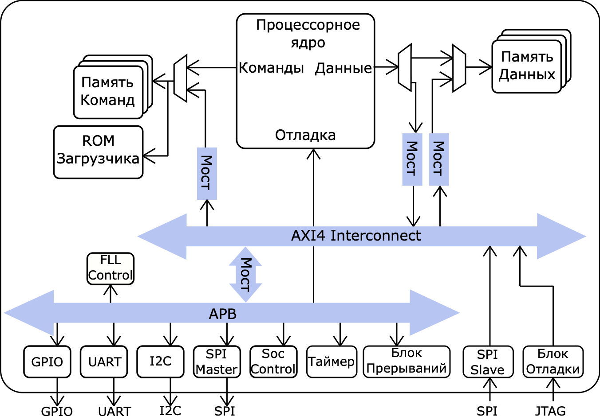
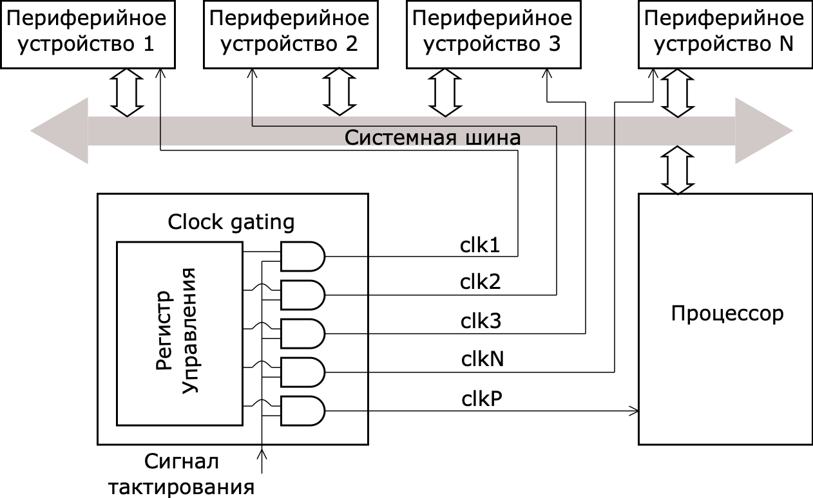
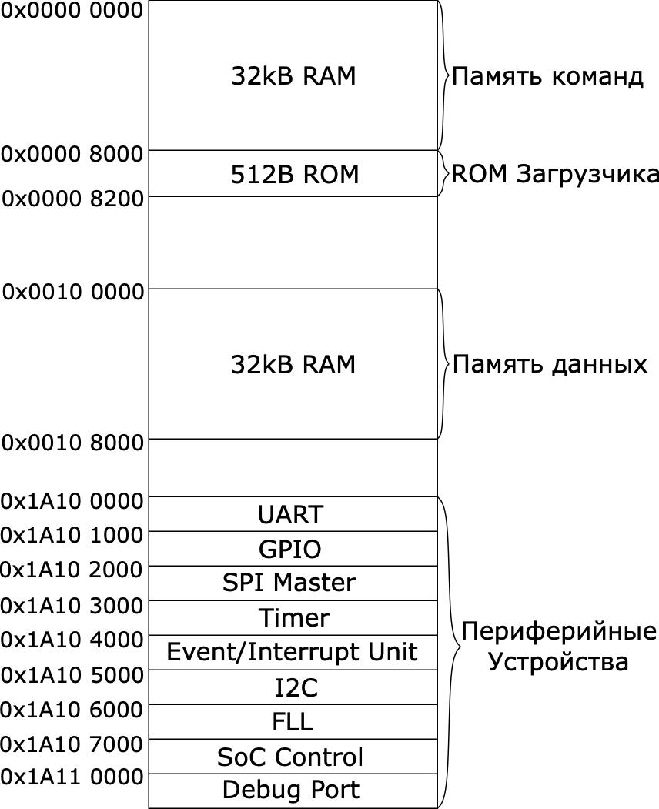
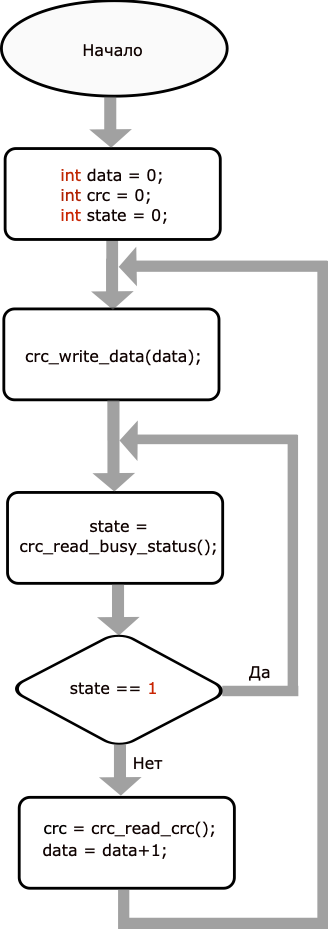
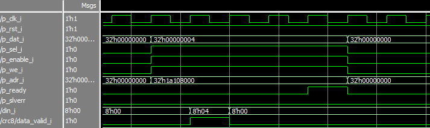
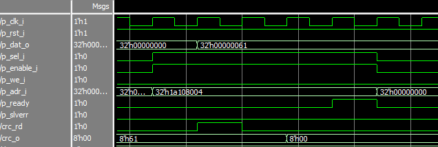

# Лабораторная работа 10. Интеграция контроллера в СнК. Разработка программного драйвера

## Система PULPino
На данный момент существует несколько крупных платформ для проектирования и разработки систем на кристалле, основанных на архитектуре RISC-V. В данном курсе мы остановимся на платформе PULP (Parallel Ultra-Low Power), предоставляющей несколько вариаций процессоров, различные периферийные контроллеры и, самое главное, готовые решения систем. В частности, к таким готовым решениям относится PULPino.

PULPino – это открытая система на базе 32-битного одноядерного RISC-V микропроцессора. Одной из ключевых ее особенностей является простота, поэтому в целях упрощения системы и достижения легкости работы с ней в PULPino намерено не реализована часть функционала. Например, в системе не используется кэш-память и возможность прямого доступа к памяти (DMA). В то же время в системе имеются основные необходимые функциональные блоки, рассмотреть которые можно на рисунке ниже. Исходные файлы аппаратной части PULPino на SystemVerilog находятся в репозитории [по ссылке](https://github.com/Konf/pulpino_students).



В зависимости от конфигурации в качестве ядра могут использоваться ядра zero-riscy или RI5CY. В zero-riscy применяется вычислительный конвейер с двумя стадиями, ядро полностью поддерживает работу с наборами инструкций RV32I и RV32C (обозначается как RV32IC). Оно также может быть сконфигурировано для использования RV32M и ограниченного количества инструкций RV32E. Основными преимуществами zero-riscy, помимо простоты, являются сниженное энергопотребление, а также малая занимаемая площадь на кристалле. Ядро RI5CY, в свою очередь, основано на четырехстадийном конвейере. Ядро может исполнять инструкции RV32IMC и, опционально, RV32F. Оно также обладает сниженными энергозатратами, однако обеспечивает большую функциональность и производительность, чем zero-riscy. В связи с этим в данном курсе мы используем систему PULPino с ядром RI5CY.

Как можно видеть из структурной схемы, в системе разделены память инструкций и данных. Также присутствует 512-байтовое ПЗУ, содержащее в себе инструкции загрузчика прошивки, который загружает программу из внешнего запоминающего устройства через интерфейс SPI (модуль SPI Master на схеме). При этом и ОЗУ с инструкциями и данными, и ПЗУ с загрузчиком находятся в едином адресном пространстве.

К шине APB подключены контроллеры интерфейсов, среди которых UART, I2C и ведущая сторона SPI, а также простой интерфейс GPIO, поддерживающий до 32 входных и выходных сигналов.

FLL Control (*Frequency-locked loop control)* – модуль управления автоподстройкой частоты, необходимый для поддержания тактовой частоты устройства на постоянном уровне при помощи цепи отрицательной обратной связи. В текущей реализации PULPino фактически не используется.

Помимо перечисленного, к шине подключен модуль обработчика событий и прерываний (*Event unit*). Модуль поддерживает векторные прерывания, количество как прерываний, так и событий ограничено 32 линиями.

Также на линии APB есть модуль счетчика времени (*Timer*). Количество таймеров внутри модуля определяется параметром при инициализации и по умолчанию равно двум. При переполнении или равенстве некоторому устанавливаемому значению, счетчик вызывает соответствующее прерывание.

Наконец, модуль *SoC Control* обеспечивает вспомогательный функционал для управления работой некоторых из блоков. К его возможностям относятся:


 - установка начального адреса загрузчика прошивки;
 - управление подачей тактового сигнала на контроллеры GPIO, UART, I2C, SPI, FLL, таймер и обработчик событий;
 - чтение информации о версии системы, размере ОЗУ и ПЗУ и наличии кэша инструкций и данных;
 - запись и чтение во вспомогательный статусный регистр, который может хранить результат верификации;
 - мультиплексирование выходных сигналов, иначе говоря, использование одних и тех же выходных контактов схемы для передачи сигналов разного назначения.


Можно заметить, что шина APB связана с портом отладки процессора. Отдельный модуль конвертирует транзакции по шине APB в команды отладочного интерфейса RI5CY. На схеме распределения адресов в памяти (memory map) отмечены зарезервированные адреса Debug Port – они и обеспечивают доступ к управлению процессором. В частности, таким образом можно изменить счетчик команд на необходимое значение.


В рамках данного курса будет рассмотрена та часть системы, которая совершает обмен данными по шине APB. Все периферийные устройства подключены к APB, за исключением контроллера SPI Slave, так как данный интерфейс может совершать обмен данными без участия процессорного ядра. Его целью является функционирование в качестве внешнего отладочного интерфейса, через который пользователь может получить доступ к внутренней памяти извне. Этот механизм может использоваться для предварительной загрузки программ в память, запуска системы, ожидания подтверждения завершения работы программы и проверки результатов.

После того, как был написан аппаратный вычислитель CRC или любой другой контроллер встает вопрос: Каким образом управлять вычислительным блоком, и как связаны аппаратная и программная часть проекта? По ходу данной лабораторной работы будут даны ответы на эти важные вопросы, а также рассказано о том, как писать драйвера периферийных устройств, тестовое программное обеспечение и проводить моделирование работы системы с участием ПО.


## Clock gating

Для подключения контроллера или вычислительного блока к системе PULPino необходимо разобраться с механизмом clock gating, который в ней используется. Clock gating — это методика отключения тактирования для определенного блока, когда он не нужен, и используется сегодня большинством конструкций SoC как эффективный метод для уменьшения энергопотребления.

Механизм используется для периферийных устройств, которые не будут использоваться постоянно. Вычислитель CRC как раз является таким из них, поэтому для экономии следует использовать этот механизм при подключении блока, а не подавать сигнал тактирования непосредственно на него.

Механизм clock gating реализован в архитектуре SoC и является частью функциональности RTL. Он останавливает тактирование отдельных блоков, когда эти блоки неактивны, эффективно отключая все функции этих блоков. Поскольку большая часть блоков логики в проекте может не переключаться в течение многих циклов, это значительно экономит энергопотребление. Самая простая и наиболее распространенная форма clock gating — это когда логическая функция "И" используется для выборочного отключения тактирования для отдельных блоков с помощью управляющего сигнала, как показано на рисунке ниже.





Рассмотрим реализацию механизма clock gating в PULPino.  В файле `cluster_clock_gating.sv` описан механизм работы: на вход модуля поступают сигналы тактирования и разрешения на тактирование, а на выход формируется сигнал тактирования для периферийных устройств.  Фрагмент кода приведен в листинге ниже.

Листинг – Реализация механизма clock gating в PUPLino:
```verilog
module cluster_clock_gating
(
    input  logic clk_i, //Входной сигнал тактирования
    input  logic en_i, //Разрешение на тактирование
    input  logic test_en_i,
    output logic clk_o //Выходной сигнал тактирования
);
`ifdef PULP_FPGA_EMUL //Если не используем механизм clock gating
// no clock gates in FPGA flow
assign clk_o = clk_i;
`else
logic clk_en;

always_latch
  begin
    if (clk_i == 1'b0)
      clk_en <= en_i | test_en_i;
  end
assign clk_o = clk_i & clk_en; //Если сигнал разрешения есть – на выход подаем сигнал тактирования
`endif
endmodule
```

Подключение модулей, реализующий механизм clock gating происходит в `peripherals.sv`. Подключается число экземпляров модуля clock gating равное количеству периферийных устройств. К каждому экземпляру подключается свой сигнал разрешения и на выход идет свой сигнал тактирования, который затем подключается к нужному периферийному устройству. Фрагмент кода приведен в листинге ниже.

Листинг – Подключение модулей, реализующих механизм clock gating:

```verilog
generate
  genvar i;
    for (i = 0; i < APB_NUM_SLAVES; i = i + 1) begin //APB_NUM_SLAVES – количество периферийных устройств
      cluster_clock_gating core_clock_gate
      (
        .clk_o ( clk_int[i] ), //Выходной сигнал тактирования
        .en_i ( peripheral_clock_gate_ctrl[i] ),  //Разрешение на тактирование
        .test_en_i ( testmode_i ),
        .clk_i ( clk_i ) //Входной сигнал тактирования
      );
    end
endgenerate

```

Управление механизмом происходит аналогичным образом, как и управление периферийными устройствами – при помощи ПО и системной шины в модуле `apb_pulpino.sv`. Фрагмент кода приведен в листинге ниже.

Листинг – Запись данных в регистры по системной шине для механизма clock gating:

```verilog
// Address offset: bit [4:2]
`define REG_PAD_MUX      4'b0000
`define REG_CLK_GATE     4'b0001
 ...
// register write logic
    always_comb
    begin
        ...
        clk_gate_n = clk_gate_q;
        ...
        if (PSEL && PENABLE && PWRITE)
        begin
            case (register_adr)
                `REG_PAD_MUX:
                    pad_mux_n     = PWDATA;
                `REG_CLK_GATE:
                    clk_gate_n    = PWDATA;

```

Включение тактирования модулей происходит в функциях инициализации драйверов, которые будут рассмотрены в одном из следующих параграфов.

## Подключение вычислительного блока CRC в проект

Для того чтобы подключить вычислитель CRC в проект необходимо выполнить ряд инструкций. Обратимся к рисунку ниже, на котором показана схема организации адресного пространства системы на кристалле PULPino. Под периферийные устройства, находящиеся на шине APB выделено адресное пространство с адресами от `0x1A100000` до `0x1A11FFFF`.

Структурная схема адресного пространства PULPino:



Для подключения нового периферийного устройства в систему необходимо выделить ему адресное пространство – диапазон адресов, который принадлежит диапазону, выделенному для контроллеров на ABP, а также не перекрывает адрес других контроллеров, подключенных к системной шине. Для этого в файле `rtl/includes/apb_bus.sv` нужно объявить константы на адреса начала и конца диапазона адресного пространства, выделяемого под данное периферийное устройство и увеличить на единицу константу количества периферийных устройств. Фрагмент кода приведен в листинге ниже.

Листинг – define на количество периферийных устройств и define на адреса вычислителя CRC:

```verilog
// SOC PERIPHERALS APB BUS PARAMETRES
`define NB_MASTER  10
...
// MASTER PORT TO CRC
`define CRC_START_ADDR        32'h1A10_8000
`define CRC_END_ADDR          32'h1A10_8FFF
...
```

Обычно количество адресов диапазона равно числу регистров для записи и чтения данных контроллера. Однако можно брать диапазон больше, с запасом, для дальнейшего расширения функциональности блока вместе с сохранением программной совместимости. Далее необходимо объявить интерфейс APB для ведомого устройства – вычислителя CRC и объявить его адреса начала конца диапазона в файле `rtl/periph_bus_wrap.sv`. Фрагмент кода приведен в листинге ниже.

Листинг – Объявление интерфейса APB для вычислителя CRC и его адресов начала и конца диапазона адресного пространства:

```verilog
...
APB_BUS.Master    debug_master,
APB_BUS.Master    crc_master
...
`APB_ASSIGN_MASTER(s_masters[8], debug_master);
assign s_start_addr[8] = `DEBUG_START_ADDR;
assign s_end_addr[8]   = `DEBUG_END_ADDR;
`APB_ASSIGN_MASTER(s_masters[9], crc_master);
assign s_start_addr[9] = `CRC_START_ADDR;
assign s_end_addr[9]   = `CRC_END_ADDR;
...
```

Следующий шаг - объявление экземпляра структуры интерфейса для CRC вычислителя и подключение самого вычислителя. Про механизм интерфейсов можно почитать в спецификации на язык SystemVerilog [1].
Также для механизма clock gating указать, что число периферийных устройств увеличилось на 1 в файле `rtl/peripherals.sv`. Фрагмент кода приведен в листинге ниже.

Листинг – Объявление экземпляра структуры интерфейса для CRC и подключение вычислителя:

```verilog
...
localparam APB_NUM_SLAVES  = 9;
...
 APB_BUS s_soc_ctrl_bus();
 APB_BUS s_debug_bus();
 APB_BUS s_crc_bus();
...
wrapper_crc8
wrapper_crc8_i
(
 .p_clk_i    ( clk_int[8]    ), //На вычислитель CRC подается тактирование с 9 gate
 .p_rst_i    ( rst_n         ),
 .p_adr_i    ( s_crc_bus.paddr[31:0] ),
 .p_dat_i    ( s_crc_bus.pwdata      ),
 .p_we_i     ( s_crc_bus.pwrite      ),
 .p_sel_i    ( s_crc_bus.psel        ),
 .p_enable_i ( s_crc_bus.penable     ),
 .p_dat_o    ( s_crc_bus.prdata      ),
 .p_ready    ( s_crc_bus.pready      ),
 .p_slverr   ( s_crc_bus.pslverr     )
);
```

## Связь аппаратной части проекта и программного обеспечения

В данном параграфе описано, каким образом связаны аппаратные контроллеры и вычислительные блоки с программным обеспечением, которое исполняется процессором. После подключения нового блока в систему, необходимо чтобы ПО, которое управляет контроллером, знало об этом.

В файле `pulpino/rtl/includes/apb_bus.sv` прописаны адрес начала и конца диапазона адресов, выделенного каждому периферийному устройству, а также указано количество периферийных устройств на шине APB. Фрагмент кода приведен в листинге ниже.

Листинг – Объявление define на адреса начала и конца диапазонов для каждого периферийного устройства:

```verilog
// SOC PERIPHERALS APB BUS PARAMETRES
`define NB_MASTER 9 //Количество периферийных устройств

// MASTER PORT TO CVP
`define UART_START_ADDR 32'h1A10_0000 //Адрес начала диапазона
`define UART_END_ADDR 32'h1A10_0FFF //Адрес конца диапазона

// MASTER PORT TO GPIO
`define GPIO_START_ADDR 32'h1A10_1000
`define GPIO_END_ADDR 32'h1A10_1FFF

// MASTER PORT TO SPI MASTER
`define SPI_START_ADDR 32'h1A10_2000
`define SPI_END_ADDR 32'h1A10_2FFF

// MASTER PORT TO TIMER
`define TIMER_START_ADDR 32'h1A10_3000
```

Кроме того базовые (начальные) адреса указаны в библиотечном файле системы PULPino `pulpino/sw/libs/sys_lib/inc/pulpino.h`. Фрагмент когда приведен в листинге ниже.

Листинг – define на базовые адреса системы, контроллеров:

```c
#define PULPINO_BASE_ADDR             0x10000000 //Базовый адрес системы

/** SOC PERIPHERALS */
#define SOC_PERIPHERALS_BASE_ADDR ( PULPINO_BASE_ADDR + 0xA100000 ) //Базовый адрес контроллеров на APB

#define UART_BASE_ADDR ( SOC_PERIPHERALS_BASE_ADDR + 0x0000 ) //Базовый адрес контроллера UART
#define GPIO_BASE_ADDR ( SOC_PERIPHERALS_BASE_ADDR + 0x1000 )
#define SPI_BASE_ADDR ( SOC_PERIPHERALS_BASE_ADDR + 0x2000 )
#define TIMER_BASE_ADDR ( SOC_PERIPHERALS_BASE_ADDR + 0x3000 )
#define EVENT_UNIT_BASE_ADDR ( SOC_PERIPHERALS_BASE_ADDR + 0x4000 )
#define I2C_BASE_ADDR ( SOC_PERIPHERALS_BASE_ADDR + 0x5000 )
#define FLL_BASE_ADDR ( SOC_PERIPHERALS_BASE_ADDR + 0x6000 )
#define SOC_CTRL_BASE_ADDR ( SOC_PERIPHERALS_BASE_ADDR + 0x7000 )
```

Адреса смещений указаны в специальных библиотеках, в которых описаны функции для чтения и записи в регистры контроллеров, такие библиотека называются - драйверами. Фрагмент кода с описание адресов регистров контроллера UART приведен в листинге ниже.

Листинг – Адреса регистров контроллера UART:

```c
#include "pulpino.h" //Подключение библиотечного файла pulpino.h
#include <stdint.h>
// UART_BASE_ADDR – базовый адрес UART, 0x00 –адрес смещения регистра UART_REG_RBR
#define UART_REG_RBR ( UART_BASE_ADDR + 0x00) // Receiver Buffer Register (Read Only)
#define UART_REG_DLL ( UART_BASE_ADDR + 0x00) // Divisor Latch (LS)
#define UART_REG_THR ( UART_BASE_ADDR + 0x00) // Transmitter Holding Register (Write Only)
#define UART_REG_DLM ( UART_BASE_ADDR + 0x04) // Divisor Latch (MS)
#define UART_REG_IER ( UART_BASE_ADDR + 0x04) // Interrupt Enable Register
#define UART_REG_IIR ( UART_BASE_ADDR + 0x08) // Interrupt Identity Register (Read Only)
#define UART_REG_FCR ( UART_BASE_ADDR + 0x08) // FIFO Control Register (Write Only)
#define UART_REG_LCR ( UART_BASE_ADDR + 0x0C) // Line Control Register
#define UART_REG_MCR ( UART_BASE_ADDR + 0x10) // MODEM Control Register
#define UART_REG_LSR ( UART_BASE_ADDR + 0x14) // Line Status Register
#define UART_REG_MSR ( UART_BASE_ADDR + 0x18) // MODEM Status Register
#define UART_REG_SCR ( UART_BASE_ADDR + 0x1C) // Scratch Register
```

Таким образом, при вызове функций драйвера происходит обмен данными с контроллером конкретного периферийного устройства по системной шине APB. На линии адреса будет выставлен адрес, находящийся в выделенном данному контроллеру адресном пространстве.

## Реализация драйвера для вычислительного блока CRC

Драйвер – это программная библиотека, функции которой управляют контроллерами периферийных устройств. Существует несколько подходов к написанию драйверов. Предлагается использовать подход, основанный на структурах. Данных метод позволяет использовать один драйвер для множества одинаковых устройств (например, в системе есть несколько контроллеров интерфейса UART).

Первое, что необходимо сделать – добавить в заголовочный файл` pulpino/sw/libs/sys_lib/inc/pulpino.h` define на базовый адрес вычислителя CRC:

```c
#define CRC_BASE_ADDR       ( SOC_PERIPHERALS_BASE_ADDR + 0x8000 ) //Базовый адрес вычислителя CRC

```

Написание заголовочного файла драйвера. В заголовочный файл необходимо подключить h-файл с базовыми адресами периферийных устройств:

```c
#include <pulpino.h> //Подключение библиотечного файла pulpino.h
```

Далее приступим к описанию самой структуры в заголовочном файле драйвера. Структура содержит поля, соответствующие регистрам контроллера. В случае контроллера CRC , содержащего регистры данных, crc и статуса, в структуре будет соответственно 3 поля. Фрагмент кода приведен в листинге ниже.

Листинг – Структура для вычислителя CRC:

```c
__attribute__ ((packed)) struct CRC_APB {
    uint32_t CRC_REG_WRITE_DATA; //Поле данных
    uint32_t CRC_REG_READ_CRC; //Поле CRC
    uint32_t CRC_REG_READ_STATUS; //Поле статуса
};
```

Также часто требуется прописывать define на константы, которые могут использоваться, например, в функциях драйвера. Использование таких констант удобно тем, что при изменении аппаратной части необходимо исправить только значения констант, объявленных в этом файле. Фрагмент кода приведен в листинге ниже.

Листинг – define на адреса регистров вычислителя CRC:

```c
#define CRC_STATUS_IDLE  0x00 //Состояние бездействия
#define CRC_STATUS_BUSY 0x01  //Состояние вычисления
#define CRC_STATUS_READ 0x02 //Состояние чтения CRC
```

Далее прописываем заголовки функций драйвера. Функции драйвера делятся на 3 типа – функция инициализации структуры, функция чтения данных из регистра, функция записи данных в регистр. Фрагмент кода приведен в листинге ниже.

Листинг – Заголовки функций для вычислителя CRC:

```c
void crc_init(void); //Инициализация структуры
void crc_write_data(int data); //Запись данных
int crc_read_status(void); //Чтение регистра состояния
int crc_read_idle_status(void); //Чтение состояния бездействия
int crc_read_busy_status(void); //Чтение состояния вычисления
int crc_read_read_status(void); //Чтение состояния чтения
int crc_read_crc(void); //Чтения значения CRC
```

Приступим к написанию c-файла - подключаем заголовочный файл:

```c
#include <crc.h>
```

Объявляем экземпляр структуры `CRC_APB`:

```c
volatile struct CRC_APB *crc8;
```

Функция инициализации структуры присваивает экземпляру структуры указатель на базовый адрес вычислителя CRC. Фрагмент кода приведен в листинге ниже.

Листинг – Функция инициализация структуры для вычислителя CRC:

```c
void crc_init(){
    crc8 = (volatile struct CRC_APB *)CRC_BASE_ADDR;
}
```

В качестве примера функции записи данных в регистр в листинге ниже приведена функция записи данных.

Листинг – Функция записи данных для вычислителя CRC:

```c
void crc_write_data(int data){
    crc8-> CRC_REG_WRITE_DATA = data;
}
```

Функция чтения статуса приведена в листинге.

Листинг – Функция чтения статуса для вычислителя CRC:

```c
int  crc_read_status(){
    return crc8->CRC_REG_READ_STATUS;
}
```

Некоторые функции драйвера часто используют другие функции драйвера. Например, в данном случае это может быть функция чтения состояния *Бездействие*. Фрагмент кода приведен в листинге ниже.

Листинг – Функция чтения состояния *Бездействие* для вычислителя CRC:

```c
int crc_read_idle_status(){
    volatile int status = crc_read_status();
    if(status == CRC_STATUS_IDLE) return 1;
    else return 0;
}
```

После того, как написаны оба файла драйвер можно считать завершенным и приступать к следующему действию – реализации тестового ПО и проверке результатов при помощи моделирования.

## Проектирование тестового ПО. Проверка результатов на моделировании

Написание тестового программного обеспечения очень важный этап, при проверке вычислительного блока и драйвера. Такое ПО должно покрывать как можно больше случаев и сценариев, чтобы убедиться в том, что все работает верно, и не допустить возникновения ошибок в драйвере, ПО и вычислителе.  Первым шагом, при написании тестового ПО является разработка алгоритма. Для вычислителя контрольной суммы из прошлой лабораторной работы предлагается следующий алгоритм:




Алгоритм представляет собой вычисление контрольной суммы для одного байта данных – происходит запись одного байта с последующим считыванием результата. После получения результата вычисления контрольной суммы происходит запись следующего байта данных, на единицу большего предыдущего. Первый записываемый байт равен нулю. Таким образом, проверяются все возможные входные данные при вычисления CRC от одного байта.  Кроме того, необходимо не забывать про механизм clock gating, используемый в системе. Помимо управление вычислительным блоком при помощи ПО, необходимо так же управлять механизмом clock gating. При подключении вычислителя в проект мы указывали, с какого gate будет подаваться тактирование на вычислитель. Для того, чтобы управлять механизмом следует указать номер этого gate в заголовочном файле `pulpino/sw/libs/sys_lib/inc/pulpino.h`:

```c
#define CGCRC     0x08 //Константа для механизма clock gate вычислителя CRC
```

Управление clock gating происходит путем записи в регистр `CGREG` единиц в разряды, равные номерам модулей, который мы хотим тактировать. Фрагмент кода приведен в листинге ниже.

Листинг – Тестовое ПО для проверки вычислителя CRC:

```c
#include <crc.h>

void main(){
    CGREG |= (1 << CGCRC); //Разрешение на тактирование вычислителя clock gate – запись 1 в 8 разряд
    int data = 0;
    int crc  = 0;
    int state = 0;
    crc_init();//Инициализация структуры
    while(1){
        crc_write_data(int data);//Запись данных
        do{
            state = crc_read_busy_status();//Чтение статуса
        }while (state == 1);
        crc = crc_read_crc();//Чтение CRC8
        data = data + 1;
    }
}
```

После того, как написано ПО нужно выполнить компиляцию и линковку. В системе PULPino управление сборкой происходит посредством Makefile. В Makefile указывается список используемых библиотек, архитектура используемого процессора, имя собираемого файла, путь до настроек компоновщика, имена выходных файлов и указания к сборке для определенных target. Подробнее про Makefile было рассказано в лабораторной работе 4.
Когда dat-файлы с прошивкой скомпилированы можно приступать к моделированию вычислителя совместно с написанным ПО. Для этого необходимо добавить полученные файлы в проект и сымитировать загрузку по JTAG, как было описано в рамках лабораторной работы 5. Имитация транзакций по системной шине APB в таком моделирование не нужны, есть необходимость генерации сигналов сброса и тактирования.
На рисунке ниже приведена временная диаграмма записи данных (`32’h4`), которая соответствует вызову функции `crc_write_data(int data)`;



На рисунке ниже происходит считывание регистра состояния(`32’h0`), которое соответствует вызову функции `crc_read_busy_status()`;


На рисунке ниже считываем результат контрольной суммы CRC8, которое соответствует вызову функции `crc_read_crc()`;



## Задания к лабораторной работе

В рамках данной лабораторной работы требуется:

 - подключить вычислительный блок CRC в проект;
 - написать программный драйвер для вычислительного блока CRC;
 - написать тестовое ПО, согласно предложенным вариантам;
 - выполнить компиляцию и линковку ПО с помощью Makefile;
 - проверить результат работы системы с тестовым ПО на моделирование.


## Варианты заданий

 - В качестве данных использовать данные, считанные по интерфейсу SPI.
 - В качестве данных использовать данные, считанные по интерфейсу UART со скоростью 115200.
 - Реализовать программный алгоритм CRC и сравнивать результаты. Если произошла ошибка – выдать сообщение по интерфейсу UART.
 - По запросу отправлять значения CRC по интерфейсу SPI.

## Контрольные вопросы

 - Что такое драйвер? Назначение драйверов.
 - Почему при написании драйвера удобно использовать структуры?
 - Механизм clock gating. Назначение.
 - Как реализован clock gating в систему PULPino?
 - Как связаны аппаратная и программная часть проекта?
 - Какие блоки подключаются к шине APB, а какие к AXI4?

## Список литературы
 1. [Спецификация SystemVerilog](http://www.ece.uah.edu/~gaede/cpe526/2012%20System%20Verilog%20Language%20Reference%20Manual.pdf)
