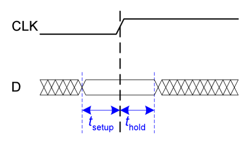
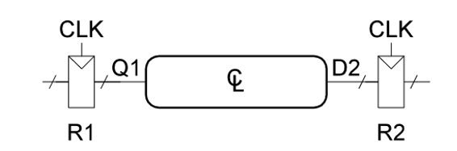
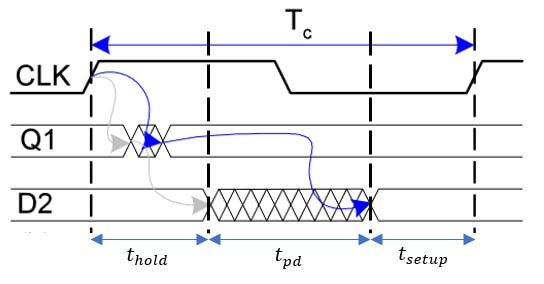
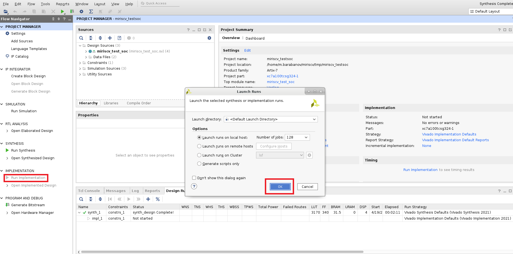
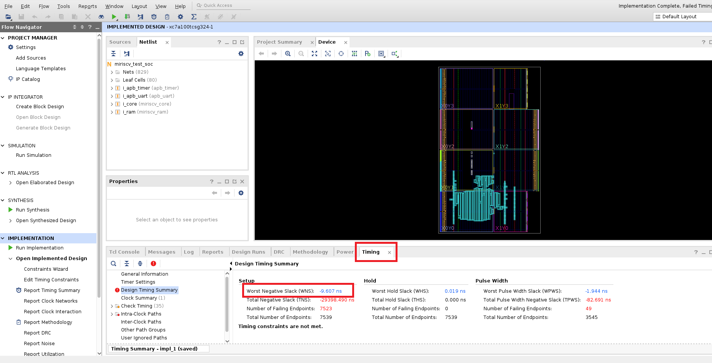
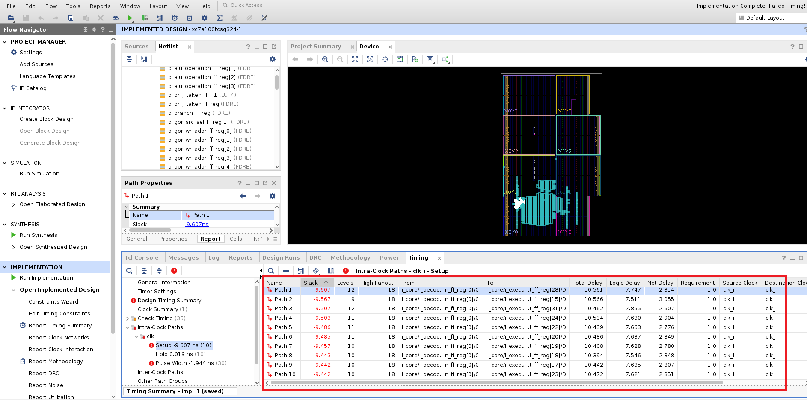
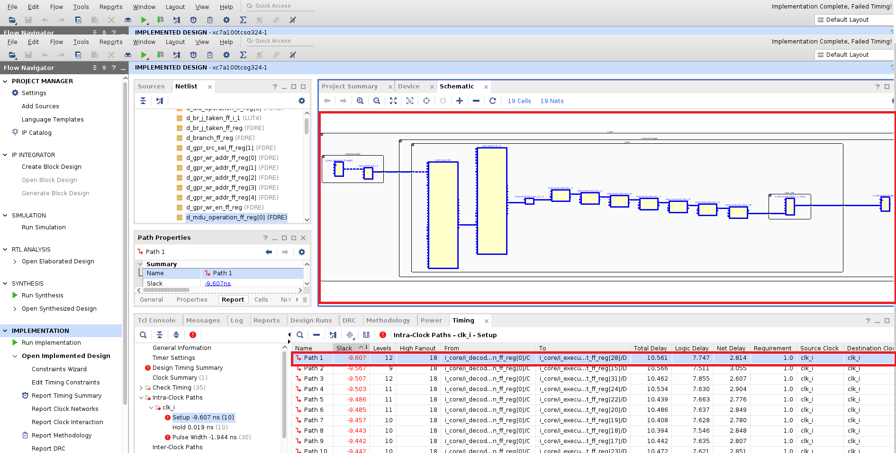

Для корректной работы последовательностных устройств предъявляются ряд требований. Информационный вход схемы должен оставаться стабильным в течение времени предустановки (tsetup) до прихода активного уровня фронта тактового сигнала и не должен изменяться в течение времени удержания (thold) после прихода активного уровня фронта тактового сигнала. (Рисунок 1)


##### Рисунок 1  Времена предустановки и удержания (tsetup и thold) #####

Последовательностные устройства можно условно представить в виде регистров, которые разделены между собой комбинационной логикой. (Рисунок 2)


##### Рисунок 2  Условное изображение последовательностных устройств #####


По фронту CLK данные защёлкиваются и попадают на выход Q1 . Далее они распространяются через блок комбинационной логики, и попадают на вход D2. Как показано на рисунке 3 сигнал на входе D2 принимает окончательное значение спустя максимальное время задержки распространения .Серые стрелки указывают минимальную задержку с учетом регистра R1 и комбинационной логики, синие - максимальную. Время tpd - это задержка на комбинационной логике

 
##### Рисунок 3  Временная диаграмма распространения данных между двумя триггерами #####


В итоге мы получаем два ограничения. Во-первых данные с выхода Q1  должны распространятся достаточно быстро, чтобы успеть дойти до входа D2 раньше фронта CLK. (tsetup). Во-вторых следующие данные с выхода Q1 должны распространятся достаточно медленно, чтобы по фронту CLK захватились предыдущие данные (thold).

STA проводит анализ tsetup и thold, опираясь на частоту(период), заданную в файле ограничений (constraints) проекта. В данном проекте файл ограничений miriscv_test_soc.xdc лежит в папке xdc и в нём задан период в 1 нс. Результом STA является значение Slack, **которое является разностью между периодом из файла ограничений ( то есть 1 нс ) и  значением периода на котором проект работает без нарушений временных ограничений ( setup time и hold time)**. Так как период, заданный в ограничениях заведомо выбран малым, значения Slack будут получаться отрицательными.

Для получения Slack нужно запустить имплементацию проекта (Рисунок 4). Имплементация проводится после синтеза, то есть после неё могут анализироваться задержки на логических элементах и трассировочных ресурсах



##### Рисунок 4  Запуск имплементации #####


После имплементации получим значение Slack для худшего критического пути. (Рисунок 5) В данном примере он равен -9,607.


##### Рисунок 5  Значение Slack для худшего критического пути #####


Данная информация поможет обнаружить слабые места дизайна. Набор действий сводится к внесению изменений в проект и анализу изменения Slack. Кликнув по значению Slack для худшего критического пути появится информация о Slack для всех критических путей. (Рисунок 6)


##### Рисунок 6  Значение Slack для всех критических путей  #####

Удобной опцией является просмотр критического пути на уровне структурной схемы. Для этого находясь в окне просмотра значений Slack для всех критических путей (Рисунок 6), кликните на интересующий Вас критический путь и нажмите на клавишу  F4 . В данном примере мы кликнули на критический путь Path1  (Рисунок 7).



##### Рисунок 7 Просмотр критического пути на уровне структурной схемы  #####


Сделаем расчёт частоты , на которой проект заработает без нарушений временных ограничений. Для этого нужно из периода тактовой частоты (значение из файла ограничений .xdc ) вычесть Slack для худшего критического пути (-9,607нс) и найти обратную величину получившегося значения:

``` 1/(1нс - (-9,607нс)) = 94,277 МГц ```

В данном примере в .xdc файле задана тактовая частота с периодом в 1 нс.
